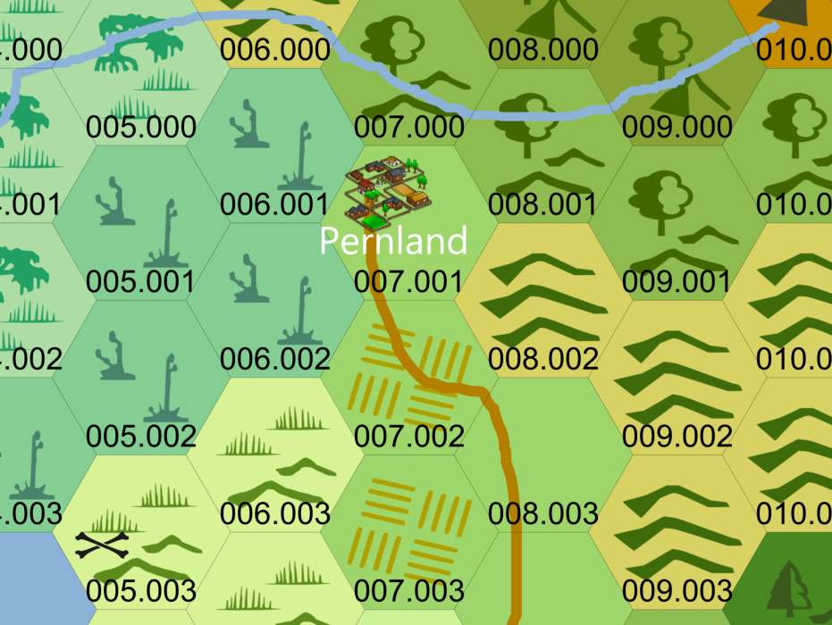
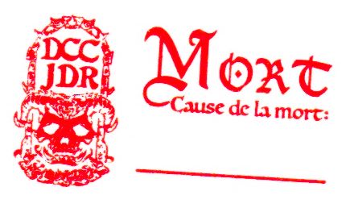

# DCC - Aventures aux Confins du Monde - Session 1 

## Le Portail sous les &Eacute;toiles

Trélazé, Les Arts Ludiques. 11 mai 2024 ; 13h30/18h.

Ce scénario est un 'funnel' (entonnoir) pour 15 à 20 personnages de niveau 0. Les joueurs ont générés 3 ou 4 personnages aléatoirement aux dés ou avec des [fiches à gratter](https://www.philibertnet.com/fr/dungeon-crawl-classics/122674-dungeon-crawl-classics-0-level-scratch-off-character-sheets-reprint-9781946231093.html?search_query=Scratch&results=7#img).

### Joueurs et Personnages

- JDR
    - Willy, Alchimiste
    - Pistil, Apiculteur
    - Ohoun, Bucheron

- Augustin
    - ~~Skofloc, Vagabond Hobbit~~
    - Rannok, Chevrier Nain
    - Salensus, Souffleur de Verre Elfe
    
- Ludo
    - Arthur Lezimpaux, Hors la Loi 
    - Jean Eude Padchance, Tonnelier
    - ~~Niels, Souffleur de Verre Elfe~~
    
- Alex
    - ~~Alphonse, Bucheron~~
    - Archibald, Hors la Loi
    - Gaëtan, Ecuyer
    
- Enzo
    - Loden, Fermier, Cultivateur de panais
    - Tyrus Valen, Alchimiste
    - ~~Lars Peck, Chasseur~~
    
- Hervé
    - Tatamash, Mendiant de guilde
    - ~~Palarion, Serrurier~~
    - Silas, Avocat Elfe
    - ~~Chomleck, Galopin~~

Les personnages dont le nom est ~~barré~~ n'ont pas survécu aux dangers de cette aventure.

### Préambule

Le vieux Robert est mort, épuisé par les travaux de l'automne. Dans ses dernière paroles, il a confié ses regrets de ne pas avoir tenté sa chance dans une vie d'aventures. Il y a plus de cinquante hivers, la dernière fois que l'Étoile Vide est apparue dans le ciel d'&Aacute;ereth, un portail s'est ouvert près des monticules de pierres non loin du village de Pernland. Il avait aperçu des joyaux à l'intérieur, ainsi que des lances en acier et des armures émaillées, mais s'était enfui quand des hommes de fer l'avaient attaqué. 

L'Étoile Vide s'est de nouveau levée. De courageux habitants de Pernland, désireux de devenir autre chose que de simples paysans, ont décidé de saisir cette chance. Cette troupe bigarée est partie explorer les mystères du tombeau caché au delà de ce portail.

### &Agrave; l'Aventure !

Les périls et dangers recontrés par ce groupe d'aspirants aventuriers ont été nombreux : les lances magiques des statues de fer gardant cette tombe ; les projections enflammées de l'imposante statue du mage de guerre inhumé en ces lieux ; Ssisssuraaaaggg, le serpent-démon immortel ; les morsures de crânes de squelettes ; des statues de cristal. Et pour finir, une impressionante armée de statues d'argile qui protègeaient le corps ratatiné du mage et son trésor. 

Fort heureusement, l'armée de statues d'argile a été vaincue par l'astuce et a fini transformée en boue, après avoir été recouverte par l'eau d'un bassin contemplatif.

### Les héros tombés à l'Aventure

Voici les héros qui ne reviendront pas de ce périple et la cause de leur trépas :
- Skofloc le Vagabond Hobbit, tué par un piège sur la première porte
- Lars Peck le Chasseur, empalé par 3 lances
- Palarion la Serrurier, tué par une statue de cristal
- Chomleck le Galopin, tué par une statue de cristal
- Alphonse le Bucheron, tué par une statue de cristal
- Niels le Souffleur de Verre Elfe, tué par une statue de cristal

