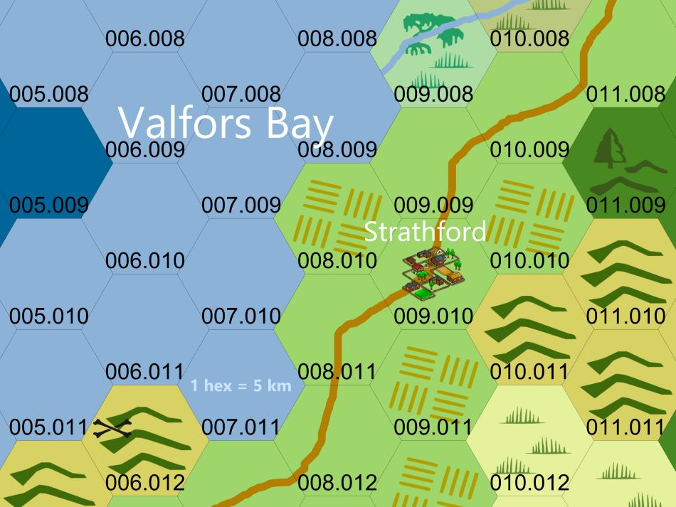
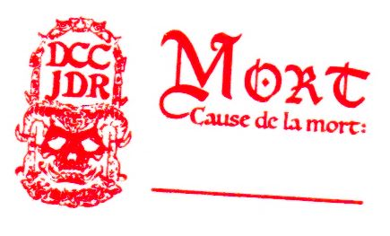

# DCC - Aventures aux Confins du Monde - Session 2

## Navigateurs sur une Mer sans &Eacute;toiles - Partie 1

Trélazé, Les Arts Ludiques. 18 mai 2024 ; 13h30/18h.

Ce scénario est un 'funnel' (entonnoir) prévu pour 10 à 15 personnages de niveau 0. Les joueurs ont généré deux personnages aléatoirement aux dés et un avec des [fiches à gratter](https://www.philibertnet.com/fr/dungeon-crawl-classics/122674-dungeon-crawl-classics-0-level-scratch-off-character-sheets-reprint-9781946231093.html?search_query=Scratch&results=7#img).

### Joueurs et Personnages

- Nicolas
    - Rémi, Orphelin
    - Gloire, Escroc
    - Jymmi, Serrurier
    
- Olivier
    - Philippe, Fermier, Cultivateur de blé
    - Baldur, Mineur Nain
    - Oudini, Escroc (Confidence artist)
    
- Valérie
    - Rogue, Marchand
    - Firiel, Mendiant de guilde
    - Azazel, Forestier Elfe
    
- Antoine
    - Tama, Charron
    - Gonkran, Vidangeur de Latrines (Gongfarmer)
    - Valadrielle, Cirier Elfe
    
- Théo
    - Naccal, Bucheron
    - Harman, Marin Halfelin
    - ~~Nartos, Coupeur de bourses~~

Les personnages dont le nom est ~~barré~~ n'ont pas survécu aux dangers de cette aventure.

### Préambule

Depuis la nuit des temps, les gens de Srathford, le village où vivent les personnages des joueurs, triment dans l'ombre d'une ruine cyclopéenne. D'origine inconnue et source d'innombrables superstitions, cette bâtisse a toujours été considérée par les habitants comme un mystère qu'il était plus prudent d'ignorer.

Mais depuis peu, quelque chose s'agite sous les blocs de pierre. Des hommes-bêtes hurlent dans la nuit, et des habitants du village sont enlevés dans leur sommeil. Sans héros pour le défendre, qui se lèvera pour résister à l'obscurité qui menace d'engloutir Srathford ? 

Galvanisés par les récits épiques de Pharnoc, Oggon et Oryx, un trio de vieux baroudeurs retirés des affaires, mais hélas trop vieux pour s’occuper de cette menace, une bande d'aventuriers s’est décidée à explorer ces ruines afin que revienne la paix à Srathford.

### &Agrave; l'Aventure !

A l'approche de la forteresse en ruines, le groupe de novices a d'abord dû affronter des corps animés par des plantes maléfiques. 
Les corps étaient ceux de Keary et Alban, les enfants du forgeron. Ils étaient portés disparus depuis onze jours.

Au sommet d'une des tours, une bannière en loques, représentant un crâne pourpre sur un fond noir, claquait au vent !

Après une discrète inspection de la forteresse, les apprentis aventuriers s'y sont introduits en passant par le mur effondré au nord-ouest, évitant prudemment la barbacane et les grognements bestiaux qui en provenaient.

Dans la cour, un puits équipé d'un système de poulis et de chaines. Adossé à un des murs, un batiment aux murs carbonisés. Ses portes en métal étaient fermées de l'extérieur. Sur celles-ci, une inscription tracée à la peinture rouge écaillée : REPENTEZ-VOUS !

Les murs et la tour au nord-est ont été engloutis par un gouffre béant. Une étrange et inquiétante brume tourbillonante bloque la vue.

Une fois la cour inspectée, les explorateurs néophytes ont poursuivi les investigations dans le batiment calciné. Ils y ont découvert les ruines d'un inquiétant charnier et une fontaine d'où sortait un étrange liquide goudronneux.

Dans la tour principale, six hommes-bêtes et leur champion à tête de taureau les attendaient. Certains des villageois y étaient également retenus prisonniers, enchainés au mur. Une fois le champion vaincu par les aventuriers, les hommes-bêtes encore en vie ont préféré fuir.

Les futurs héros sont alors retournés à Srathford, avec leurs camarades libérés, pour un peu de repos

### Les héros tombés à l'Aventure

Voici les héros qui ne reviendront pas de ce périple et la cause de leur trépas :

- Nartos le coupeur de bourses, écrasé par une pierre
