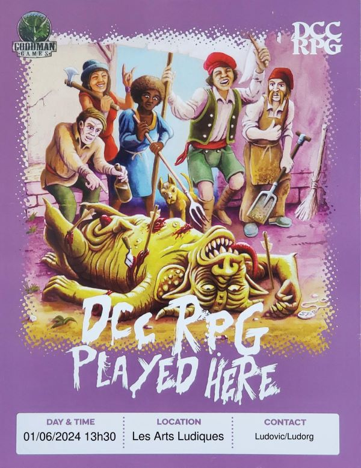
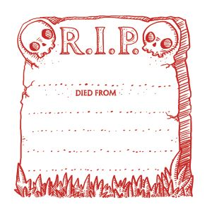

# DCC - Aventures aux Confins du Monde - Session 3

## Navigateurs sur une Mer sans &Eacute;toiles - Partie 2

Trélazé, Les Arts Ludiques. 1er juin 2024 ; 13h30/18h.

Suite de l'entonnoir débuté [le 18 mai](dcc_lal_2024_05_18), mais avec d'autres joueurs (en applicant le principe de 'table ouverte'). Les nouveaux joueurs ont reçu deux personnages générés aléatoirement avec le [0-Level Party Generator](https://purplesorcerer.com/create_party.php) de [Purple Sorcerer Games](https://purplesorcerer.com/index.php) et un troisième avec des [fiches à gratter](https://www.philibertnet.com/fr/dungeon-crawl-classics/122674-dungeon-crawl-classics-0-level-scratch-off-character-sheets-reprint-9781946231093.html?search_query=Scratch&results=7#img).

### Joueurs et Personnages

- Augustin
    - Edgard Adgar, Diseur de bonne aventure
    - Haledoc Tomson, Tenturier Halfelin
    - Arnaud de Couroie, Mercenaire

- Claire
    - Gwym, Fermier, Cultivateur de radis
    - ~~Veezi, Sage Elfe~~
    - Turlogh, Fermier, Cultivateur de blé

- Grégoire
    - Talu, Esclave
    - Valardyn, Apprentie Magicienne
    - Zapranoth, Serviteur sous contrat

- Laura
    - Cushara, Soldat
    - Gazal, Usurier Halfelin
    - ~~Tewk, Halefin gantier~~

- Rodica
    - Tara, Dresseur d'animaux
    - Sigur, Avocat Elfe
    - Zomara, Cordonnier

Les personnages dont le nom est ~~barré~~ n'ont pas survécu aux dangers de cette aventure.

### Préambule

A leur retour au village Srathford, dans la nuit, les novices du premier groupe ont tous été frappés, sauf Rémi l'orphelin, d'une étrange fièvre subite. Dans l'urgence, les trois vieux baroudeurs Pharnoc, Oggon et Oryx ont malgré tout réussi à réunir quelques courageux villageois, tous bien décidés à en finir avec les infames créatures qui rodent dans les ruines de la forteresse.

### &Agrave; l'Aventure !

Au petit matin, la troupe se met en route, guidée par Rémi l'orphelin, un des novices présents la veille.
Une inspection plus minutieuse du puits dans la cour de la forteresse et la présence de lambeaux de chair sur les crochets de la chaîne, a permis aux aventuriers néophytes d'en découvrir la finalité. Des villageois ont été descendus avec cette chaîne dans le puits. Les flux d'énergie du Chaos dans ce puits les ont probablement transformés en hommes-bêtes.

Dans la tour principale, à l'aide de fourches, les jeunes explorateurs déblaient la trappe pour accéder aux souterrains sous la forteresse.

Les ecaliers mènent à la salle du trésor qui a été entièrement vidée. Au sol, quelques pièces ont été oubliées par les pillards.
Les coffres ont été renversés et vidés. Dans l'un d'eux, un double fond.
Edgard Adgar, bien mal inspiré, déclenche un piège dans ce coffre. Une lame lui tranche deux doigts. 
L'importante hémorragie manque de l'emporter, mais in extremis et avec beaucoup de chance, ses comparses réussissent à cautériser ses plaies.

Dans la pièce suivante, un grand bassin rempli d'une eau saumatre. Les murs sont décorés de mosaïques représentant d'immondes cérémonies à d'horribles et funestes démons.

**TODO**

Une forme encapuchonnée se tenant au sommet d'une pierre imposante sur le bord d'un vaste lac; sept tentacules ondulent hors de l'eau.
île basse située au centre d'un lac noir. Un doré
pyramide est placée au sommet de l'île, et une figure armée de
un fléau se prépare à sacrifier une jeune fille.

Deux personnages en armure, tenant un seul fléau, commandant des légions de guerriers voûtés ressemblant à des bêtes.

En fouillant la pièces, les apprentis aventuriers découvrent des robes cérémonielles usées par le temps.

**TODO**

- BASSIN + lac souterrain
- Menhir + Drakkar
- Temple
- Effigie animée

### Les héros tombés à l'Aventure

Voici les héros qui ne reviendront pas de ce périple et la cause de leur trépas :

- Veezi le Sage Elfe, tué par un homme bête et sa lance
- Tewk le Halefin gantier, tué par l'Effigie animée du Seigneur du Chaos et son fléau
