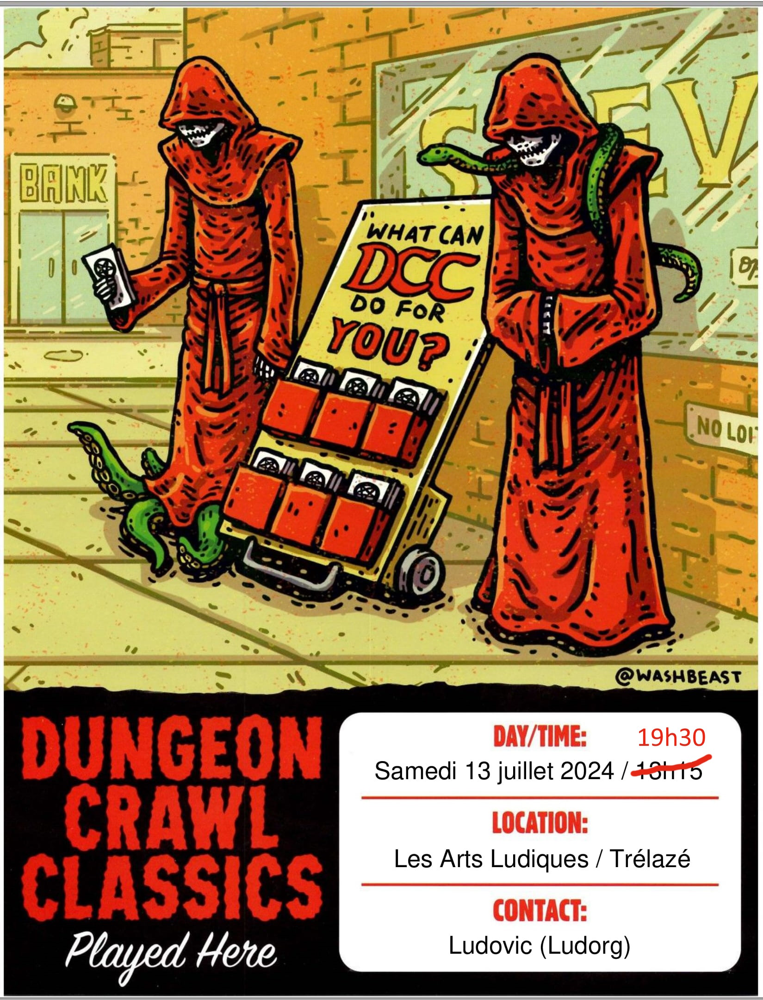

# DCC - Aventures aux Confins du Monde - Session 4

## Le Fléau des Rois Barbares - En route vers le village de Hirot

Trélazé, Les Arts Ludiques. 13 juillet 2024 ; 19h30/22h15.

Séance intermédiaire au cours de laquelle des personnages de niveau 0 sont passés niveau 1. Trois nouveaux personnages de niveau 0 ont rejoint le groupe : deux personnages générés aléatoirement avec le [0-Level Party Generator](https://purplesorcerer.com/create_party.php) et un troisième généré avec des [fiches à gratter](https://www.philibertnet.com/fr/dungeon-crawl-classics/122674-dungeon-crawl-classics-0-level-scratch-off-character-sheets-reprint-9781946231093.html?search_query=Scratch&results=7#img).

Cette session a été l'occasion de débuter le scénario "Le Fléau des Rois Barbares", prévu pour 6 à 12 personnages de niveau 1.

### Joueurs et Personnages

- Olivier
    - Houdini, Bandit, Escroc, Guerrier niveau 1 (village de Starthford)
    - Philippe, Témoin, Clerc Niveau 1 (village de Starthford)
    - Baldur, Nain, Niveau 1 (village de Starthford)

- Augustin
    - Selensus, Elfe niveau 1 (village de Pernland)
    - Rannok, Nain, éleveur niveau 1 (village de Pernland)
    - Edgar Adgar, Diseur de bonne aventure , [Classe à choisir] niveau 1, (village de Starthford)

- JS
    - Agilis Frae, Elfe Sage niveau 0 (village de Pernland)
    - Rusti Citas, Elfe Forestier niveau 0 (village de Pernland)
    - Dojohn, Fermier avec un mouton niveau 0 (rencontré entre Pernland et Hirot)

Les personnages dont le nom est ~~barré~~ n'ont pas survécu aux dangers de cette aventure.

### Préambule

au village Srathford

les trois vieux baroudeurs Pharnoc, Oggon et Oryx

d'une étrange fièvre subite

Pernland, le sage du village, après les funérailles du vieux Robert

### &Agrave; l'Aventure !

<!-- 
### Les héros tombés à l'Aventure

Voici les héros qui ne reviendront pas de ce périple et la cause de leur trépas :

-->
