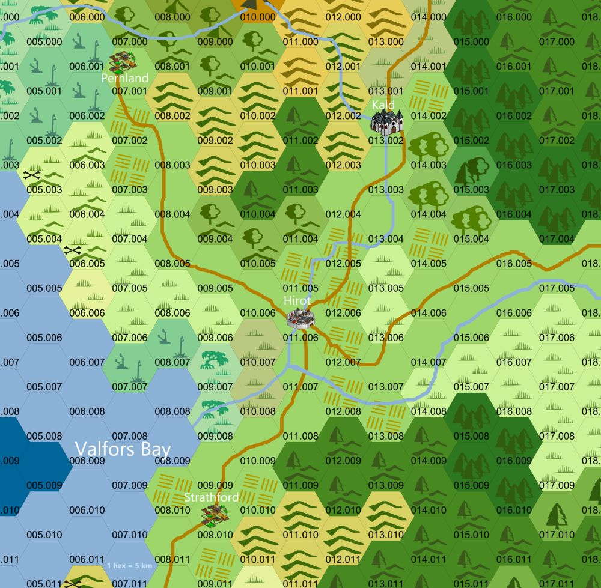

# DCC - Aventures aux Confins du Monde - Session 4

## Le Fléau des Rois Barbares - En route vers le village de Hirot

Trélazé, Les Arts Ludiques. 13 juillet 2024 ; 19h30/22h15.

Séance intermédiaire au cours de laquelle des personnages de niveau 0 sont passés niveau 1. Trois nouveaux personnages de niveau 0 ont rejoint le groupe : deux personnages générés aléatoirement avec le [0-Level Party Generator](https://purplesorcerer.com/create_party.php) et un troisième généré avec des [fiches à gratter](https://www.philibertnet.com/fr/dungeon-crawl-classics/122674-dungeon-crawl-classics-0-level-scratch-off-character-sheets-reprint-9781946231093.html?search_query=Scratch&results=7#img).

Cette session a été l'occasion de débuter le scénario "Le Fléau des Rois Barbares", prévu pour 6 à 12 personnages de niveau 1.

### Joueurs et Personnages

- Olivier
    - Houdini le Bandit, Escroc reconverti, Guerrier Niveau 1 (village de Starthford)
    - Philippe le Témoin, Clerc Niveau 1 (village de Starthford)
    - Baldur, Nain, Niveau 1 (village de Starthford)

- Augustin
    - Selensus, Elfe Niveau 1 (village de Pernland)
    - Rannok, Nain, Niveau 1 (village de Pernland)
    - Edgar Adgar, Diseur de bonne aventure, Mage Niveau 1, (village de Starthford)

- JS
    - Agilis Frae, Elfe Sage niveau 0 (village de Pernland)
    - Rusti Citas, Elfe Forestier niveau 0 (village de Pernland)
    - Dojohn, Fermier niveau 0 et son mouton (rencontré entre Pernland et Hirot)

Les personnages dont le nom est ~~barré~~ n'ont pas survécu aux dangers de cette aventure.

### Préambule

De retour au village de Pernland, après avoir affronté les périls du [Portail sous les &Eacute;toiles](dcc_lal_2024_05_11), les aventuriers en herbe sont allés monter leurs trouvailles à Anector le sage du village. Ne sachant que faire du globe de cristal, du sceptre et du brasero de cuivre trouvés dans la tombe du mage de guerre primitif, Anector leur a conseillé d'aller voir Draupnir le magicien, qui vit dans une tour non loin du village de Hirot.

Au village de Srathford, les aventuriers du second groupe, partis à l'assaut de la Forteresse du Chaos, ont pû s'en échapper in extremis avant son effondrement. Propulsés par une vague géante de la [Mer sans &Eacute;toiles](dcc_lal_2024_06_01), ils se sont retrouvés inconscients sur une plage à l'Ouest du village et ont pu rentrer à Srathford après une grosse journée de marche.

Quant aux novices du premier groupe, ceux frappés d'une fièvre subite (contractée après avoir fouillé [l'antre des hommes bêtes de la forteresse en ruines](dcc_lal_2024_05_18)), ils se sont tous remis après quelques jours de repos.

Les trois vieux vétérans de Srathford, Pharnoc, Oggon et Oryx ont conseillé aux jeunes aventuriers de se rendre à Hirot pour en savoir plus sur les objets magiques découverts dans les ruines de la forteresse du Chaos. Ils leur ont recommandé de consulter Draupnir, le magicien, un de leurs anciens compagnons d’aventures.

Pendant ce court moment de répit, Oggon l’Ancien, prêtre d’Amun Tor, a profité de l’occasion pour enseigner à Philippe les rituels sacrés de ce culte.

Quant à Edgar Adgar, le Diseur de bonne aventure du village, il espère que Draupnir puisse lui apprendre les rudiments des arts hermétiques.

### &Agrave; l'Aventure !

<!-- 
### Les héros tombés à l'Aventure

Voici les héros qui ne reviendront pas de ce périple et la cause de leur trépas :

-->
