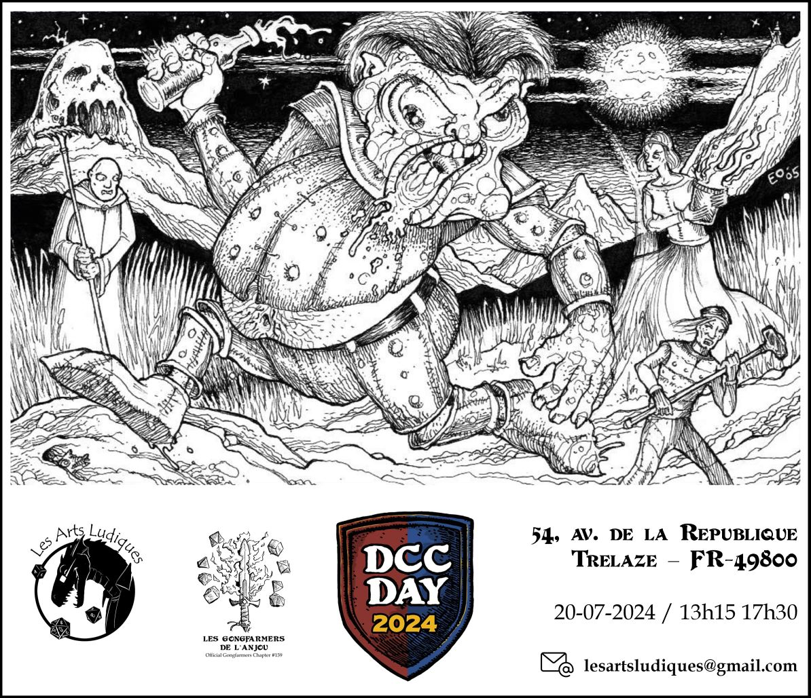

# DCC - Aventures aux Confins du Monde - Session 5 - DCC Day 2024

## Dungeon Crawl Classics #0 – Les légendes ne naissent pas (Legends are made not born)

Trélazé, Les Arts Ludiques. 20 juillet 2024 ; 13h30/17h30.

Petit interlude à l'occasion du [DCC Day 2024](https://goodman-games.com/blog/category/dcc-day/) avec un entonnoir (funnel) basé sur le module Dungeon Crawl Classics numéro 0 "Legends are made not born". Cet ancien module, sorti en 2005 (et donc avant DCC RPG), permettait de jouer des personnages de niveau 0 avec les règles D&D 3.5. Il a été adapté pour DCC RPG par mes soins.

Pour cette partie, chaque joueur avait deux personnages de niveau 0. Un premier généré aléatoirement avec le [0-Level Party Generator](https://purplesorcerer.com/create_party.php) et un deuxième créé avec des [fiches à gratter](https://www.philibertnet.com/fr/dungeon-crawl-classics/122674-dungeon-crawl-classics-0-level-scratch-off-character-sheets-reprint-9781946231093.html?search_query=Scratch&results=7#img).

### Joueurs et Personnages

- Enzo
    - Maxwell, Meunier et Boulanger
    - ~~Sancho, Dresseur de d'animaux, accompagné de Sam son Poney~~
    
- Grégoire
    - Karen, Nain, Fabricant de coffre
    - ~~Komtuveux le Nain, &Eacute;leveur de porcs, accompagné de Xorex sa truie~~
    
- Akami
    - ~~Esmée, Diseuse de bonne aventure~~
    - Maria, Soigneuse
    
- Anna
    - Luc, Soldat
    - Vérone, Halfelin, Gantière
    
- Romain
    - ~~Ginette, Cordière (Fabricante de cordes)~~
    - Leroux, Astrologue
    
- Ludo
    - Jean-Bernard , Halfelin, Teinturier
    - ~~Qicjote, Brigand~~

Les personnages dont le nom est ~~barré~~ n'ont pas survécu aux périls de cette aventure.

### Préambule

Au village de Dundraville, depuis quelques années, un ogre exige un tribut mensuel des habitants. Tant que les demandes concernaient de la bière, des moutons et des fournitures banales occasionnelles, le petit village s'est conformé à ces demandes. L'ogre se contentait de récupérer les biens extorqués et de quitter la ville tranquillement. 

Cependant, le mois dernier, ses doléances ont changé. En plus de la bière et des moutons, l'ogre exigea de l'or et des matériaux de construction ! Mais la situation est devenue encore plus sombre. L'ogre est revenu hier avec encore plus de demandes de bière et pire encore : des villageois ! 

Le village était en émoi et refusa la demande de l'ogre. La brute s'est mise en colère et a attrapé deux citadins et les a ramenés dans son antre. Ils sont destinés à son gosier, sans aucun doute ! 

Au milieu de toute cette agitation, de courageux habitants ont juré d'affronter l'ogre et de le traduire en justice. Avec l'aide des druides locaux et du brasseur de la ville, le dernier lot de bière que l'ogre a pris a été mélangé à un poison léger pour aider à neutraliser la brute. Il est maintenant temps pour les héros courageux d'achever leur exploit.

### &Agrave; l'Aventure !

#### Skulltop Hillock, l'antre de l'ogre

Après deux heures de marche, peu avant la tombée de la nuit, la troupe arrive à proximité de Skulltop Hillock, l'antre de l'ogre. C'est une grande colline patinée par les intempéries, dont le sommet a la forme d'un crâne humanoïde, avec des creux pour les orbites oculaires et une gueule béante et rugueuse. 

L'entrée de la grotte est cependant bloquée par un gros rocher de pierre qui a été poussé devant. Les aventuriers en herbe décident alors d'escalader le rocher et d'entrer dans le repaire de l'ogre par la cheminée qui débouche dans une des orbites du rocher en forme de crâne. La deuxième cavité est occupée par un vautour qui y a fait son nid. Il attaque la première personne du groupe arrivée en haut (Ginette la Cordière) qui chute et meurt les os brisés. Les autres arrivent à se débarrasser du rapace qui défend sa couvée.

Le conduit de cheminée mène au repaire de Blogg, le terrible ogre qui terrorise Dundraville. Il mesure près de trois mètres de haut et porte une armure de cuir cloutée craquelée. Son visage est incrusté de verrues et ses cheveux sont ébouriffés et hirsutes. Une massue massive repose contre le mur voisin. 

L'ogre est affalé sur la table, le visage enfoui dans un plat de mouton. Sous sa main se trouve un flacon en étain vide. Blogg est ivre et sous l'emprise du poison qui a été mis dans les tonneaux de bières. Même s'il est amoindri, il se bat au mieux de ses capacités et affronte les héros jusqu'à sa mort.

La fureur du combat passée, les aventuriers comptent les leurs. L'ogre n'a pas été si difficile à vaincre, mais certains d'entre eux sont morts d'une chute dans la cheminée en voulant rejoindre prestement le combat contre Blogg.

L'exploration de la grotte débute. Après avoir évité le chien-loup qui garde les lieux, les novices tombent sur Gurt, le larbin hobgobelin de Blogg. Il a la charge de la cuisine, du ménage, de la garde du troupeau de moutons et d'autres tâches désagréables. Celui-ci leur indique l'existence du passage secret qui mène au niveau inférieur des lieux. 

#### Sous la grotte de l'ogre

Après avoir évité différents pièges, les apprentis explorateurs débouchent dans une pièce qui sert de laboratoire d'alchimie à un magicien. Un établi est recouvert de béchers, de flacons et de verrerie assortie. Une table est encombrée de plusieurs livres ouverts. 
Un des livres est le journal de Suto, le magicien qui vit en ces lieux. 

&Agrave; sa lecture, les aventuriers apprennent que Suto est allié à une entité qu'il nomme "La Voix d'en Dessous". Suto souhaite poursuivre le travail de son père, Erasmus, en localisant le Codex Ilyium. Il envisage d'invoquer un démon nommé Frogroth pour l'aider à localiser ce Codex. Suto a acheté un parchemin nécessaire pour invoquer Frogroth, en utilisant l'or de Dundraville. La dernière entrée du journal, datée de la veille, révèle qu'une fois que Suto aura fini d'incruster son cercle magique d'argent, il sera prêt à utiliser le parchemin.

Au cours des fouilles du laboratoire, les héros découvrent également un balai animé, qui les attaque ! Ces coups, conjugués à la maladresse de Karen, seront fatals à Qicjote le Brigand.

Un peu plus loin, dans la salle d'invocation, les baroudeurs en herbe rencontrent Suto qui parachève son rituel. Le centre du sol est dominé par un pentagramme sculpté dans le sol. Presque tout le symbole gravé est rempli d'argent. À l'extrémité de la pièce, le mur a été sculpté à l'image d'une tête démoniaque hideuse ressemblant à une grenouille avec une large gueule. La moitié inférieure de la bouche forme un petit autel dédié au démon Frogroth. Un large trou est situé sur le sol devant l'autel. C'est d'ici que provient la "Voix d'en Dessous", qui est en fait, celle de Quast, un quasit manipulateur qui utilise Suto pour atteindre son objectif de rappeler Frogroth sur le plan matériel primaire.

Après avoir défait Suto, et fait fuir Quast, les héros découvrent une dernière pièce proche de l'atelier. Elle contient huit cages en bois qu'un nain, hypnotisé et charmé par Suto, est en train de construire. Deux des cages sont occupées par les villageois enlevés par l'ogre. 

#### Retour à Dundraville

Ce qui a commencé comme une simple quête visant à vaincre un ogre extorquant le village de Dundraville a révélé un sinistre complot en préparation. Avec la défaite de Suto et de son allié diabolique, Dundraville est à nouveau à l'abri de déprédations inconnues. De simples citoyens ont fait leurs premiers pas pour devenir des légendes...

### Les héros tombés à l'Aventure

Voici les héros qui ne reviendront pas de ce périple et la cause de leur trépas :

- Sancho le Dresseur de d'animaux, chute
- Komtuveux le Nain éleveur de porcs, chute
- Esmée la Diseuse de bonne aventure, chute
- Ginette la Cordière, chute
- Qicjote le Brigand, tué par un balai animé et la maladresse de Karen