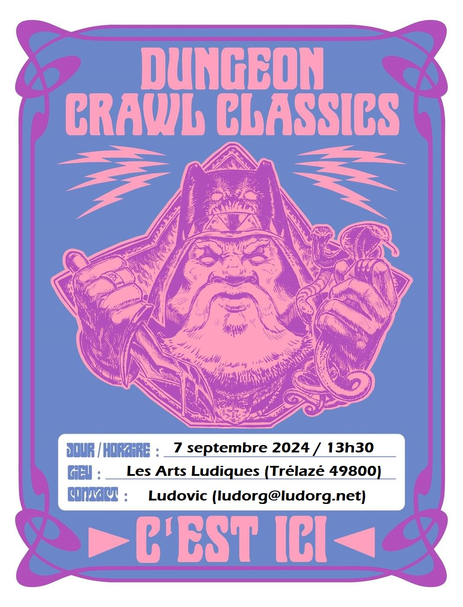
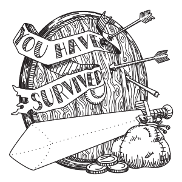
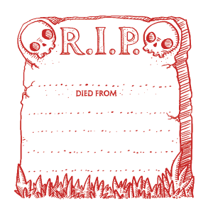

# DCC - Aventures aux Confins du Monde - Session 4

## Le Fléau des Rois Barbares - Au village de Hirot

Trélazé, Les Arts Ludiques. 07 septembre 2024 ; 13h30/17h30.

Nouvelle séance intermédiaire de passage au niveau 1 pour des personnages ayant survécu à un entonnoir. Deux nouveaux personnages de niveau 0 ont rejoint le groupe.

Cette session a été l'occasion de poursuivre le scénario "Le Fléau des Rois Barbares", prévu pour 6 à 12 personnages de niveau 1.

### Joueurs et Personnages

- Olivier
    - Houdini le Bandit, Guerrier
    - Philippe le Témoin, Clerc de de Amun Tor

- Akami
    - Maria l'Acolyte, Clerc de Justicia en provenance du village de Dundraville
  
- Enzo
    - Tyrus Valen l'Astrologue, Alchimiste au village de Pernland, devenu Magicien
    - Maxwell le Mendiant, Meunier et Boulanger à Dundraville devenu ~~Voleur~~ Marchand de farine et de mulet

- Clémence
    - Ningorus, Apprenti Sorcier originaire de Dundraville
    - Samuel, Cordonnier du village de Hirot

<!-- Les personnages dont le nom est ~~barré~~ n'ont pas survécu aux dangers de cette aventure. -->

### Préambule

<!-- 

(village de Dundraville)
village de Starthford
 (village de Dundraville)
 (village de Pernland)

De retour au village de Pernland, après avoir affronté les périls du [Portail sous les &Eacute;toiles](dcc_lal_2024_05_11), les aventuriers en herbe sont allés monter leurs trouvailles à Anector le sage du village. Ne sachant que faire du globe de cristal, du sceptre et du brasero de cuivre trouvés dans la tombe du mage de guerre primitif, Anector leur a conseillé d'aller voir Draupnir le magicien, qui vit dans une tour non loin du village de Hirot.

Au village de Srathford, les aventuriers du second groupe, partis à l'assaut de la Forteresse du Chaos, ont pu s'en échapper in extremis avant son effondrement. Propulsés par une vague géante de la [Mer sans &Eacute;toiles](dcc_lal_2024_06_01), ils se sont retrouvés inconscients sur une plage à l'Ouest du village et ont pu rentrer à Srathford après une grosse journée de marche.

Quant aux novices du premier groupe, ceux frappés d'une fièvre subite (contractée après avoir fouillé [l'antre des hommes bêtes de la forteresse en ruines](dcc_lal_2024_05_18)), ils se sont tous remis après quelques jours de repos.

Les trois vieux vétérans de Srathford, Pharnoc, Oggon et Oryx ont conseillé aux jeunes aventuriers de se rendre à Hirot pour en savoir plus sur les objets magiques découverts dans les ruines de la forteresse du Chaos. Ils leur ont recommandé de consulter Draupnir, le magicien, un de leurs anciens compagnons d’aventures.

Pendant ce court moment de répit, Oggon l’Ancien, prêtre d’Amun Tor, a profité de l’occasion pour enseigner à Philippe les rituels sacrés de ce culte.

Quant à Edgar Adgar, le Diseur de bonne aventure du village, il espère que Draupnir puisse lui apprendre les rudiments des arts hermétiques.

-->

### &Agrave; l'Aventure !

<!--
Après deux jours de marche, au crépuscule, les groupes venant de Pernland et de Srathford se sont rencontrés par hasard à la croisée des chemins menant à Hirot. 

Alors qu’ils approchaient du village, une étrange et sinistre procession a croisé leur route. Des villageois, suivis de cavaliers en armure et peaux de loup, montés sur des chevaux de guerre, escortaient une jeune fille bâillonnée et ligotée vers un autel en pierres dressées à l’extérieur du village. Elle était destinée à être sacrifiée pour apaiser un molosse démoniaque qui terrorise la population par ses attaques fréquentes. 

Après quelques discussions avec les villageois, les aventuriers les ont laissé préparer ce funeste rituel. Quand la procession s'en est repartie vers Hirot, ils se sont mis en embuscade en attendant l'infâme bête ! Lorsque celle-ci fit son apparition, un combat a priori inégal débuta. Il tourna pourtant à la faveur des apprentis héros. Quand le coup fatal fût porté au monstre, son corps a disparu dans une brume noir épaisse. 

Le molosse vaincu, les aventuriers ont libéré la jeune femme, Morgane, fille de Brogan Haverson le tenancier de l'auberge "La Lance Tue-Loup".

-->

<!-- 
### Les héros tombés à l'Aventure

Voici les héros qui ne reviendront pas de ce périple et la cause de leur trépas :

-->
