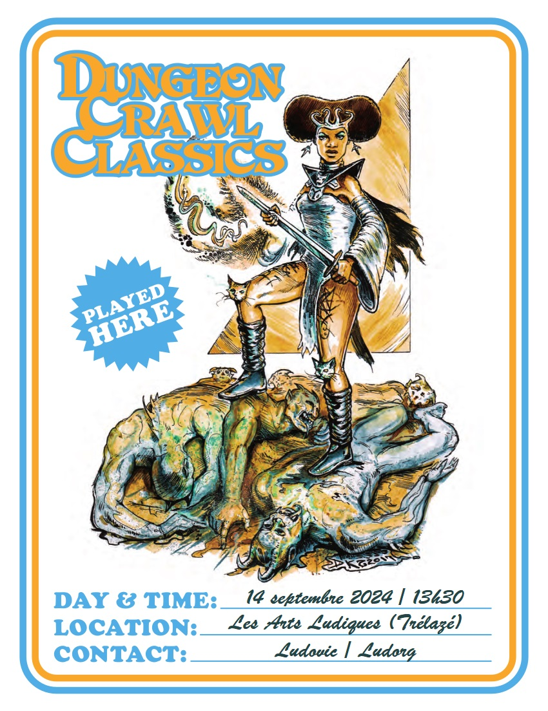

# DCC - Aventures aux Confins du Monde - Session 7

## Le Fléau des Rois Barbares - Dans la tombe de l'Ulfheonar ; La fin du Molosse

Trélazé, Les Arts Ludiques. 14 septembre 2024 ; 13h30/17h30.

Nouvelle séance de passage au niveau 1 pour des personnages ayant survécu à un entonnoir. Deux nouveaux personnages de niveau 0 ont rejoint ce [large groupe d'aventuriers](./dcc_lal_persos). Cette session a été l'occasion de poursuivre le scénario "Le Fléau des Rois Barbares", [débuté en Juillet](./dcc_lal_2024_07_13) et [poursuivi en septembre](./dcc_lal_2024_09_07).

### Joueurs et Personnages

- Laura
    - Cushara, Guerrière du village de Strathford

- Augustin
    - Rannok, Nain
    
- Hervé
    - Sylas, Elfe en provenance du village de Pernland
    
- Grégoire
    - Vallardine, Magicienne, originaire de Strathford
    
- Nicolas
    - Billy, Barbier, originaire de Hirot
    - Bigy, Halfelin vagabond, originaire de Hirot

<!-- Les personnages dont le nom est ~~barré~~ n'ont pas survécu aux dangers de cette aventure. -->

### Préambule

Les aventuriers de Pernland, Starthford et Dundraville, réunis par le hasard à Hirot pour affaires avec le mage Draupnir, ont découvert un village terrorisé par un [Molosse ressurgi des temps anciens](./dcc_lal_2024_09_07).

À l'auberge "La Lance Tue-Loup", ils ont appris que ce petit bourg avait déjà été attaqué par ce loup maléfique dans des temps anciens. Un seigneur de guerre, surnommé le Tueur de Loups, possédait une lance magique et un bouclier qui lui permettaient de vaincre la bête. Sa tombe se trouve au nord.

Grâce à Ymae, une vieille connaissance de Draupnir, ils ont également appris que le molosse devait être immobilisé avant de recevoir le coup fatal.

Guidés par Samuel et Billy du village de Hirot, et suivis de loin par Bigy, un Halfelin vagabond, les apprentis héros se sont mis en quête de la lance magique dans le tombeau de l'Ulfheonar.

Une grande pierre circulaire bloquait l'entrée du tombeau, obligeant la troupe à passer par une fissure étroite sur le côté du tumulus. À l'intérieur, après avoir évité une fosse remplie de lances, ils ont dû affronter deux goules en embuscade dans une des tombes.

### &Agrave; l'Aventure !

#### Dans la tombe de l'Ulfheonar 

Après un court repos à l'extérieur du tombeau de l'Ulfheonar, les aventuriers reprennent son exploration. Dans la tombe de l'Ours, sous une lourde dalle de l'autel, ils trouvent une cape en peau d'ours cousue avec un crâne à crocs qui fait office de heaume grossier.

Au bout du couloir, trois longues marches mènent à une grande pièce. Un examen attentif du lourd portail en pierre dans le fond révèle que celui-ci est en fait scellé dans la pierre. Il n'y a pas d'issue visible à cette pièce. 

Après une fouille méticuleuse et méthodique de l'endroit, un conduit caché est découvert au-dessus du linteau de pierre surmontant l'entrée. Celui-ci mène à une pièce piégée avec une fausse lance en bois. Une goule attaque Bigy partit explorer le conduit. Elle était cachée dans une cheminée menant à la véritable tombe de l'Ulfheonar où repose "La Lance Tue-Loup".

En fouillant sous les décombres de la première pièce, celle de l'entrée par la fissure, les aventuriers découvrent un coffre avec le bouclier magique de l'Ulfheonar.

#### La fin du Molosse

De retour au village de Hirot, les aventuriers, munis des attributs magiques du roi barbare surnommé le Tueur de Loups, grâce aux chaleureuses recommandations de Brogan l'aubergiste, empruntent quelques équipements auprès de Hael le forgeron.

La troupe se met en route dans les tourbières basses où se terre le Molosse.
Après quelques heures de marche et de recherches dans cet endroit sinistre, les novices débusquent l'antre de la bête. C'est une grotte souterraine où les eaux du marais tombent en cascade. Au centre de la grotte, une mare noire d'aspect inquiétant absorbe toute la lumière. 

La bête attaque les apprentis héros. Grandement aidés par la magie balbutiante, mais redoutablement efficace de Vallardine, ils la maitrisent rapidement et lui assène le coup fatal avec la Lance Tue-Loup, après avoir immobilisée la créature.

Le Molosse de Hirot est définitivement vaincu. Nul doute que cette victoire sera célébrée comme il se doit dans le Grand Hall du Jarl...

<!-- 
### Les héros tombés à l'Aventure

Voici les héros qui ne reviendront pas de ce périple et la cause de leur trépas :

-->
