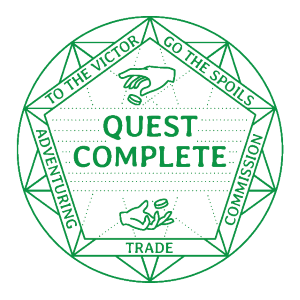
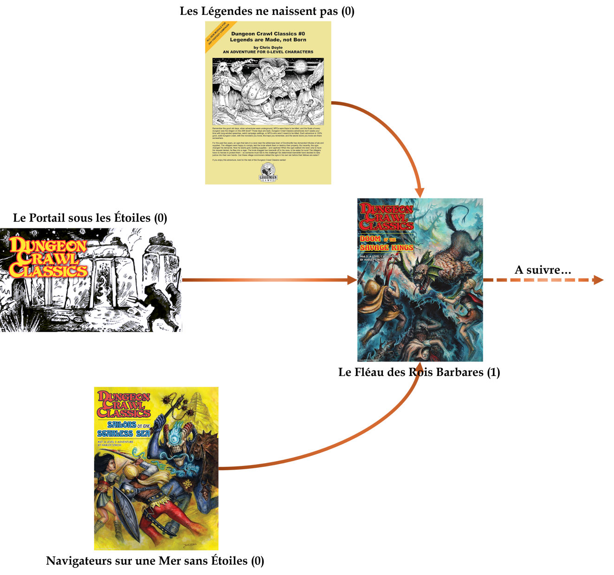

# DCC - Aventures aux Confins du Monde - Liste des personnages

## Héros en devenir

Les personnages qui ont survécu à un 'entonnoir' (funnel) gagnent 10 PX. Ils peuvent choisir une classe de niveau 1 (ceux dont le niveau est indiqué 0+ dans le tableau ci-dessous).

Les classes accessibles aux personnages humains sont Guerrier, Voleur, Magicien, Clerc. Les classes Nain, Elfe, et Halfelin, ne sont accessibles qu'aux personnages dont l'intitulé du métier de niveau 0 indique l'un de ces peuples.

Pour chacune des sessions, voici les points d'expérience (PX) gagnés pour chaque personnage joueur ayant pris part aux aventures.

| Session       | Titre                                            | PX      |
| ----          | ----                                             | ----    |
| 1 (funnel)    | Le Portail sous les Étoiles                      |      10 |
| 2, 3 (funnel) | Navigateurs sur une Mer sans Étoiles             |      10 |
| 4             | Le Fléau des Rois Barbares 1/3                   |       3 |
| 5 (funnel)    | Les Légendes ne naissent pas                     |      10 |
| 6             | Le Fléau des Rois Barbares 2/3                   |       6 |
| 7             | Le Fléau des Rois Barbares 3/3                   |      10 |

Le schéma ci-dessous représente le cheminement des aventures.

| Joueur | Personnage | Métier (niveau 0) | Village d'origine | Classe (niveau 1) | Niveau actuel | Session(s) jouée(s) | PX |
|----|----| ----| ----| ----| ----| ----| ---- |
| JDR | Willy | Alchimiste | Pernland | | 0+ | 1 | 10 |
| JDR | Pistil | Apiculteur | Pernland | | 0+ | 1 | 10 |
| JDR  | Ohoun | Bucheron | Pernland | | 0+ | 1 | 10 |
| Augustin | Rannok | Chevrier Nain | Pernland | Nain | 1 | 1, 4, 7 | 23 |
| Augustin | Salensus | Souffleur de Verre Elfe | Pernland | Elfe  | 1 | 1, 4 | 13 |
| Ludo | Arthur Lezimpaux | Hors la Loi | Pernland | | 0+ | 1 | 10 |
| Ludo | Jean Eude Padchance | Tonnelier | Pernland | | 0+ | 1 | 10 |
| Alex | Archibald | Hors la Loi | Pernland | | 0+ | 1 | 10 |
| Alex | Gaëtan | Ecuyer | Pernland | | 0+ | 1 | 10 |
| Enzo | Loden | Fermier, Cultivateur de panais | Pernland | | 0+ | 1 | 10 |
| Enzo | Tyrus Valen | Alchimiste | Pernland | Magicien | 1 | 1, 6 | 16 |
| Hervé| Tatamash | Mendiant de guilde | Pernland | | 0+ | 1 | 10 |
| Hervé | Silas | Avocat Elfe | Pernland | Elfe  | 0+ | 1, 7 | 20 |
| Nicolas | Rémi | Orphelin | Strathford | | 0+ | 2 | 10 |
| Nicolas | Gloire | Escroc | Strathford | | 0+ | 2 | 10 |
| Nicolas| Jymmi | Serrurier | Strathford | | 0+ | 2 | 10 |
| Olivier | Philippe | Fermier, Cultivateur de blé | Strathford | Clerc de Amun Tor| 1 | 2, 4, 6 | 19 |
| Olivier | Baldur | Mineur Nain | Strathford | Nain | 1 | 2, 4 | 13 |
| Olivier | Oudini | Escroc (Confidence artist) | Strathford | Guerrier | 1 | 2, 4, 6  | 19 |
| Valérie | Rogue | Marchand | Strathford | | 0+ | 2 | 10 |
| Valérie| Firiel | Mendiant de guilde | Strathford |  | 0+ | 2 | 10 |
| Valérie | Azazel | Forestier Elfe | Strathford | Elfe  | 0+ | 2 | 10 |
| Antoine | Tama | Charron | Strathford | | 0+ | 2 | 10 |
| Antoine | Gonkran | Vidangeur de Latrines (Gongfarmer) | Strathford | | 0+ | 2 | 10 |
| Antoine | Valadrielle | Cirier Elfe |  Strathford | Elfe  | 0+ | 2 | 10 |
| Théo | Naccal | Bucheron | Strathford | | 0+ | 2 | 10 |
| Théo | Harman | Marin Halfelin | Strathford | Halfelin | 0+ | 2 | 10 |
| Augustin | __Edgard Adgar__ | Diseur de bonne aventure | Strathford | __Magicien__ | 1 | 3, 4 | 13 |
| Augustin | Haledoc Tomson | Tenturier Halfelin | Strathford | Halfelin | 0+ | 3 | 10 |
| Augustin | Arnaud de Couroie | Mercenaire | Strathford | | 0+ | 3 | 10 |
| Claire | Gwym | Fermier, Cultivateur de radis | Strathford | | 0+ | 3 | 10 |
| Claire | Turlogh | Fermier, Cultivateur de blé | Strathford | | 0+ | 3 | 10 |
| Grégoire | Talu | Esclave | Strathford | | 0+ | 3 | 10 |
| Grégoire | Vallardine | Apprentie Magicienne | Strathford | Magicienne | 1 | 3, 7 | 20 |
| Grégoire | Zapranoth | Serviteur sous contrat | Strathford | | 0+ | 3 | 10 |
| Laura | Cushara | Soldat | Strathford | Guerrier | 1 | 3, 7 | 20 |
| Laura | Gazal | Usurier Halfelin | Strathford | Halfelin | 0+ | 3 | 10 |
| Rodica | Tara | Dresseur d'animaux | Strathford | | 0+ | 3 | 10 |
| Rodica | Sigur | Avocat Elfe | Strathford | Elfe | 0+ | 3 | 10 |
| Rodica | Zomara | Cordonnier | Strathford | | 0+ | 3 | 10 |
| JS | Agilis Frae | Sage Elfe | Pernland |  | 0 | 4 | 3 |
| JS | Rusti Citas | Forestier Elfe | Pernland |  | 0 | 4 | 3 |
| JS | Dojohn | Fermier avec un mouton | La Pampa entre Pernland et Hirot | | 0 | 4 | 3 |
| Enzo | Maxwell | Meunier et Boulanger | Dundraville | Voleur | 1 | 5, 6 | 16 |
| Grégoire | Karen | Fabricant de coffre Nain | Dundraville | Nain | 0+ | 5 | 10 |
| Akami | Maria | Soigneuse | Dundraville | Clerc de Justicia | 1 | 5, 6 | 16 |
| Anna | Luc | Soldat | Dundraville |  | 0+ | 5 | 10 |
| Anna | Vérone | Gantière Halfelin | Dundraville | Halfelin | 0+ | 5 | 10 |
| Romain | Leroux | Astrologue | Dundraville | | 0+ | 5 | 10 |
| Ludo | Jean-Bernard | Teinturier Halfelin | Dundraville | Halfelin | 0+ | 5 | 10 |
| Clémence | Ningorus | Apprenti Sorcier | Dundraville |  | 0 | 6 | 6 |
| Clémence | Samuel | Cordonnier | Hirot |  | 0 | 6 | 6 |
| Nicolas (Mogagreed) | Billy  | Barbier | Hirot | | 0+ | 7 | 10 |
| Nicolas (Mogagreed) | Bigy | Vagabond Halfelin | Hirot  | Halfelin  | 0+ | 7 | 10 |

## Tombés à l'Aventure

Ces personnages sont tombés lors d'une aventure. Paix à leurs âmes !

| Joueur | Personnage | Niveau | Session(s) jouée(s)
| ---- | ---- | ---- | ---- |
| Augustin | Skofloc, Vagabond Halfelin | 0 | 1 |
| Ludo | Niels, Souffleur de Verre Elfe | 0 | 1 |
| Alex | Alphonse, Bucheron | 0 | 1 |
| Enzo | Lars Peck, Chasseur | 0 | 1 |
| Hervé | Palarion, Serrurier | 0 | 1 |
| Hervé | Chomleck, Galopin | 0 | 1 |
| Théo | Nartos, Coupeur de bourses | 0 | 2 |
| Claire | Veezi, Sage Elfe | 0 | 3 |
| Laura | Tewk, Halefin gantier | 0 | 3 |
| Enzo | Sancho, Dresseur de d'animaux | 0 | 5 |
| Grégoire | Komtuveux, &Eacute;leveur de porcs Nain | 0 | 5 |
| Akami | Esmée, Diseuse de bonne aventure | 0 | 5 |
| Romain | Ginette, Cordière | 0 | 5 |
| Ludo |Qicjote, Brigand | 0 | 5 |
