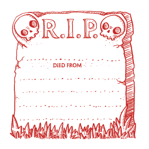

# DCC - Aventures aux Confins du Monde - Liste des personnages

## Héros en devenir

Ces personnages ont survécu à un 'entonnoir' et gagnent 10 PX. Ils vont pouvoir choisir une classe de niveau 1. Les classes accessibles sont Guerrier, Voleur, Magicien, Clerc. Les classes Nain, Elfe, et Halfelin, ne sont accesibles qu'aux personnages dont le métier du niveau 0 indique l'un de ces peuples.

| Joueur | Personnage | Métier (niveau 0) | Classe (niveau 1) |
|----|----| ----| ----|
| JDR | Willy | Alchimiste | |
| JDR | Pistil | Apiculteur | |
| JDR  | Ohoun | Bucheron | |
| Augustin | Rannok | Chevrier Nain | Nain |
| Augustin | Salensus | Souffleur de Verre Elfe | Elfe  |
| Ludo | Arthur Lezimpaux | Hors la Loi | |
| Ludo | Jean Eude Padchance | Tonnelier | |
| Alex | Archibald | Hors la Loi | |
| Alex | Gaëtan | Ecuyer | |
| Enzo | Loden | Fermier, Cultivateur de panais | |
| Enzo | Tyrus Valen | Alchimiste | |
| Hervé| Tatamash | Mendiant de guilde | |
| Hervé | Silas | Avocat Elfe | Elfe  |
| Nicolas | Rémi | Orphelin | |
| Nicolas | Gloire | Escroc | |
| Nicolas| Jymmi | Serrurier | |
| Olivier | Philippe | Fermier, Cultivateur de blé | |
| Olivier | Baldur | Mineur Nain | Nain |
| Olivier | Oudini | Escroc (Confidence artist) | |
| Valérie | Rogue | Marchand | |
| Valérie| Firiel | Mendiant de guilde | |
| Valérie | Azazel | Forestier Elfe | Elfe  |
| Antoine | Tama | Charron | |
| Antoine | Gonkran | Vidangeur de Latrines (Gongfarmer) | |
| Antoine | Valadrielle | Cirier Elfe | Elfe  |
| Théo | Naccal | Bucheron | |
| Théo | Harman | Marin Halfelin | Halfelin |
| Augustin | Edgard Adgar | Diseur de bonne aventure | |
| Augustin | Haledoc Tomson | Tenturier Halfelin | Halfelin |
| Augustin | Arnaud de Couroie | Mercenaire | |
| Claire | Gwym | Fermier, Cultivateur de radis | |
| Claire | Turlogh | Fermier, Cultivateur de blé | |
| Grégoire | Talu | Esclave | |
| Grégoire | Valardyn | Apprentie Magicienne | |
| Grégoire | Zapranoth | Serviteur sous contrat | |
| Laura | Cushara | Soldat | |
| Laura | Gazal | Usurier Halfelin | Halfelin |
| Rodica | Tara | Dresseur d'animaux | |
| Rodica | Sigur | Avocat Elfe | Elfe  |
| Rodica | Zomara | Cordonnier | |

## Tombés à l'Aventure

Ces personnages sont tombés lors d'une aventure. Paix à leurs âmes !

| Joueur | Personnage |
| ---- | ---- |
| Claire | Veezi, Sage Elfe |
| Laura | Tewk, Halefin gantier |
| Augustin | Skofloc, Vagabond Halfelin |
| Ludo | Niels, Souffleur de Verre Elfe |
| Alex | Alphonse, Bucheron |
| Enzo | Lars Peck, Chasseur |
| Hervé | Palarion, Serrurier |
| Hervé | Chomleck, Galopin |
| Théo | Nartos, Coupeur de bourses |
