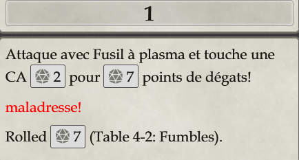
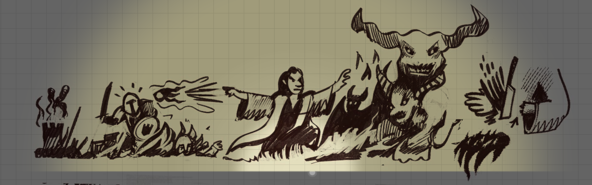

# l’Hypercube de Myt

Vendredi 13 décembre 2024 - Discord + Foundry

## Les joueurs

- Juge Tantan

- Augustin
- Darth
- Emmuelka
- Thibault
- Thomas
- Ludorg

## Les personnages

Entre parenthèses, le score des joueurs.

- Dorun le nain mineur (5)
- Chicahua le shaman (5)
- Jildreya la teinturière halfeline (5)

### Les personnages qui ont péri

- Indi le pilleur de tombe (1)
- Poutra la Soldate (0)
- Rubuld le scribe (4)
- Firène l'Elfe Forestier (1)

### Les backups survivants

- Poppeur le Coiffeur (4)

### Les backups morts

- Firène l'Elfe Forestier (1)

## Préambule

Chaque année, lors de l'équinoxe de printemps, l'entrée sud du cube se déverrouille du coucher du soleil jusqu'au prochain lever. Ce phénomène est l'occasion de célébrer le Festival du Veau Gras. Aidés par une grande quantité de bières, avec d'autres courageux camarades, nous sommes partis explorer les mystères de cet hypercube....

## Dans l'Hypercube

### l'entrée

Au-dessus de l'entrée, une inscription indique "Quiconque peut être digne, peut devenir moi."

- Porte du cube, Lianes sur les pierres du mur
- Des Brume multicolores
- Mur flexible

Dans le couloir, deux kobolds. Ce sont des adorateurs du Dieu de la paix Ulech. Certains d'entre nous font vœu de paix.

### les premières deux portes

Deux portes avec une bouche remplie de crocs métalliques en guise de poignée.

Un polype sort le long du mur.

On progresse en évitant prudemment le polype.

### le combat contre le soldat du futur

Un peu plus loin, des voix. C'est un soldat avec un fusil. Il parle à un certain "Sarge" et porte un fusil à plasma dont il n'hésite pas à se servir.

Poutra le charge, mais elle tombe sous un coup de sa crosse.

On immobilise le soldat avec le sac de la teinturière hobbite. Il prétend être notre descendant d'un futur lointain. L'un de nous récupère son fusil. Les soldats sont prisonniers dans ce couloir sans fin depuis au moins deux semaines et errent à la recherche de la sortie.

### les plateformes et les images miroirs

Indi récupère un des bras de Poutra et le "donne" à la bouche de la porte.
La porte s'ouvre et un portail blanc apparait.
Prudemment, nous nous penchons et nous nous retrouvons tous téléportés instantanément.
On se retrouve dans une pièce étrange avec des couloirs scintillants.

Indi regarde une des lumières scintillantes qui sortent d'une boule miroir qui flotte. Deux images miroirs de Indi apparaissent sur une des plateformes.
Elles imitent les gestes du vrai Indi.

Rubuld le scribe, lui jette de l'encre dessus pour reconnaitre le véritable Indi. Dans le combat contre les miroirs de Indi, Indi (le vrai) tombe.

On avance vers le dais et une petite fille qui semble être sortie des années 70 (Jane Johnson).

### sur le dais de l'autel

En fermant les yeux on arrive à accéder au dais. Sur l'autel, un masque. La halfeline essaie de le mettre et elle se sent mal et est affaiblie.

Poppeur le Coiffeur essaie de tirer sur le masque, mais son coup rate (a priori) et c'est Jane Johnson qui prend le tir et elle tombe dans le vide...

Jildreya tente de reprendre le masque et réussit cette fois à établir un contact avec un allié puissant qui lui confère un sort en retour.

### dans la crypte de Mytus

Un elfe qui est une de nos anciennes connaissances apparait... C'est Firène.

Dans la pièce, un papillon mécanique. Des bougies représentant des aventuriers. Une statue à l'effigie du mage Mytus. Une potion scellée dans une alcôve.

Le papillon se transforme en Chupacabra.

Du nez de Mytus, deux aventuriers prennent forme quand les bougies tombent au sol. Le Chupacabra finit par tomber sous nos coups, mais les portes ne s'ouvrent pas.

Sur la fiole, une étiquette mentionnant une interdiction aux démons de la consommer...

Dans la narine bouchée de Mytus, en fouillant avec la perche de l'elfe, on découvre une main démoniaque.

L'elfe nous propose de sacrifier sa main. Le shaman réussit habilement à la découper et à la remplacer par celle du démon. Les portes s'ouvrent.

### le conservateur

Dans une pièce carrée avec des cuves dans les coins, une grande figure entoilée, c'est le Conservateur. Sa forme est humaine, mais sa tête est composée d'une petite sphère divisée en deux par un triangle. Il nous annonce récolter des données et les analyse pour Mytus le Fou.

Grâce à ses pouvoirs dans les quatres dimensions, le conservateur nous repousse vers les cuves et des chimères en sortent. Jildreya la halfeline avait auparavant lancé un sort pour piéger ces cuves. Ils seront fatals à certaines chimères, ainsi qu'à certains d'entre nous, dont Rubuld...

