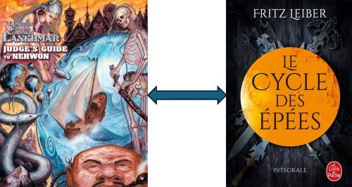

# DCC Lankhmar: A bibliography of Nehwon sources for the french translation "Le cycle des Epées"

This table maps the "Fafhrd and Gray
Mouser fiction list" from "A bibliography of Nehwon sources", in "DCC Lankhmar - Judge's Guide to Nehwon", to its equivalent in the french translation "Le cycle des Epées".

| # | Original title | Title in "Le cycle des Epées" | Volume in "Le cycle des Epées" |
| ---- | ------- | -------- | -------- |
1 | The Jewels in the Forest (1939, as "Two Sought Adventure") | Les Joyaux dans la forêt (The Jewels in the Forest) (1939) | Épées et Mort (Swords Against Death)    | 
2 | The Bleak Shore (1940) | Le Rivage désolé (The Bleak Shore) (1940) | Épées et Mort (Swords Against Death)    | 
3 | The Howling Tower (1941) | La Tour qui hurle (The Howling Tower) (1941) | Épées et Mort (Swords Against Death)    | 
4 | The Sunken Land (1942) | L'Île naufragée (The Sunken Land) (1942) | Épées et Mort (Swords Against Death)    | 
5 | Thieves' House (1943) | La Maison des voleurs (Thieves' House) (1943) | Épées et Mort (Swords Against Death)    | 
6 | Gray Mouser: 1 (1944) | (1) |  | 
7 | Gray Mouser: 2 (1944) | (1) |  | 
8 | Adept's Gambit (1947) | Le Gambit de l'initié (Adept's Gambit) (1947) | Épées et Brumes (Swords in the Mist) | 
9 | "Claws from the Night (1951, as ""Dark Vengeance"")" | Les Serres de la nuit (Claws from the Night) (1951) | Épées et Mort (Swords Against Death)    | 
10 | The Seven Black Priests (1953) | Les Sept Prêtres noirs (The Seven Black Priests) (1953) | Épées et Mort (Swords Against Death)    | 
11 | Induction (1957) | Invitation au voyage (Induction) (1957) | Épées et Démons (Swords and Deviltry) | 
12 | Lean Times in Lankhmar (1959) | Des Temps difficiles à Lankhmar (Lean Times in Lankhmar) (1959) | Épées et Brumes (Swords in the Mist) | 
13 | When the Sea-King's Away (1960) | Quand le roi de la mer n'est pas là... (When the Sea-King's Away) (1960) | Épées et Brumes (Swords in the Mist) | 
14 | Scylla's Daughter (1961) | (2) |  | 
15 | The Unholy Grail (1962) | Le Graal hérétique (The Unholy Grail) (1962) | Épées et Démons (Swords and Deviltry) | 
16 | Bazaar of the Bizarre (1963) | Le Bazar du bizarre (Bazaar of the Bizarre) (1963) | Épées et Mort (Swords Against Death)    | 
17 | The Cloud of Hate (1963) | Le Nuage de haine (The Cloud of Hate) (1963) | Épées et Brumes (Swords in the Mist) | 
18 | The Lords of Quarmall (1964) | Les Seigneurs de Quarmall | Épées et Sorciers (Swords Against Wizardry)  | 
19 | Stardock (1965) | Le Quai des étoiles | Épées et Sorciers (Swords Against Wizardry)  | 
20 | The Swords of Lankhmar (1968) | Le Royaume de Lankhmar (The Swords of Lankhmar) | Le Royaume de Lankhmar (The Swords of Lankhmar) | 
21 | Their Mistress, the Sea (1968) | Homme libre, toujours tu chériras la mer... (Their Mistress, the Sea) (1968) | Épées et Brumes (Swords in the Mist) | 
22 | The Wrong Branch (1968) | Le Mauvais embranchement (The Wrong Branch) (1968) | Épées et Brumes (Swords in the Mist) | 
23 | In the Witch's Tent (1968) | Dans la tente de la sorcière | Épées et Sorciers (Swords Against Wizardry)  | 
24 | The Two Best Thieves in Lankhmar (1968) | Les Deux Voleurs de Lankhmar | Épées et Sorciers (Swords Against Wizardry)  | 
25 | The Circle Curse (1970) | L'Éternel retour (The Circle Curse) (1970) | Épées et Mort (Swords Against Death)    | 
26 | The Snow Women (1970) | Les Femmes des neiges (The Snow Women) (1970) | Épées et Démons (Swords and Deviltry) | 
27 | Ill Met in Lankhmar (1970) | Mauvaise rencontre à Lankhmar (Ill Met in Lankhmar) (1970) | Épées et Démons (Swords and Deviltry) | 
28 | The Price of Pain-Ease (1970) | Le Prix de l'oubli (The Price of Pain-Ease) (1970) | Épées et Mort (Swords Against Death)    | 
29 | The Sadness of the Executioner (1973) | La Tristesse du bourreau | La Magie des glaces (Swords and Ice Magic) | 
30 | Trapped in the Shadowland (1973) | Pris au piège de la terre de l'ombre | La Magie des glaces (Swords and Ice Magic) | 
31 | The Bait (1973) | L'Appât | La Magie des glaces (Swords and Ice Magic) | 
32 | Beauty and the Beasts (1974) | La Belle et les Bêtes | La Magie des glaces (Swords and Ice Magic) | 
33 | Under the Thumbs of the Gods (1975) | Sous la loi des dieux | La Magie des glaces (Swords and Ice Magic) | 
34 | Trapped in the Sea of Stars (1975) | Pris au piège de la mer des étoiles | La Magie des glaces (Swords and Ice Magic) | 
35 | The Frost Monstreme (1976) | Le Monstrème de glace | La Magie des glaces (Swords and Ice Magic) | 
36 | Rime Isle (1977) | L'Île de givre | La Magie des glaces (Swords and Ice Magic) | 
37 | Sea Magic (1977) | Magie de la mer | Le Crépuscule des épées (The Knight and Knave of Swords) | 
38 | The Mer She (1978) | Elle-de-mer | Le Crépuscule des épées (The Knight and Knave of Swords) | 
39 | The Childhood and Youth of the Gray Mouser (1978) | (3) |  | 
40 | The Curse of the Smalls and the Stars (1983) | La Malédiction des riens et des étoiles | Le Crépuscule des épées (The Knight and Knave of Swords) | 
41 | Slack Lankhmar Afternoon Featuring Hisvet (1988) | (4)  |  | 
42 | The Mouser Goes Below (1988) | (4) La Descente aux abîmes du Souricier | Le Crépuscule des épées (The Knight and Knave of Swords) |
43 | The Tale of the Grain Ships: A Fragment (1997) | (5) |  | 
44 | Swords Against the Shadowland (1998) | (6) |  | 

Notes on missing items (see "A bibliography of Nehwon sources") : 
1) “Gray Mouser: 1” and “Gray Mouser: 2” are each short poems. They can be found in Ill Met in Lankhmar (White Wolf Publishing, 1995)
1)  Began as “The Tale of the Grain Ships” in 1936, but the story became the prototype for “Scylla’s Daughter” and later The Swords of Lankhmar.
1)  “The Childhood and Youth of the Gray Mouser” was written by Leiber’s long-time friend and co-creator of Fafhrd and the Gray Mouser, Harry Otto Fischer. It was published in The Dragon #18.
1)  These two stories were combined into one when published in The Knight and Knave of Swords (1988).
1)  The story became the prototype for “Scylla’s Daughter” and later The Swords of Lankhmar.
1)  Swords Against the Shadowland was written by Robin Wayne Bailey and was authorized by Leiber.

This table can also be found in [this Excel file](./assets/leiber-books-novels.xlsx)