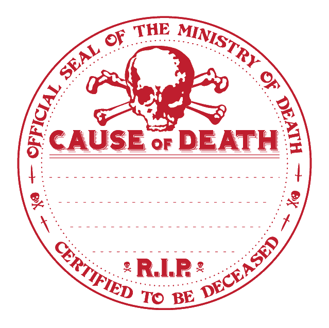

# DCC - Le Portail sous les &Eacute;toiles

Vendredi 14/03/2025 ; 20h30-00h00 ; Les Conjurés du Temporel

Session de découverte de DCC avec le 'funnel' (entonnoir) "Le Portail sous les &Eacute;toiles", proposé dans le livre de règles.

## Synopsis

Ce ne sont pas des aventuriers, juste des gens ordinaires portés par un rêve commun : échapper à leur quotidien pour embrasser une vie d'aventures, de gloire et de richesses.

 Cette nuit, un mystérieux portail doit s'ouvrir près de Pernland, leur village. Les risques sont grands, mais ils sont déterminés à saisir cette chance unique et à plonger dans l'inconnu, espérant découvrir les trésors cachés de l'autre côté. 
 
 L'Étoile Vide s'est de nouveau levée. Ces courageux habitants de Pernland, désireux de devenir autre chose que de simples paysans, ont décidé de saisir leur chance. Leur troupe bigarrée est partie explorer les mystères du tombeau caché au-delà de ce portail.

## Joueurs et Personnages

- Thomas 
    - Jeanne Castor : Bouchère du village (RIP)
    - Notirimibus : Usurier Halfelin
    - Debilius le Sage : Diseur de bonne aventure
    - Masquina : Ménestrel
- Lucas 
    - Theodorom : Marchand 
    - Thraven : Chasseur
    - Fethos : Docker
    - Kevin : Bohémien Halfelin (RIP)
- Evan
    - Lauri : Palfrenier
    - Gerard : Mercenaire
    - Sipril : Bûcheron (RIP)
    - Aragrada : Sage Elfe (RIP)

## Périls et dangers

Ce groupe d'aspirants aventuriers a dû faire face à de nombreux dangers et épreuves : les lances enchantées des statues de fer qui montaient la garde devant la tombe ; les torrents de flammes jaillissant de l'imposante statue représentant le mage de guerre inhumé en ces lieux ; Ssisssuraaaaggg, le serpent-démon à la présence terrifiante ; sans oublier les morsures féroces des crânes de squelettes animés. Cependant, devant les statues de cristal animées qui rôdaient autour d'un vaste bassin d'eau, d'où s'élevait une lumière diffuse et mystérieuse, ils ont choisi de rebrousser chemin, en emportant suffisamment de richesses de ce tombeau pour marquer un tournant dans leur destinée et entrevoir un avenir plus prometteur.

## Les héros tombés à l'Aventure

Dans le tableau ci-dessous, les héros qui ne reviendront pas de ce périple et la cause de leur trépas.

| Personnage | _Cause of Death_ |
| --- | --- |
| Jeanne Castor, Bouchère du village | Percée par deux lances des gardiens |
| Kevin, Bohémien Halfelin | Mort par le feu de la statue  |
| Aragrada, Sage Elfe | Morte grillée par la feu de la statue | 
| Sipril, Bûcheron | Occis par le Serpent Démon Ssisssuraaaaggg |