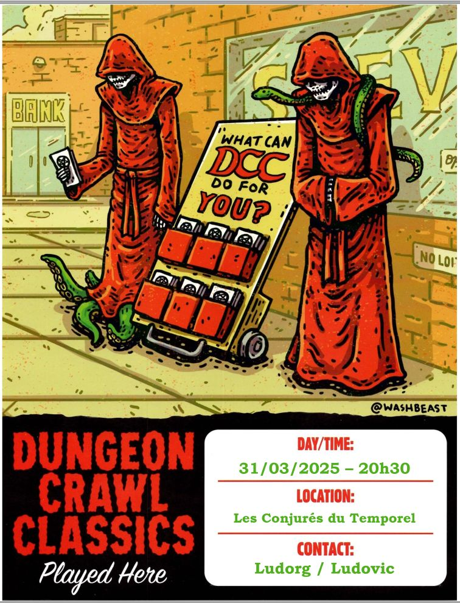
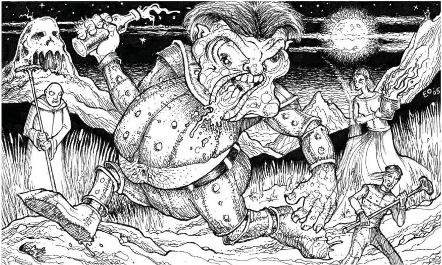

# DCC - Les légendes ne naissent pas

## Synopsis

Depuis plusieurs années, un ogre installé dans une grotte proche du village de Dundraville, impose à ses habitants de lui fournir de la bière et des provisions. 
Terrifiés à l'idée qu'il ne s'en prenne à eux ou ne détruise leurs biens, les habitants obéissaient sans protester.

Cependant, les exigences de l'ogre ont récemment changé. Désormais, il réclame de l'or, des matériaux de construction... et même des prisonniers !

Quand les villageois ont refusé de se plier à sa volonté, l'ogre est entré dans une furie dévastatrice. Il a emmené de force deux habitants dans sa grotte, où leur sort semble scellé : ils seront très probablement dévorés.

Privés de héros pour les défendre, les villageois n'ont d'autre choix que de faire appel à leur propre courage. Les plus audacieux – ou imprudents – ont décidé de se charger eux-mêmes de la situation.
Reste à savoir si ces roturiers  réussiront à éliminer l'ogre dans son repaire avant qu'il ne soit trop tard... 

