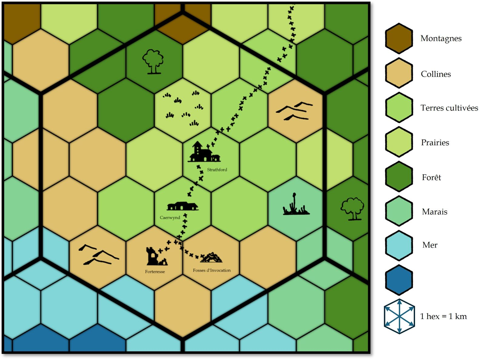

# DCC - Les Disparus de Caerwynd

Vendredi 18/04/2025 ; 20h30-00h00 ; Les Conjurés du Temporel

Scénario introductif pour un module de type 'entonnoir' (funnel).

## Préambule

Depuis des temps immémoriaux, les habitants de Strathford travaillent à l'ombre d'une ruine cyclopéenne, entourée de superstitions. Considérée comme un mystère à éviter, cette bâtisse semble désormais s'animer. Des créatures hurlantes surgissent dans la nuit, et des villageois disparaissent dans leur sommeil.

Dans le hameau de Caerwynd, situé entre la forteresse et Strathford, des disparitions troublantes ont eu lieu : il y a trois jours, Ewan, un vieux fermier, féru des légendes sur cette forteresse maudite, a disparu. Il y a cinq jours, Kellan, un berger solitaire, a également été porté disparu, son troupeau a été retrouvé désormais sans maître. C'est Britanice la Fromagère qui a constaté sa disparition.

Le calme du passé fait désormais place à l'inquiétude et à l'effroi...

## Personnages et Joueurs

- Thomas
  - Lucard, Bedeau en charge du temple dédié à Amun Tor, au village de Stratford
  - Poinstiné, Astrologue (RIP)
  - Britanice, Fromagère
  - Ewan, Fermier (après sa libération)
- Evan
  - Erohye, Avocat Elfe
  - Vixela, Apothicaire Nain
  - Vala, Trappeur
  - Farnoc, Berger Nain (après sa libération)

## Périls et dangers

Dans le hameau de Caerwynd, une attaque nocturne par des hommes-bêtes conduit au kidnapping de deux enfants, Niv et Sindri, fils de Moira, la guérisseuse locale. Vala, le trappeur et frère de Moira, forme une équipe déterminée à les sauver. 

En suivant les traces des ravisseurs, le groupe arrive à une caverne, située sous une colline en face de la forteresse. S'ensuivent des combats contre les hommes-bêtes.

Dans les profondeurs de la caverne, le groupe tombe sur une fosse lugubre, où sont suspendues des chaînes souillées de sang, fichées à d'imposantes piques. Les cadavres qui y pendent sont peu à peu dévorés par des créatures rampantes, leurs chairs enchevêtrées dans un réseau de lianes sinistres. Parmi eux, Ewan, un fermier du village, lutte encore pour sa survie, suspendu à l'une des chaînes. Faible mais conscient, il révèle que les enfants, Niv et Sindri, sont au fond de la fosse.

Après avoir libéré Farnoc, un berger nain, enfermé dans une cage, le groupe décide de descendre dans la fosse. 

En explorant les lieux, ils découvrent un escalier envahi par des lianes humides menant à une salle où des squelettes imposants d'hommes-bêtes, pris dans les lianes, semblent dédiés à un culte macabre. Un sacrifice a l'air d'être en cours sur un cinquième squelette. Les lianes bougent très lentement pour donner vie à cette sordide scène. 

Les deux enfants se sont réfugiés dans cette pièce et sont toujours en vie.

Face à cette menace, le groupe met le feu aux lianes avant de fuir vers Strathford chercher des renforts. Sur les conseils de Pharnoc, ils ne manqueront pas de prendre quelques conseils auprès des trois aventuriers vétérans : Darnok le Vaillant, Oggon l'Acien, et Oryx le Roublard...

<!--

Dans la nuit une petite troupe d'hommes-bêtes a attaqué le hameau de Caerwynd. Ils ont kidnappé Niv et Sindri, les enfants de Moira, une guérisseuse respectée du hameau, la soeur de Vala, le Trappeur.

Vala a alors pris la tête d'une courageuse bande hétéroclite, bien décidée à ramener ses enfants à Moira. En suivant les traces laissées par les hommes-bêtes, ils sont à une caverne, sous une colline, juste en face de la forteresse.

A l'exterieur, deux sentinelles.

La troupe entre dans la caverne qui sera nommée plus tard Les fosses d'invocation.

Les dalles se sont effondrées, révélant un trou béant dans le sol. Cinq chaînes maculées de sang pendent dans la fosse, accrochées à des piques ancrées au sol. Une chaleur intense monte d'en bas, accompagnée d'une odeur de pourriture.

Les chaînes pendent dans l'obscurité, et leur longueur varie de 4 à 7 mètres. Chaque chaîne se termine par de grands crochets barbelés, sur lesquels repose le corps d'un villageois. Il y a 9 mètres entre le bord de la fosse et le sol.

Sur une des chaines, Ewan le fermier encore vivant. Les hommes-bêtes ont jeté  Niv et Sindri, les deux enfants de Moira dans la fosse. Ils sont vivants. Ewan les a entendu pleurer et appeler à l'aide. Leur chute a probablement été amortie par les racines et les lianes épaisses.

Combat contre deux autres hommes-bêtes avant de fouiller leur antre.

Dans une cage, le groupe libère Pharnoc, un nain mineur. Quand ils sauront récupére les enfants, il propose d'aller demander l'assistance de trois aventuriers vétérans se sont retirés à Stratford pour leur vieux jours.Darnok, Oggon et Oryx le trio de vieux baroudeurs.

En descendant, par la fosse, Les murs et le sol de la corniche sont recouverts de lianes ; impossible de marcher sans entendre le craquement humide des lianes sous les pieds.

Des dizaines de lianes épaisses et tressées ont gravi les marches abruptes en pierre, remplissant presque l'escalier. Les murs, le plafond et les lianes sont tous glissants, l'humidité s'élevant d'en bas.

Au fond d'un couloir, dans une pièce plus grande Un bloc de pierre brut se dresse au milieu d'une masse de lianes épaisses. Quatre squelettes, entièrement enchevêtrés dans les lianes, se tiennent autour de la pierre telles d'effroyables marionnettes ; un cinquième est étendu sur le bloc, en pleine dissection. Chaque squelette est une créature bipède, plus grande qu'un homme, mais avec une tête de taureau, d'ours ou d'oiseau, dont les os blanchis sont dressés dans une caricature impie de culte.

Le groupe a mis le feu au lianes avant de s'enfuir à Strathford.
 -->

<!----- 

Flagstones here have fallen away to
reveal a yawning hole in the floor. Five gore-spattered chains hang
in the pit from spikes anchored in the floor. An intense heat wafts
up from below, accompanied by the stench of rot.

The chains hang down in the darkness below, and vary from
13’ to 23’ in length. Each chain ends in large barbed hooks,
on each hook is the corpse of a villager. It is 30’ from the lip
of the pit to the floor.

The walls and floor of the ledge
are threaded with vines – it is impossible to step anywhere without
hearing the wet crunch of vines underfoot.

 Dozens of thick, braided vines have wormed
their way up the steep stone steps, nearly filling the stairway. The
walls, ceiling and vines are all slick with moisture billowing up
from below.

A crude stone block stands
amidst a mass of thick vines. Four skeletons, fully entangled in
the vines, stand around the stone like grisly marionettes; a fifth
is splayed out on the block, in mid-dissection. Each skeleton is a
bipedal creature, taller than a man, but with the head of a bull,
bear or bird, with bleached bones raised in an unholy caricature
of worship.

-->
