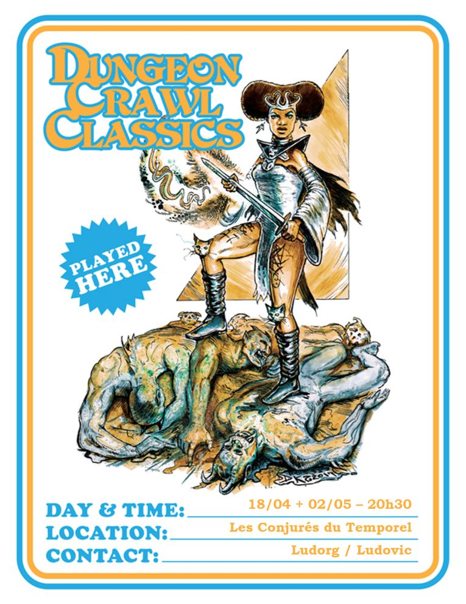
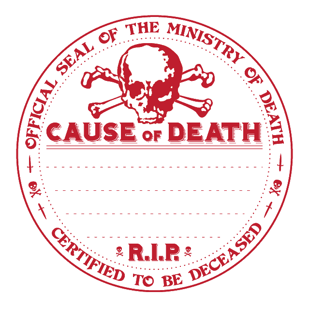

# DCC - A l'assaut de la Forteresse des Seigneurs du Chaos

Vendredi 02/05/2025 ; 20h30-00h00 ; Les Conjurés du Temporel

Suite du module 'entonnoir' (funnel), débuté [deux semaines avant](./dcc_cdt_2025_04_18).

## Préambule

De retour à Strathford après avoir délivré Niv et Sindri, les enfants de Moira retenus dans la caverne des fosses d'invocation des horreurs grimpantes, Vala et sa bande hétéroclite, inspirés par les récits épiques de Darnok le Vaillant, Oggon l'Ancien et Oryx le Roublard (trois vieux baroudeurs retirés des combats, mais désormais trop âgés pour affronter ce péril) décident d'explorer les ruines de la sinistre forteresse, dans l'espoir de restaurer la paix à Strathford et de libérer le village de la menace des hommes-bêtes.

## Personnages et Joueurs

- Sacha
  - Sclavor, Esclave (RIP)
  - Willie Claude, Vidangeur de Lattrines ([Gongfarmer](https://www.youtube.com/watch?v=y3K5JjzwRyo&t=36s))
  - Shul, Serrurier

- Lucas
  - Atzul, Barbier
  - Evadare, Sage Elfe
  - Uccastrog, bûcheron (RIP)

- Joseph
  - Kadabra, Elfe Cirier
  - Nehic, Forgeron Nain
  - Thulan, Alchimiste
  
- Evan
  - Erohye, Avocat Elfe
  - Vixela, Apothicaire Nain
  - Vala, Trappeur
  - Farnoc, Berger Nain

## Périls et dangers

Parvenus aux abords de la forteresse, les aventuriers se retrouvent face à un obstacle inquiétant : des horreurs grimpantes barrent le chemin d'accès. Les nains et le barbier s'élancent sans hésitation, affrontant ces corps jadis humains, désormais animés par cette végétation maléfique.  
Lorsqu'ils parviennent à abattre ces créatures, leur effroi grandit : ce sont Keary et Alban, les enfants du forgeron, disparus depuis onze jours.  

Au sommet d'une tour délabrée, une bannière en lambeaux claque au vent, exhibant un sinistre crâne pourpre sur fond noir.  

Après une reconnaissance prudente des lieux, le reste du groupe choisit d'éviter l'entrée principale. En se glissant par une brèche dans le mur effondré au nord-ouest, ils contournent la barbacane et les grognements menaçants qui s'en échappent.  

Alors qu'ils progressent, un bloc de granit se détache soudainement. Il écrase Sclavor, révélant un passage menant à une petite caverne où trône un portail étrange. Le portail est couvert de runes, et en son centre, un grand pentagramme inscrit dans un cercle scintille d'un éclat argenté, dégageant une aura inquiétante dans la pénombre. Personne parmi les novices n'arrive à les comprendre ces symboles étranges.

Dans la cour remplie de plantes malsaines et de ronces épaisses, un puits équipé de poulies et de chaînes attire leur attention. Les chaînes, sont recouvertes de lambeaux de chair. Des effluves magiques et des énergies chaotiques emplissent l'air d'une tension oppressante.

Adossé à un mur calciné, un édifice aux parois noircies par le feu intrigue les intrus. Ses portes de métal, verrouillées de l'extérieur, portent une inscription tracée à la peinture rouge écaillée : **REPENTEZ-VOUS !**  

Les murs et la tour nord-est ont été engloutis par un gouffre béant, d'où s'élève une brume dense et tourbillonnante, dissimulant ce qui se cache au-delà.

Les nains et le barbier, après avoir évité d'être broyés sous la herse actionnée par les hommes-bêtes, parviennent finalement à rejoindre leurs compagnons d'infortune dans la cour.

Dans la tour principale, la porte enfoncée, les apprentis-aventuriers découvrent six hommes-bêtes et leur champion à tête de taureau qui les attendent en embuscade. Près d'eux, plusieurs villageois, enchaînés au mur, observent leurs sauveurs avec un mélange de peur et d'espoir.  

Le combat éclate, brutal et sans merci. Mais, galvanisés par leur courage et leur détermination, les villageois finissent par terrasser leurs ennemis et libérer leurs compagnons. 

Un voile d'incertitude plane toujours sur la forteresse, ses ombres recelent d'autres secrets à découvrir. Pourtant, avec cette première victoire, l'espoir renaît parmi les gens de Strathford. 

## Héros tombés à l'Aventure
  

Ci-dessous, les héros qui ne reviendront pas de ce périple et la cause de leur trépas.

| Personnage | _Cause of Death_ |
| --- | --- |
| Sclavor | Ecrasé par un bloc de granit |
| Uccastrog | Encorné par le Champion Homme-Bête |
