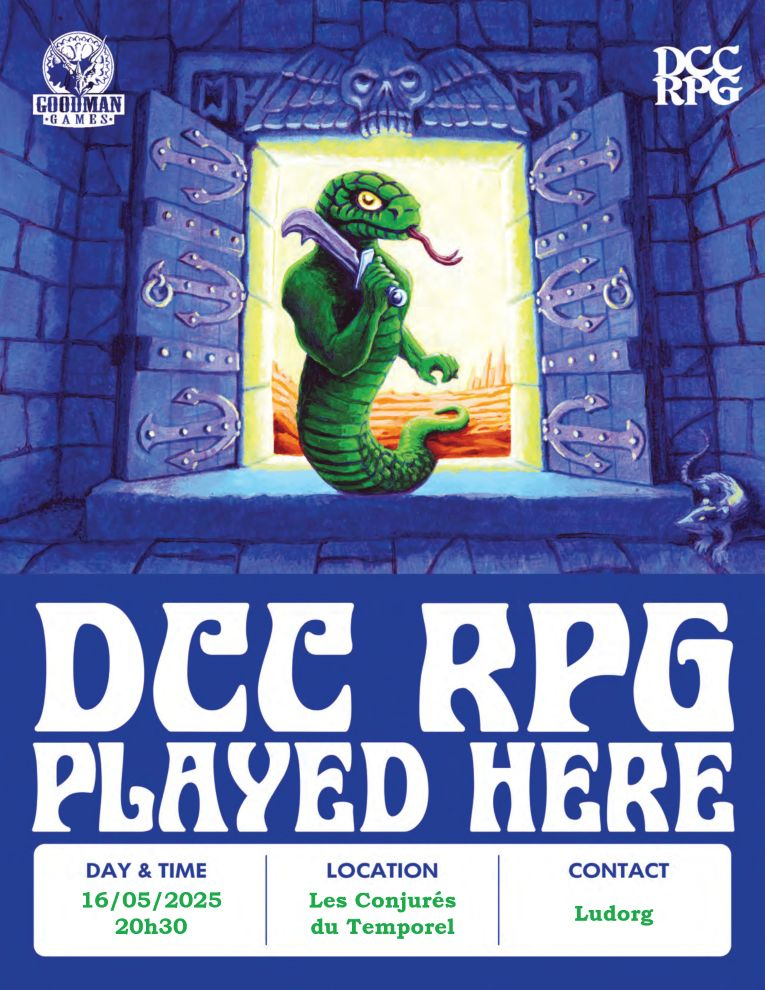

# DCC - Sous la Forteresse des Seigneurs du Chaos

Vendredi 16/05/2025 ; 20h30-00h00 ; Les Conjurés du Temporel

Suite et fin du module 'entonnoir' (funnel) : Navigateurs sur une mer sans étoiles. Voir [Les Disparus de Caerwynd](./dcc_cdt_2025_04_18) et [A l'assaut de la Forteresse des Seigneurs du Chaos](./dcc_cdt_2025_05_02).

## Précédemment

Après avoir libéré les enfants de Moira et vaincu les hommes-bêtes dans la caverne des Fosses d'Invocation, une troupe hétéroclite du village de Strathford a décidé de s'aventurer dans la Forteresse en ruine des Seigneurs du Chaos pour mettre un terme aux menaces qui pèsent sur leur village et découvrir les secrets de cette sinistre bâtisse.

Les aventuriers, arrivés à la forteresse, ont affronté d'abord des horreurs végétales qui se sont révélées être les enfants disparus du forgeron. Après avoir contourné l'entrée principale, ils ont découvert un portail mystérieux et ont traversé une cour sinistre, marquée par la magie chaotique et des avertissements inquiétants. Un piège a tué Sclavor, révélant un passage secret. Finalement, ils ont affronté un groupe d'hommes-bêtes menés par un champion à tête de taureau, ont libéré les villageois captifs et ont remporté une victoire difficile, redonnant espoir à Strathford.

## Personnages et Joueurs

- Sacha
  - Willie Claude, Vidangeur de Lattrines ([Gongfarmer](https://www.youtube.com/watch?v=y3K5JjzwRyo&t=36s))
  - Schul, Serrurier
  - Dalex, Collecteur d'Impots (libéré dans la tour)
  - Giken, Garde de Caravane (libéré dans la tour)
- Joseph
  - Kadabra, Elfe Cirier
  - Nehic, Forgeron Nain
  - Alchimiste, Thulan
  - Nuruk, Teinurier Halfelin (libéré dans la tour)
- Thomas
  - Lucard, Bedeau en charge du temple dédié à Amun Tor, au village de Stratford
  - Britanice, Fromagère
  - Ewan, Fermier
  - Yttruyakin, Apprentie Magicienne (libérée dans la tour)

<!-- 
- Evan
  - Erohye, Avocat Elfe
  - Vixela, Apothicaire Nain
  - Vala, Trappeur
  - Farnoc, Berger Nain

- Lucas
  - Atzul, Barbier
  - Evadare, Sage Elfe
  -->

## Périls et dangers

Certains villageois, capturés par les hommes-bêtes, décident de rejoindre les aventuriers dans leur quête.  D'autres, trop affaiblis, retournent au village escortés par Vala le Trappeur, Atzul le Barbier et d'autres de leurs compagnons.

En fouillant la tour où s'est déroulé le combat contre les hommes-bêtes, les aventuriers retrouvent certaines des possessions des villageois capturés. Sous une pile de peaux, dans une alcôve, ils découvrent une épée courte elfique incrustée d’émeraudes, enveloppée dans une simple cape verte.
Cousue dans l’ourlet de la cape, une carte au trésor en vélin révèle un emplacement mystérieux.

Sur le corps du champion à tête de taureau, ils trouvent un grand torque en argent, auquel sont accrochés des crânes blanchis. Chaque crâne est marqué d’une rune du chaos.

### Exploration sous la Forteresse

Depuis la tour, un escalier s’enfonce sous la forteresse. Quelques pièces d’or éparpillées et des traces sur les marches témoignent d’une présence récente. 

Une salle où d’anciens coffres gisent, vides et abandonnés.
Dans l’un d’eux, dissimulé au fond d’un compartiment secret, se trouvent deux anneaux d’argent ornés d’émeraudes, un tabard de soie marqué d’un sceau du chaos, et une fiole en acier contenant deux doses d’huile de lotus noir, son contenu noirâtre frémissant sous la lumière vacillante.

En face, un passage débouche sur un portail couvert de runes, en son centre, un grand pentagramme cerclé d’argent scintille.

Les marches de pierre continuent leur descente, et mène à une vaste salle en longueur, ses murs ornés de mosaïques complexes décrivant d’immondes cérémonies dédiées à des créatures infernales. La pierre suinte d’humidité, tapissée d’algues noires, et la condensation ruisselle en fins ruisseaux vers un bassin noirâtre qui s’étend au centre.

Dans chaque coin de la pièce, une robe à capuche brodée de sceaux étranges repose dans une alcôve. Les aventuriers n’hésitent pas et brûlent les robes.

L’exploration continue.

Les grandes marches de
pierre descendent sur une plage de sable sombre bordant une vaste mer
souterraine. Au loin sur la mer, une lumière dorée
perce l’obscurité. Un énorme menhir se dresse au bord de l’eau, des
vagues sombres léchant ses côtés finement sculptés.

Au-delà de cette pierre imposante, une silhouette émerge de l’ombre : un drakkar à tête de dragon, sa coque marquée de sceaux de protection et de runes verdâtres qui palpitent faiblemen.

Le navire s’immobilise à une quinzaine de mètres du rivage. Au loin, le battement profond de tambours, mêlé à des hurlements de terreur, résonne dans l’obscurité. 

En allumant une bougie au sommet du
menhir, le navire enchanté approche de la rive, permettant
aux aventuriers de monter à bord sans danger.

Ils récupèrent un encensoir au sommet du menhir. Une fois à bord, le navire, se met en mouvement, voguant sur la mer souterraine en direction de la lumière dorée. 

Des tentacules commencent à émerger des profondeurs, menaçant de saisir le navire. En utilisant l’encensoir, les aventuriers parviennent à repousser cette créature marine, permettant au navire de continuer sa route.

### Le Temple du Chaos

Le navire accoste sur une île où se dresse une imposante ziggourat, ses massifs blocs de pierre parcourus de fines fissures incandescentes, laissant filtrer une lumière brûlante. 

Une large rampe serpente autour de l’édifice, s’élevant jusqu’à son sommet. Des hordes d’hommes-bêtes s’y bousculent, hurlant à l’obscurité, martelant d’énormes tambours de peau et poussant une file de prisonniers terrifiés vers le sommet rayonnant de la ziggourat. Tout en haut, une silhouette gigantesque et redoutable, bardée d’armure et entourée d’une fumée infernale, semble émerger des profondeurs.

Les aventuriers, armés de courage et de détermination, décident d’gravir la rampe et d’attaquer les hommes-bêtes, accaparés par leur sombre cérémonie.

Le sommet du temple est dominé par un vaste gouffre fumant, d’où émane une lumière infernale. Un puissant homme-bête brandit une effigie terrifiante, sculptée à l’image du Seigneur du Chaos, au cœur de la fumée tourbillonnante. Sous ses ordres, les prisonniers hurlants sont poussés, un à un, dans l’abîme.

Plus bas, un trio d’hommes-bêtes renverse d’immenses paniers tressés, déversant des milliers de pièces d’or sur les corps des captifs. En touchant le gouffre, le métal provoque des giclées de fumée sifflante et des flammes qui dévorent l’air.

Les aventuriers, après un combat acharné, parviennent à vaincre les hommes-bêtes et à détruire l’effigie du Seigneur du Chaos. Lorsqu'elle bascule dans le gouffre, le temple se met à trembler. La caverne s’effondre : d’énormes blocs de pierre se détachent du plafond et plongent dans la mer, tandis que d’immenses vagues s’écrasent contre les flancs de la ziggourat.

Dans la précipitation, les aventuriers regagnent le drakkar, fuyant l’anéantissement du sanctuaire. Une vague titanesque se soulève et propulse le navire à une vitesse terrifiante vers la paroi opposée de la caverne...

## Héros tombés à l'Aventure
  

Ci-dessous, les héros qui ne reviendront pas de ce périple et la cause de leur trépas.

| Personnage | _Cause of Death_ |
| --- | --- |
| Jiken | En combattant les hommes-bêtes sur la ziggourat |
| Lucard | En voulant sauver Britanice |

<!-- 

Le navire accoste sur une île, où se dresse une une imposante ziggourat d’où
émane une lumière brûlante par de fines fissures entre ses massifs blocs
de pierre.

Une large rampe encercle l’édifice, s’élevant jusqu’au sommet
du temple. Des hordes d’hommes-bêtes s’y bousculent, hurlant à
l’obscurité, martelant d’énormes tambours de peau et poussant une
file de prisonniers terrifiés vers le pic rayonnant de la ziggourat. Tout
en haut du temple, une silhouette gigantesque
et redoutable d’un personnage en armure, entouré de fumée infernale
émane des profondeurs.

Les aventuriers, armés de courage et de détermination, décident de
gravir la rampe et attaquent les hommes-bêtes accaparés par leur sombre cérémonie.

Le sommet du temple est dominé par un vaste gouffre fumant qui
rougeoie d’une lumière infernale. Un puissant homme-bête maintient
en l’air l’effigie d’une terrifiante silhouette en armure dans la fumée
tourbillonnante alors que les prisonniers sont poussés en hurlant, les
uns après les autres, dans le gouffre. Un trio d’hommes-bêtes hargneux
renverse des paniers tressés, déversant ainsi des milliers de pièces à
la suite de villageois capturés, provoquant des giclées de fumée
sifflante et de flammes !

Les aventuriers, après un combat acharné, parviennent à vaincre les hommes-bêtes et à détruire l’effigie du Seigneur du Chaos. Sa chute dans le gouffre, provoque la destruction
de son temple et de la caverne. Des blocs de pierre massifs se
détachent du plafond de la grotte et tombent dans la mer. Des
vagues s’écrasent sur les flancs de la ziggourat.

Dans la précipitation, les aventuriers, parviennent à fuir et à regagner le drakkar. Une vague géante le propulse à une
vitesse terrifiante vers la paroi opposée de la caverne ! Le navire à tête de dragon surfe sur la crête de la
vague géante et se jette dans la mâchoire rocheuse, les flots hurlants
s’écrasant tout autour de vous ! -->

