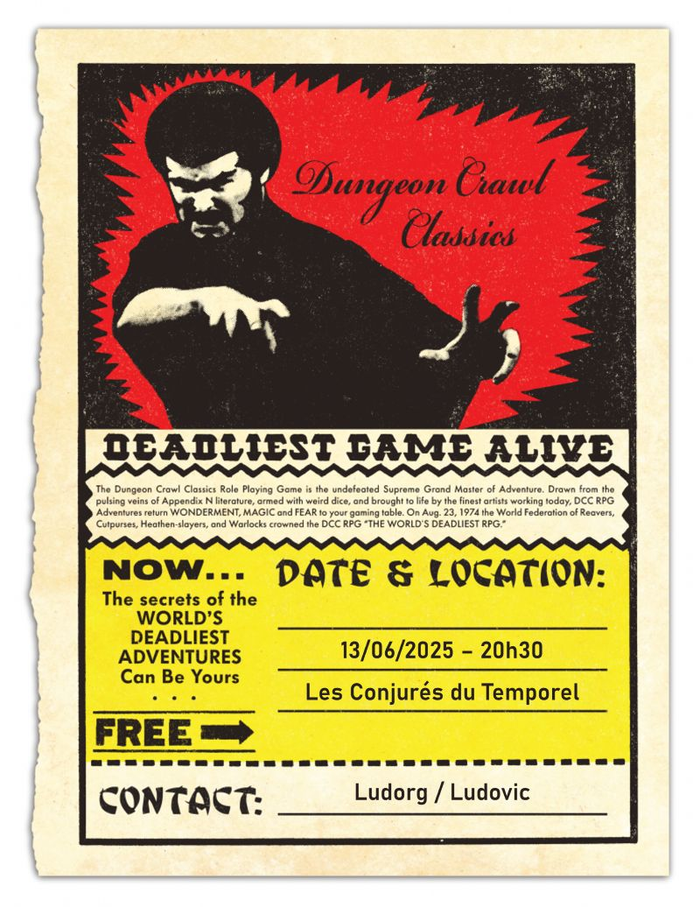

# DCC - A l'aventure vers le village de Hirot

Vendredi 13/06/2025 ; 20h30-00h15 ; Les Conjurés du Temporel

Séance de passage au niveau 1 pour certains des personnages du module 'entonnoir' (funnel) : Navigateurs sur une mer sans étoiles. Voir [Les Disparus de Caerwynd](./dcc_cdt_2025_04_18), [A l'assaut de la Forteresse des Seigneurs du Chaos](./dcc_cdt_2025_05_02) et [Sous la Forteresse des Seigneurs du Chaos](./dcc_cdt_2025_05_16).

## Personnages et Joueurs

- Joseph
  - Thulan, Mage (Alchimiste)
  - Nuruk, Halfelin (Teinturier Halfelin)

- Thomas
  - Britanice, Clerc de Pelagia (Fromagère)
  - Yttruyakin, Mage (Apprentie Magicienne)

- Evan
  - Erohye, Elfe (Avocat Elfe)
  - Vala, Voleur (Trappeur)

## Périls et dangers

### Et le bateau coula...

Entraîné par la vague titanesque déclenchée par l'effondrement de la Forteresse des Seigneurs du Chaos, le drakkar fut porté malgré lui sur les flots déchaînés de la mer sans étoiles. 

Ballotté par les énergies débridées, il dériva jusqu’à un étroit goulet dans les falaises surplombant la Baie de Valfors, où il finit par s’échouer violemment sur des récifs acérés.

Les aventuriers, projetés à la mer, ont lutté contre les courants dévastateurs. Le navire sombra dans les eaux tumultueuses ne laissant que des débris dispersés. 

Après avoir rassemblé ce qu’ils pouvaient de leurs effets, les survivants ont réussi à atteindre la côte, épuisés mais vivants. Ils ont ensuite rejoint le village de Strathford, où ils ont pu se reposer et panser leurs blessures.

### Des perturbations aux alentours de Strathford

Les récents événements ont marqué la région de manière irréversible. Les forces chaotiques libérées lors de l’effondrement de la forteresse ont engendré de profondes perturbations autour de Strathford.

L’énergie du Chaos a remodelé les terres, distordant les paysages de manière surnaturelle et inquiétante.
Des arbres tordus s’élèvent comme des spirales vivantes, leurs troncs noués en motifs défiant toute logique naturelle. Plus troublant encore, certains animaux semblent touchés par des mutations : un cerf, dont les bois lévitent à quelques centimètres de son crâne, a été aperçu en lisière de forêt.

Mais c’est surtout la colline où s’élevait jadis la forteresse qui captive l’attention : une lueur rougeâtre s’en dégage nuit et jour, peignant le ciel d’un halo menaçant. Ce phénomène mystérieux s’estompera au bout de quelques jours, mais beaucoup de villageois choisissent déjà d’abandonner les terres voisines, persuadés que ces manifestations ne sont que les prémices d’un mal plus grand.

### Un peu de repos

Après ces événements tumultueux, les aventuriers ont décidé de se reposer à Strathford et de prendre conseil auprès d'autres villageois, dont les vieux baroudeurs Oggon l’Ancien, Darnok le Vaillant et Oryx le Roublard, mais aussi auprès d'Iminix, le magicien local.

#### Des pièces étranges

Dans les pièces ramassées par Nuruk le Halfelin, certaines ont attiré son attention. Très anciennes, elles présentent l’image d’une belle femme à l’air vaguement désagréable mais qui ressemble à fortement à Britanice la fromagère.

#### La légende de l’Abbaye des Bois

La carte découverte dans la tour des hommes-bêtes, minutieusement déchiffrée par Vala et Oryx, semble indiquer l’emplacement des ruines d'une antique abbaye, perchée sur un plateau rocheux au cœur de la forêt. Ces ruines, oubliées depuis des siècles, sont connues sous le nom de l’Abbaye des Bois. Elles seraient situées au delà du village de Hirot, au nord vers les montagnes, à plusieurs jours de marche.

Selon les légendes locales, ce lieu isolé aurait abrité l’Abbé des Bois, un ancien grand prêtre retiré du monde. Révolté par la corruption des cités humaines, il aurait mené ses disciples dans la nature, emportant avec lui un trésor sacré d’une valeur inestimable : reliques serties d’or et de gemmes, ouvrages liturgiques cousus de fil d’or, encensoirs précieux et cinq mystérieux reliquaires symbolisant les périls de l’âme humaine.

Mais au fil du temps, toute trace de l’abbé et de sa communauté s’est effacée. Seuls demeurent les ruines et le murmure persistant que leur secret n’a jamais été retrouvé…

### Et l'aventure continue...

Iminix, le magicien de Strathford, a initié Yttruyakin et Thulan aux fondements des arts hermétiques. Mais ses enseignements, bien que précieux, restent limités. Ainsi, les deux apprentis mages ont pris la décision de se rendre à Hirot, un village niché au nord, près des montagnes. Ils espèrent y rencontrer Draupnir, un mage renommé pour sa sagesse et sa profonde maîtrise des arcanes.

Draupnir fut jadis compagnon d’armes des trois vétérans de Strathford : Darnok le Vaillant, Oggon l’Ancien et Oryx le Roublard. 

De son côté, Britanice, la fromagère, encore meurtrie par ses premières aventures et la perte tragique de son soupirant Lucard, a choisi de suivre la voie de l’appel divin. Inspirée par Pelagia, déesse de la mer et des tempêtes, elle a entamé son apprentissage des arcanes sacrés auprès de Thalios le Murmure-aux-Vagues, un ermite mystique vivant dans une grotte taillée dans les falaises surplombant la baie de Valfors. On dit que sa voix est plus souvent entendue par la mer que par les hommes.

Pendant ce temps, Nuruk le halfelin et Vala, le trappeur, ont trouvé en Oryx le Roublard un mentor habile. Celui-ci leur a enseigné les subtilités du larcin et de la discrétion, art dans lequel il excelle.

Quant à Erohye, son chemin l’a mené jusqu’à Velwyn Murmure-de-Pierres, une elfe énigmatique capable d’écouter les secrets enfouis dans les pierres levées et les menhirs anciens.

### Un mystérieux cavalier 

Quelques jours avant le départ pour Hirot, Oryx aperçut un cavalier énigmatique accompagné de deux hommes d’armes. Le trio semblait quitter précipitamment les abords de la forteresse, prenant grand soin d’éviter le village. 

D’après ses investigations, ils auraient passé un certain temps retranchés dans une tour en ruine, dissimulée non loin de la place forte effondrée.

### Aux portes de Hirot

Après avoir aidé plusieurs familles à fuir un village hanté par le Chaos, le groupe parvint au crépuscule, aux abords embrumés de Hirot. L’atmosphère, lourde et étrange, présageait déjà les horreurs à venir.

En approche du village, ils furent témoins d’une sinistre procession : des villageois escortés de cavaliers en peaux de loup menaient une jeune fille bâillonnée vers un antique autel de pierre, en dehors des murs. Destinée à un sacrifice rituel, elle devait apaiser une créature infernale, un molosse monstrueux qui terrorisait la région.

Après avoir échangé avec les villageois, les aventuriers décidèrent de ne pas intervenir immédiatement, préférant se poster en embuscade. Lorsque la bête surgit, le combat s’engagea dans une confusion totale, poussant même certains à fuir. Mais grâce à l’audace de Britanice, qui lui porta un coup décisif, le monstre se dissipa dans une brume noire aussi épaisse que surnaturelle.

