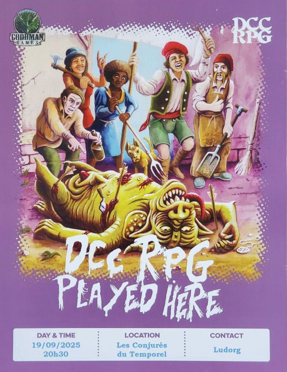

# DCC - Au village de Hirot

Vendredi 19/09/2025 ; 20h30-00h00 ; Les Conjurés du Temporel

Suite du module "Le Fléau des Rois barbares", voir la première partie : [A l'aventure vers le village de Hirot](./dcc_cdt_2025_06_13).

## Précédemment

Le groupe d'aventuriers en devenir aide plusieurs familles à fuir Strathford, leur village désormais marqué à jamais par le Chaos. 

À la tombée de la nuit, ils arrivent aux portes de Hirot. 
Là, ils assistent à une procession inquiétante : des villageois, escortés de cavaliers en peaux de loup, mènent une jeune fille vers un autel de pierre pour un sacrifice censé apaiser un molosse infernal. 
Les aventuriers choisissent l'embuscade plutôt que l'intervention directe. 
Lorsque la créature surgit, le combat est chaotique, mais Britanice parvient à lui porter un coup décisif, dissipant le monstre dans une brume surnaturelle.

## Personnages et Joueurs

- Thomas
  - Britanice, Clerc de Pelagia (Fromagère)

- Evan
    - Erohye, Elfe (Avocat Elfe)

- Sacha
    - Willy Claude, Guerrier (Vidangeur de latrines)

- Eoghan
    - Ciarrior, Nain Mineur
    - Toska, Garde de Caravane

- Félix
    - Enoriel, Elfe Forestier
    - Talion, Coupeur de Bourses

### Héros au repos

- Evan - Vala, Voleur (Trappeur)
- Joseph - Nuruk, Halfelin (Teinturier Halfelin)
- Joseph - Thulan, Mage (Alchimiste)
- Sacha - Dollex, Collecteur d'Impots
- Sacha - Schul, Serrurier
- Thomas - Yttruyakin, Mage (Apprentie Magicienne)

## Périls et dangers

### Arrivée à Hirot

La jeune fille destinée à être offerte en sacrifice au molosse de Hirot, mais sauvée in extremis par les aspirants héros, se nomme Morgane Haverson. Elle est la fille de l’aubergiste Broegan Haverson, un homme robuste et respecté dans le village que tous appellent "le Taureau".

Son établissement, l’Enseigne de la Lance Tue-Loup, était autrefois un caravansérail isolé, bien avant que Hirot ne devienne un village. Il conserve encore les marques de ses origines rudes : des meurtrières sont taillées dans les volets, une lourde barre de fer permet de condamner la porte en cas de besoin, et des créneaux sont visibles sur les rebords de la toiture.

À la palissade qui ceint le village de Hirot, les aventuriers et leur caravane de fuyards sont accueillis avec méfiance par la garde de nuit, dirigée par Nothan le Jeune, un homme sévère, à la longue moustache et au regard féroce.

### L’Enseigne de La Lance Tue-Loup

L’accueil à l’auberge est empreint d’émotion. Broegan est infiniment reconnaissant envers ceux qui ont sauvé sa fille. Ils ont gagné sa gratitude éternelle et n’auront pas à payer le gîte ni le couvert durant tout leur séjour à l’Enseigne de la Lance Tue-Loup.
Lloré, le seul barde et conteur de Hirot, est présent pour distraire la foule. Il remercie lui aussi chaleureusement ceux qui lui ont ramené Morgane, sa promise.

La capacité défensive de la Lance Tue-Loup n’a pas échappé aux habitants de Hirot. Nombre d’entre eux ont pris l’habitude d’y passer leurs soirées et de dormir dans la salle commune. Comme chaque soir, une vingtaine de villageois s’y retrouvent pour partager un moment de répit. Ils jouent aux dés, boivent un peu, tentant d’oublier la bête qui rôde à leurs portes.

Parmi eux se trouve Enoriel, un elfe forestier récemment installé au village. Intrigué par les aventuriers et leur histoire, il observe avec attention.

Ciarrior, un mineur nain, est également captivé par leurs récits. Se présentant comme chasseur de trésors, il cherche des compagnons pour explorer les collines au nord, où reposerait la tombe d’un ancien roi barbare, l’Ulfheonar, qui aurait possédé une lance magique capable de tuer le molosse. Ciarrior affirme avoir localisé l’emplacement de cette sépulture.

Talion, un coupeur de bourses au fond plutôt honnête, est aussi présent. Habitué du Repaire des Trois Rats, un bouge douteux situé à l’autre bout du village, il a été convaincu par Enoriel de venir à l’auberge ce soir.

Le groupe est complété par Toska, un garde de caravane aguerri aux dangers des routes. Recruté par Willy Claude au départ de Strathford, il veille sur ceux qui ont choisi de fuir le village, désormais en proie à la corruption du Chaos. Toska était un ami proche de Giken, son éternel compagnon de voyage, tombé en combattant les hommes-bêtes lors de l’assaut sur la ziggourat de la Forteresse des Seigneurs du Chaos.

Le rez-de-chaussée de la Lance Tue-Loup abrite une vaste salle commune où l’on sert à boire et à manger. Une grande lance est suspendue au-dessus du bar : une réplique de la légendaire arme de l’Ulfheonar. La soirée se déroule dans une ambiance malgré tout festive, bien que chacun reste conscient du péril que représente le molosse.

Il est de notoriété publique que le molosse guérit de ses blessures durant le jour, et revient aussi puissant la nuit suivante.

L’alcool aidant, les langues se délient. Certains affirment que le jarl et ses thegns n’ont pas la moindre idée de la manière de vaincre la créature.

Tous les trois jours, la population de Hirot se réunit sur la place du village, où l’on tire au sort celui ou celle qui sera sacrifié au molosse. Le jarl Holgwig et Sylle Ru, son éminence grise, orchestrent cette sinistre cérémonie.

### Quelques emplètes au village

Le village de Hirot, bien que modeste, dispose de plusieurs commerces essentiels, dont la forge du maître forgeron Hael la Cigogne, réputé pour la qualité de ses armes et armures.

Sur la place du village, une cassette verrouillée par un cadenas repose sur un court poteau de bois, en son centre. Une bannière en lambeaux, représentant un loup noir rampant, pend tristement au-dessus du coffre. C’est là que sont tirés au sort ceux qui seront sacrifiés au molosse.

De l’autre côté de la place se dresse la chapelle de Justicia. Ce modeste lieu de culte est l’un des rares bâtiments de Hirot entièrement construit en pierre. Le vitrail en rosace, surplombant la nef, représente Justicia affrontant un molosse-démon, brandissant un grand marteau de guerre.

Le père Beacom est convaincu que le molosse est un châtiment divin, infligé pour les péchés du village. Il est assisté de deux acolytes (frère Aker et frère Haams) ayant fait vœu de silence. Ils suivent le père lorsqu’il arpente les rues, se flagellant pour expier leurs fautes et celles de la communauté.

En rendant visite à ses anciens acolytes du Repaire des Trois Rats, un bouge mal famé tenu par le sinistre Maître Jenks et son gang, Talion entend une rumeur sur la disparition des frères Kej, Stein et Ilham. Ils auraient découvert un trésor digne d’un roi, caché dans les collines au nord de Hirot, avant de partir pour les contrées du sud.

De retour à l’auberge, les aventuriers croisent Broegan 
Haverson, en pleine discussion avec trois des hommes du jarl, les thegns Ofenloch, Kreig et Orioc. Ils semblent tendus et nerveux. Les thegns sont les membres de la suite du jarl Holgwig, ses guerriers d’élite.

Après leur départ, Broegan confie aux aventuriers son inquiétude : les hommes du jarl sont venus l’interroger sur Morgane, sa fille, et sur les circonstances de son sauvetage. Il redoute que le jarl découvre qu’elle a été sauvée par des étrangers, ce qui pourrait lui attirer des ennuis.

### La tombe de l’Ulfheonar

Guidés par Ciarrior, le mineur nain promis à une carrière de chasseur de trésors, les aventuriers se rendent à la tombe de l’Ulfheonar, enfouie dans les collines au nord de Hirot.

Selon certains récits, la sépulture d’un ancien chef de guerre barbare serait dissimulée dans ces hauteurs. Ce roi des temps anciens, surnommé le Tueur de Loups, aurait été un redoutable combattant.

Les légendes racontent qu’il possédait une lance magique capable de tuer le molosse, ainsi qu’un bouclier enchanté apte à repousser ses assauts. Les bardes le nomment l’Ulfheonar.

Dans les temps anciens, les tribus sauvages vénéraient un esprit de loup maléfique, auquel elles offraient des sacrifices dans une fosse perdue au cœur des tourbières basses. L’Ulfheonar aurait mis fin à ces rituels sanglants en terrassant l’esprit du loup grâce à sa lance magique.

Après moins de deux kilomètres de marche, la forêt s’interrompt en bordure d’une pente escarpée, révélant une étroite vallée en contrebas. Au milieu de la vallée se trouve un tumulus de terre recouvert d’herbes hautes ayant la forme d’un serpent.

Deux cours d’eau argentés dévalent de chaque côté de la butte serpentine, se rejoignant pour former une mare scintillante et peu profonde au niveau de la tête de l’énorme
tumulus. De l’autre côté de la mare, enchâssée dans le monticule de terre, se trouve une grande pierre circulaire décorée de spirales serpentines usées par le temps.

Impossible de faire bouger la pierre, même à plusieurs.

Une inspection attentive du lit du cours d’eau situé à l’est révèle un endroit où le courant a érodé la berge, créant une étroite fissure dans les pierres.

Cette fissure mène à une pièce qui s’est partiellement effondrée : de grandes dalles de pierre qui supportaient
autrefois le plafond sont désormais inclinées vers l’intérieur sous le poids de la terre située au-dessus. Des débris se sont empilés au centre de la pièce.

Cette pièce débouche sur un couloir qui mène d'un côté à une pièce plus large au plafond bas. Le sol y est dallé de pierres et descend en pente raide depuis les quatre murs  jusqu’à une fosse obscure au centre de la pièce.

Au milieu du couloir, deux escaliers de pierre s’enfoncent dans l’obscurité, l’un vers la gauche, l’autre vers la droite.

De l’autre côté, une grande pièce rectangulaire s’ouvre devant les aventuriers. De grandes dalles de pierre soutiennent un plafond assez haut. Trois longues marches
descendent vers le sol de l’antichambre. Deux braseros de bronze martelé sont disposés devant une imposante porte de pierre au bout de la pièce.

Des centaines de runes en spirale sont sculptées sur la porte et semblent tournoyer à l’infini. L’image d’un loup énorme terrassé par un serpent est gravée au-dessus du portail.

Le sol est couvert de ce qui semble être des milliers de fines bandelettes translucides de parchemin. Ces bandelettes séchées et craquelées sont en réalité les peaux d’un nombre
incalculable de serpents !

En observant attentivement la porte, les aventuriers remarquent que le portail a été fixé dans le sol et ensuite lesté par en haut, condamnant le passage pour l’éternité.

La dalle ne peut pas être déplacée par la
force de simples mortels, mais si elle venait à être détruite d’une manière ou d’une autre, le plafond laisserait choir plusieurs tonnes de pierre et de terre.

En entrant dans cette pièce, les aventuriers ont allumé
les braseros qui entourent l'impressionante porte. Après un certain temps passé, certains remarquent alors que la fumée du feu ne s’accumule pas dans la pièce, mais s’échappe par le conduit caché situé au-dessus de l’entrée de la pièce...