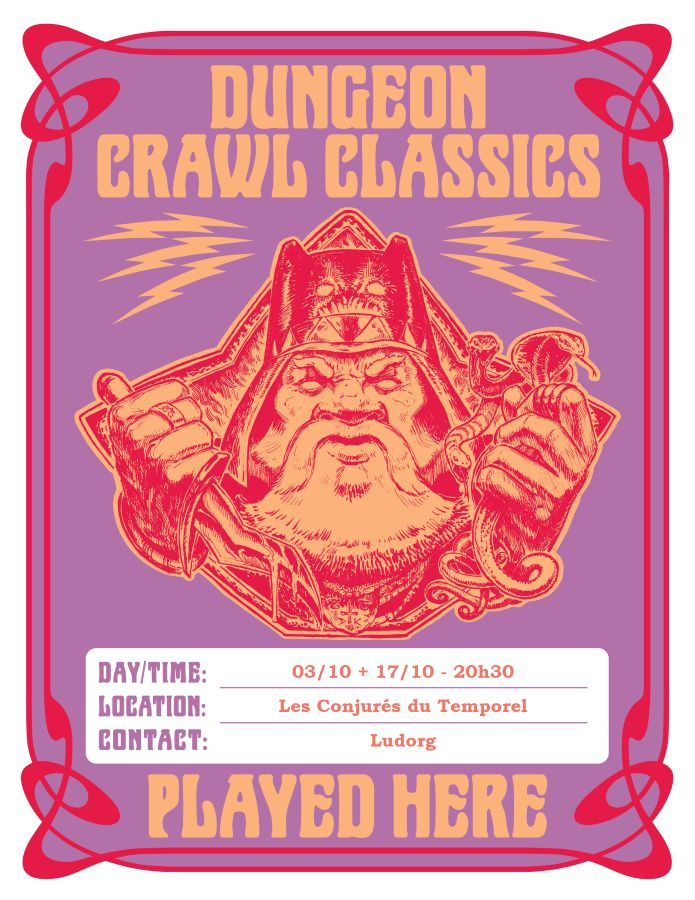

# DCC - La Tombe de l’Ulfheonar

Vendredi 03/10/2025 ; 20h45-23h30 ; Les Conjurés du Temporel

Suite du module "Le Fléau des Rois barbares", voir la session précédente : [Au village de Hirot](./dcc_cdt_2025_09_19).

## Précédemment

Morgane Haverson, fille de l’aubergiste Broegan ("le Taureau"), a été sauvée in extremis d’un sacrifice au molosse de Hirot par les aventuriers.

L’auberge, l’Enseigne de la Lance Tue-Loup, est un ancien caravansérail fortifié, devenu refuge pour de nombreux villageois chaque soir.
Broegan offre gîte et couvert aux sauveurs de sa fille.

Parmi les habitués : Enoriel (elfe forestier), Ciarrior (nain mineur, chasseur de trésors), Talion (voleur repenti), Toska (garde de caravane).
L’ambiance est tendue : la menace du molosse plane, la population se rassemble à l’auberge pour se rassurer.

AU Repaire des Trois Rats, Talion apprend la disparition de trois frères : Kej, Stein et Ilham ; Ils seraient partis après avoir trouvé un trésor dans les collines.
Broegan s’inquiète de l’intérêt soudain des hommes du jarl pour sa fille et ses sauveurs.

Guidés par Ciarrior, les aventuriers explorent la tombe d’un ancien roi barbare, l’Ulfheonar, qui aurait possédé un bouclier et une lance magique capable de tuer le molosse.

## Personnages et Joueurs

- Thomas
    - Britanice, Clerc de Pelagia (Fromagère)
    - Yttruyakin, Mage (Apprentie Magicienne)

- Joseph
    - Thulan, Mage (Alchimiste)
    - Tuhuruc, Halfelin (Teinturier Halfelin)

- Eoghan
    - Ciarrior, Nain Mineur
    - Toska, Garde de Caravane

## Exploration de la Tombe de l’Ulfheonar

Certains aventuriers, exténués et incommodés par l’atmosphère des lieux, préfèrent rester à l’air libre. L’exploration de la tombe se poursuit donc avec ceux qui demeurent vaillants.  
 
Dans le couloir, un escalier adossé au mur est mène à une fosse située sous la salle au sol incliné et glissant. Le plafond, les murs et le sol de cette pièce sont entièrement recouverts d’une mousse noire visqueuse et de vase. Plus haut, le plafond voûté est percé d’un trou. Juste en dessous, des dizaines de lances en bronze sont fichées dans le sol.  
 
Un examen attentif révèle une flaque de sang, suivie d’une piste menant à l’autre escalier du couloir. Les marches de pierre usées de l’escalier ouest descendent vers une cave circulaire, dont les murs de dalles sont gravés de runes noires. Au centre se dresse un amas de pierres surmonté d’une dalle évoquant une table ou un autel. Sur celle-ci repose le crâne d’un ours gigantesque.  
 
Les explorateurs décident alors d’envoyer leurs deux plus petits compagnons dans le conduit dissimulé au-dessus de l’entrée de la grande salle. Ciarrior, le nain mineur, et Tuhuruc, le halfelin, s’y faufilent sans difficulté. L’étroit passage serpente dans l’obscurité : à peine soixante centimètres de haut et de large, un sol de pierre rugueuse, un plafond tissé de racines et de branches. Il débouche sur une vaste salle au plafond voûté, semblable à une galerie.  
 
En son centre s’élève une colonne monumentale, décorée de dizaines de gravures stylisées représentant des loups mis à mort. La colonne est composée de sections alternées de bois et de pierre. Suspendus à environ six mètres du sol, tels des trophées, se trouvent une longue lance et un bouclier de bronze.  
 
Une inspection attentive révèle que les blocs de bois et de pierre s’emboîtent comme les pièces d’un puzzle complexe, chaque section reposant sur la précédente. La pression constante du sommet a ralenti, mais non empêché, la pourriture du bois. Ciarrior estime, à juste titre, que la colonne risque de s’effondrer si l’on tente de retirer la lance ou le bouclier.  
 
Les novices imaginent alors un stratagème : utiliser une corde, tirée depuis le couloir, pour récupérer les armes sans danger. Mais, en rebroussant chemin dans le conduit, une affreuse goule surgit d’une cheminée du plafond. De son ventre béant s’extrait un grand serpent à tête humanoïde.  
 
Au même moment, dans la salle de l’autel au crâne d’ours, deux autres goules émergent de l’obscurité et attaquent les intrus. Leur peau grise et flasque semble flotter autour de leurs os ; elles ne sont plus que des enveloppes humaines vidées de vie.  
 
Le combat tourne finalement à l’avantage des aventuriers, bien que certains soient grièvement blessés. Les monstres abattus, Talion reconnaît dans ces créatures les corps de ses anciens compagnons : les trois frères disparus, Kej, Stein et Ilham.  
 
Ciarrior et Tuhuruc retournent alors dans le conduit pour mettre leur plan à exécution et tenter de récupérer la lance et le bouclier, tout en espérant ne pas finir écrasés par la colonne instable. Mais la stratégie échoue : le déplacement des objets provoque l’effondrement de la structure. Les blocs de bois et de pierre éclatent et s’écrasent au sol, déclenchant une réaction en chaîne. Des débris pleuvent du plafond, une énorme dalle s’abat, et plusieurs tonnes de pierre et de terre s’effondrent, comblant cette fausse tombe.  
 
Épuisés et meurtris, les aventuriers choisissent de regagner le village de Hirot pour une nuit de repos. Le lendemain matin, avant de retourner à la Tombe de l’Ulfheonar, ils projettent de se rendre à la tour de Draupnir. Ni lui ni son apprenti n’ont été vus depuis près d’un mois.  
