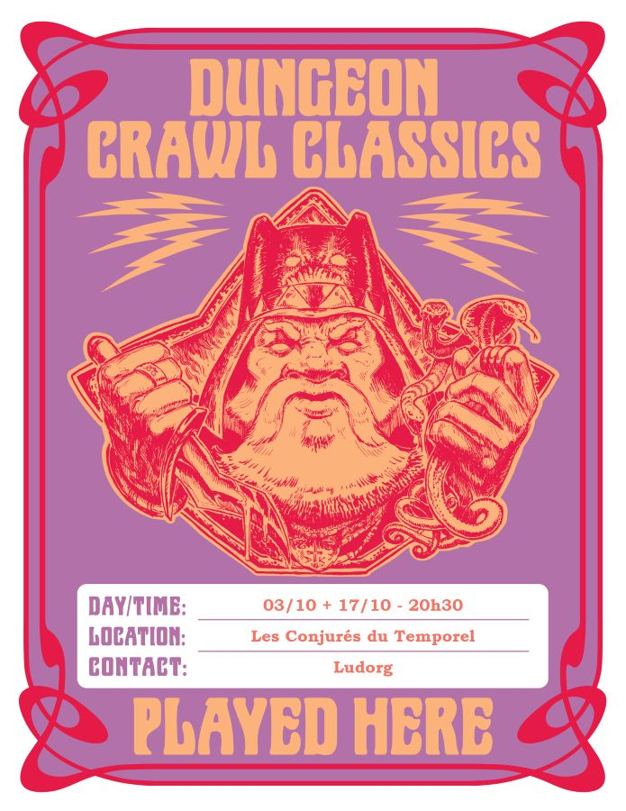

# DCC - La Fin du Fléau des Rois barbares

Vendredi 17/10/2025 ; 20h30-00h00 ; Les Conjurés du Temporel

Suite et fin du module "Le Fléau des Rois barbares", voir la session précédente : [La Tombe de l’Ulfheonar](./dcc_cdt_2025_10_03).

## Précédemment

Une partie du groupe reste à l’extérieur tandis que les autres explorent la tombe. Ils découvrent des salles couvertes de mousse noire, une cave gravée de runes avec un autel portant un crâne d’ours, et un conduit étroit par lequel Ciarrior et Tuhuruc atteignent une vaste galerie dominée par une colonne instable, où sont suspendus une lance et un bouclier.

En tentant de récupérer les armes à l’aide d’une corde, des goules et un serpent humanoïde surgissent. Le combat, malgré des blessures, tourne à l’avantage des aventuriers. Talion reconnaît alors les cadavres : ce sont les trois frères disparus.

Le déplacement des objets provoque l’effondrement de la colonne et condamne la tombe. Épuisés, les héros regagnent Hirot pour se reposer, projetant de se rendre à la tour de Draupnir le lendemain.

## Personnages et Joueurs

- Thomas
    - Britanice, Clerc de Pelagia (Fromagère)
    - Yttruyakin, Mage (Apprentie Magicienne)

- Evan 
    - Vala, Voleur (Trappeur)

- Eoghan
    - Toska, Guerrier (Garde de Caravane)

- Félix
    - Enoriel, Elfe Forestier
    - Talion, Coupeur de Bourses

### Héros au repos

- Eoghan - Ciarrior, Nain (Mineur Nain)
- Evan - Erohye, Elfe (Avocat Elfe) : prépare le rituel pour appeler un familier
- Sacha - Willy Claude, Guerrier (Vidangeur de latrines)
- Sacha - Dollex, Collecteur d'Impots
- Sacha - Shul, Serrurier

## Périls et dangers

### Retour à la Tombe de l’Ulfheonar

Après une nuit de repos à l’auberge de la Lance Tue-Loup, à Hirot, Tuhuruc et Thulan se préparent à gagner la tour de Draupnir, dans l’espoir d’y retrouver le mage et son apprenti disparus depuis près d’un mois. Le reste du groupe choisit quant à lui de poursuivre l’exploration de la tombe de l’Ulfheonar.

Au village, l’atmosphère est lourde : le tirage au sort destiné à désigner la prochaine victime du molosse doit avoir lieu à midi. Broegan Haverson avertit les jeunes aventuriers que leur nom sera inscrit par le scribe sur une bandelette de parchemin, au même titre que celui des autres villageois, puis placé dans le coffre sacré où sera effectué le tirage.

En chemin vers la tombe, certains aventuriers sont gagnés par l’inquiétude : ils ont la désagréable impression d’être suivis.

Les héros se rendent d’abord dans la Catacombe de l’Ours des Cavernes. Non sans mal, ils déplacent la lourde dalle au sommet de la table-autel. À l’intérieur du coffre de pierre, ils découvrent une douzaine de crânes humains déposés sur la peau et le crâne d’un énorme ours des cavernes. Des lanières de cuir cousues dans la peau permettent de la porter comme une cape, le crâne à crocs servant de heaume grossier. Cette cape, lorsqu’elle est endossée par un guerrier ou un nain, confère à son porteur une furie guerrière incontrôlable.

Après avoir pris possession de la cape, les aventuriers retournent dans la grande galerie. Ils décident d’explorer un passage jusque-là ignoré, situé juste avant la colonne effondrée : une cheminée mène à une petite pièce voûtée.

Un squelette, vêtu de peaux en lambeaux et d’un haubert de mailles rouillé, repose assis sur un trône de pierre. Sur ses genoux, une longue lance scintille faiblement dans l’ombre, tandis qu’une corne à boire polie est accrochée à l’accoudoir.

Il ne fait aucun doute que cette humble salle est le lieu de repos du seigneur de guerre barbare connu sous le nom d’Ulfheonar. Les murs sont ornés de tentures représentant une scène de bataille : un guerrier barbare, vêtu d’une cape d’ours et brandissant une lance, affronte un sombre molosse qu’il maintient à terre, tandis que ses guerriers achèvent la bête.

Les aventuriers s’emparent de la lance et de la corne, puis quittent la tombe. Mais à la sortie, une volée de flèches les accueille : des archers embusqués tirent depuis les arbres. Les héros se mettent à couvert et regagnent l’intérieur de la tombe. Ils se dirigent alors vers l’entrée principale, où ils parviennent enfin à déplacer le rocher qui bloquait le passage. Cette fois, ils ne sont pas attaqués et peuvent sortir sans encombre pour regagner Hirot.

### Tirage au sort défavorable

De retour à Hirot, la troupe est accueillie par Nothan le Jeune, chef des gardes. Il leur annonce que le tirage au sort a eu lieu : c’est Toska, l’un des aventuriers, qui a été désigné comme prochaine victime du molosse. Les hommes du jarl viendront le chercher à l’auberge avant la tombée de la nuit.

Les aventuriers décident alors de tenter un stratagème. Par l’intermédiaire de Nothan, ils informent le jarl qu’ils se rendront eux-mêmes aux menhirs situés hors du village, là où le molosse vient se repaître de ses victimes sacrifiées. Aidés de la lance, ils espèrent pouvoir vaincre la créature.

Plus tard, alors qu’ils prennent un repas bien mérité à l’auberge, Nothan revient les prévenir : le jarl Holgwig accepte leur proposition, mais ses hommes s’assureront que le groupe se rende bien aux menhirs pour y sacrifier Toska.

### Affrontement avec le Molosse

À la nuit tombée, les aventuriers se rendent aux menhirs, Toska à leurs côtés. Ils préparent une embuscade près des pierres levées et attendent. Toska se tient au centre du tertre. Dans la nuit noire, des grognements sourds résonnent bientôt dans les bois. Le molosse surgit : une créature massive, aux yeux rouges luisants et aux crocs dégoulinants de bave.

Toska s’empare de la lance et se tient prêt. Il parvient à bloquer la bête une première fois, mais le molosse se libère de l’emprise de l’arme magique. Ses compagnons continuent de l’assaillir. Finalement, Toska, dans un ultime effort, réussit à immobiliser le monstre, et Vala lui porte le coup fatal. Cette fois, grâce à la lance de l’Ulfheonar, la bête ne disparaît pas dans un nuage de fumée noire : elle s’effondre, définitivement morte.

Emplis de gloire et de soulagement, les aventuriers ramènent le cadavre du molosse au village. À leur arrivée, la cloche d’alarme retentit : les habitants sortent de leurs maisons et acclament les héros. Une foule en liesse les entoure, les célébrant comme des sauveurs.

La décision est prise d’incinérer immédiatement le corps de la bête. Guidés par la foule, les aventuriers montent sur la crête qui domine le village. Le cadavre est déposé sur un bûcher, et dans un immense brasier, le molosse est consumé par les flammes.

Le jarl Holgwig félicite chaleureusement la troupe, et Sylle-Ru, son éminence grise, remet à chacun une bourse en récompense de sa bravoure. Une grande fête sera organisée le lendemain en leur honneur, dans le Grand Hall.
