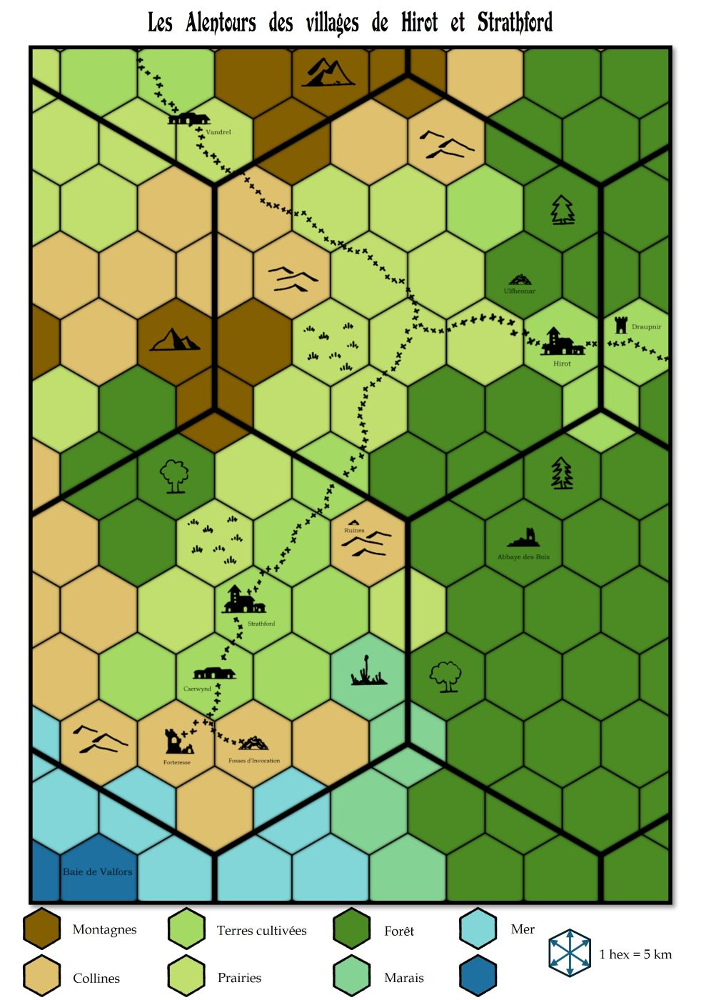

# DCC - Disparitions à la Tour de Draupnir

Vendredi 14/11/2025 ; 20h30-00h00 ; Les Conjurés du Temporel

## Précédemment

Après une nuit de repos à Hirot, Thulan et Tuhuruc partent vers la tour de Draupnir tandis que les autres retournent fouiller la tombe de l'Ulfheonar. 
Ils récupèrent la cape faite avec la peau et le crâne d’un ours, ainsi que la lance d’Ulfheonar.
Une embuscade d’archers les attend à la sortie, mais ils parviennent à regagner le village. 

Le tirage au sort désigne Toska comme sacrifice, et les aventuriers proposent d’aller affronter eux‑mêmes le molosse en utilisant la lance. La nuit venue, Toska immobilise la bête, Vala lui porte le coup fatal ; Le molosse est vaincu et est brûlé sans attendre sur un bûcher, les héros sont acclamés par les villageois et récompensés par le Jarl Holgwig.

## Personnages et Joueurs

- Thomas
    - Britanice, Clerc de Pelagia (Fromagère)
    - Yttruyakin, Mage (Apprentie Magicienne)

- Evan 
    - Erohye, Elfe (Avocat Elfe) : prépare le rituel pour appeler un famillier

- Sacha 
    - Willy Claude, Guerrier (Vidangeur de latrines)

- Eoghan
    - Toska, Guerrier (Garde de Caravane)

- Félix
    - Talion, Voleur (Coupeur de Bourses)

- Augustin
    - Artus Stinc, Voleur (Coupeur de Bourses)

### Héros au repos

- Evan - Vala, Voleur (Trappeur)
- Eoghan - Ciarrior, Nain (Mineur Nain)
- Félix - Enoriel, Elfe (Elfe Forestier)
- Augustin - Horos, Elfe (Sage Elfe)
- Sacha - Dollex, Collecteur d'Impots
- Sacha - Shul, Serrurier

## Périls et dangers

### Quelques jours de festivités à Hirot

Après leur victoire sur le molosse, les aventuriers savourent quelques jours de repos bien mérités à Hirot. Le jarl Holgwig organise de grandes festivités en leur honneur. Les héros sont célébrés comme les sauveurs du village.

Dans la grande salle du hall, des festins somptueux sont servis : les tables débordent de plats traditionnels du Nord. Lloré, unique barde et conteur de Hirot (et également soupirant de Morgane) anime les réjouissances de ses chants épiques et de récits de héros oubliés. La fête s’étire sur plusieurs jours. Enivrés par l’hydromel et portés par l’enthousiasme ambiant, certains en perdent toute notion du temps. Trois jours ? Cinq ? Qu’importe : le village vit au rythme des chants et des toasts.

Pendant ce temps, Erohye, l’elfe, poursuit son travail sur le rituel d’invocation de son familier, espérant ainsi renforcer ses capacités magiques avant de se rendre à la tour de Draupnir.

Au cœur des festivités, les aventuriers sont rejoints par Artus Stinc, un chasseur de trésors attiré par la rumeur de leur découverte : une carte menant à l’Abbaye des Bois.
Ce lieu isolé aurait autrefois abrité un grand prêtre et ses disciples. Retirés du monde, ils auraient disparu en emportant un trésor sacré d’une valeur inestimable : reliques serties d’or et de gemmes, ouvrages liturgiques cousus de fil d’or, encensoirs précieux, et cinq mystérieux reliquaires symbolisant les périls de l’âme humaine.

Mais avant de se lancer à la recherche de ce trésor oublié, les aventuriers doivent d’abord se rendre à la tour de Draupnir. Thulan le Mage et Tuhuruc le Halfelin y sont partis depuis plus de cinq jours et ils ne sont toujours pas revenus...

### Vers la Tour de Draupnir

Les aventuriers quittent Hirot dans la matinée. La route qui mène à l’est est bordée de champs cultivés, avec les forêts en arrière-plan. Le voyage se déroule sans encombre, et ils arrivent bientôt en vue de la tour.

Deux ou trois fermes forment un petit hameau au pied d’une colline, sur laquelle se dresse la tour de Draupnir : une structure de pierre grise, peu élevée, percée de fenêtres étroites et dotée d’une porte en bois massif.

Des paysans, occupés dans un champ voisin, les informent que la tour est inhabitée depuis plusieurs semaines. Ils n’ont vu ni Draupnir ni Rubuld, son apprenti, depuis longtemps. Quant à Thulan et Tuhuruc, il semble qu’ils soient passés par ici il y a quelques jours. Ils seraient entrés dans la tour... mais n’en sont jamais ressortis.

Les aventuriers s’approchent de la tour. La porte est fermée, mais non verrouillée. À l’intérieur, les lieux sont silencieux. La tour semble pourtant correctement entretenue.
Dans le vestibule, trois portes mènent à différentes pièces. Celle de gauche s’ouvre, et un balai magique en sort, poursuivant son ménage comme si de rien n’était.
Les aventuriers pénètrent dans la pièce, mais un étrange phénomène se produit...

### Le Passage vers l’Autre Monde

Ils se retrouvent avec stupéfaction dans un paysage boréal couvert
de givre, où des arbres noirs se serrent les uns contre les autres
sous la neige, dissimulant des zones encore plus obscures sous leurs
frondaisons. A mi-chemin du sommet d’une montagne de
roche noire qui semble avoir été fendue comme une bûche par la hache
d’un géant. Devant, un vague sentier serpente jusqu’au sommet.
Derrière, il descend dans la forêt obscure. La porte a disparu. Le
ciel nuageux a pris une couleur d’acier.

Britanice perçoit une voix de femme, pressante, qui résonne dans son esprit :
"Par le sang d’Ivrian et le symbole d’Ivrian, viens à moi !". 

Troublé mais résolu, le groupe décide de suivre le sentier qui grimpe vers le sommet de la montagne. La piste serpente à travers les étendues glacées. La neige recouvre désormais presque entièrement la roche noire. Après deux heures de marche, à l’orée d’un bois sombre, un petit cairn de pierres a été érigé, solitaire.

Soudain, des cris de guerre retentissent derrière eux : des ululements sauvages, bestiaux, portés par le vent. Une horde approche.
Des hommes surgissent : cheveux bruns en bataille, presque nus malgré le froid, le corps couvert de motifs dorés. Sur leur tête, des bois de cerf forment des coiffes rituelles. Ils avancent, féroces, comme surgis d’un autre âge.

Les aventuriers se préparent au combat... Sur l’un des guerriers, Willy-Claude reconnaît une étoffe appartenant à Tuhuruc, le halfelin teinturier.
Le groupe repousse rapidement les hommes sauvages, les mettant en déroute.
Au campement dans le bois, sous une peau grossière, ils découvrent les corps sans vie de Tuhuruc et Thulan. Les sauvages les ont tués.

Les aventuriers poursuivent leur ascension et gravissent quatre heures durant, une bonne partie du sentier. Devant eux s’étend une vaste forêt boréale glacée, qui s’étire à perte de vue. À l’est, ils aperçoivent une mer figée sous la banquise.
Le monde semble avoir perdu toute couleur : seuls subsistent les arbres et les roches noires, la neige et un ciel d’acier.

Soudain, d’une fissure dans la roche (qu’ils prenaient pour une simple tache sombre) surgit une créature à la fourrure blanche, cauchemardesque croisement entre un scorpion et un mille-pattes. Elle se précipite vers eux.
Le combat s’engage sur le sentier escarpé. D’un puissant coup de lance, Toska la précipite dans le ravin.

### Rencontre avec Ivrian

Après deux heures de marche, les aventuriers atteignent enfin l’extrémité du sentier. Devant eux, une ouverture noire perce l’épaisse couche de neige qui recouvre la montagne. Des marches usées, taillées à même la roche, mènent à un tunnel obscur, large de six mètres et haut de deux mètres quarante, au plafond voûté.

En examinant l’entrée, Talion remarque qu’il y avait autrefois des portes fixées à cette ouverture. Les trous des charnières sont encore visibles, mais les battants et leurs fixations ont disparu depuis longtemps.

L’ouverture donne sur un long tunnel de dix-huit mètres de large, dont la voûte culmine à quatre mètres cinquante. Les murs, le sol et le plafond sont faits de roche noire, ornée de motifs représentant des fossiles de poissons anciens et d’énormes ammonites. Ces décorations, brillantes sur fond mat, ne se révèlent qu’à la lumière vacillante des torches et des lanternes.

Talion observe cette fresque minérale avec attention. Soudain, il s’arrête, intrigué. Un poisson éthéré, luminescent, émerge lentement du mur. Sans hésiter, Toska l’embroche de sa lance. La créature se dissout aussitôt en une brume scintillante.

Sur la droite, ce qui semblait être une porte se révèle être un rideau de fils adamantins, serrés et suspendus au plafond. Ces fils se détendent au contact, permettant de les traverser.

Ce passage mène à une salle carrée d’environ quinze mètres de côté. Les murs de pierre noire sont bas, et le plafond voûté culmine à trois mètres soixante.

Au centre de la pièce se dresse un fauteuil en bois noir, apparemment confortable, garni de coussins blancs. À ses côtés se trouvent un repose-pied assorti, un petit coffre, et une table basse sur laquelle repose un chandelier encore pourvu d’une bougie intacte.

Le coffre contient plusieurs volumes reliés, qui semblent être des journaux. Ils sont rédigés dans un code étrange, difficile à déchiffrer. Certaines illustrations, en revanche, sont explicites : elles montrent le dépeçage de femmes vivantes pour alimenter des cuves. D’autres dessins représentent un démon à tête de cheval, orné de bois de cerf, ainsi que de petites abeilles à l’apparence cruelle.

Sur la gauche du hall principal, un couloir étroit mène à une vaste salle dont la voûte en berceau culmine à quatre mètres cinquante. Tout au fond, à l’ouest, se dresse un grand trône de pierre noire. Une silhouette translucide y est assise : une femme d’une beauté saisissante, à la peau d’un blanc argenté et aux cheveux d’un noir de jais.

Les aventuriers reconnaissent avec stupeur les traits de Britanice, dont le visage figure sur les pièces d’argent découvertes précédemment. Elle leur sourit et déclare d’une voix douce : "Je suis Ivrian de Dalcia. Je vous souhaite la bienvenue."

_Récit retranscrit par Kophaloth, le scribe aux mille parchemins_

