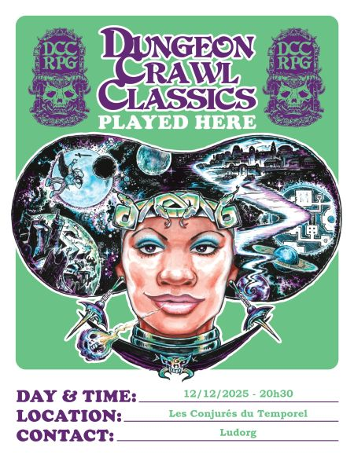

# DCC - Troubles durant le Festival des Feux Sacrés du Solstice d'Hiver

Vendredi 12/12/2025 ; 20h30-00h00 ; Les Conjurés du Temporel

Interlude à Hirot et début du module "Le Retour du dieu ancestral".

## Précédemment

Les aventuriers ont exploré le Siège d’Ivrian, libéré Draupnir et son apprenti des machinations des anciens Bâtisseurs. Ils ont rencontré le fantôme d’Ivrian, qui leur a demandé de récupérer l’astrolithe. Armés de l’épée runique Écorchenuit, ils ont traversé un gouffre, affronté le démon Aagazzbagh et vaincu ses gardiens, mais la pierre a disparu avec la créature. En suivant un sentier jusqu’à un cercle de pierres noires, ils ont trouvé un portail menant à la tour de Draupnir, où ils sont finalement revenus.

## Personnages et Joueurs

- Thomas
    - Britanice, Clerc de Pelagia (Fromagère)

- Evan 
    - Vala, Voleur (Trappeur)    

- Sacha 
    - Willy Claude, Guerrier (Vidangeur de latrines)

- Félix
    - Talion, Voleur (Coupeur de Bourses)

- Augustin
    - Artus Stinc, Voleur (Coupeur de Bourses)

### Héros au repos

- Thomas - Yttruyakin, Mage (Apprentie Magicienne) : prépare le rituel pour appeler un familier
- Evan - Erohye, Elfe (Avocat Elfe)
- Eoghan - Ciarrior, Nain (Mineur Nain)
- Eoghan - Toska, Guerrier (Garde de Caravane) : accompagne le groupe pour l'expédition vers l'iceberg hyperboréen, tout en restant en retrait
- Félix - Enoriel, Elfe (Elfe Forestier)
- Augustin - Horos, Elfe (Sage Elfe)
- Sacha - Dollex, Collecteur d'Impots
- Sacha - Shul, Serrurier

## Périls et dangers

Après quelques jours de repos à la tour de Draupnir, Yttruyakin et Erohye, guidés par le magicien, étudient de nouveaux sorts tandis que Britanice médite pour maîtriser de nouveaux rituels.
Toska et Talion reprennent leurs forces, et le reste du groupe profite de l’hospitalité de Draupnir et de ses serviteurs animés. 
Revigorés, les aventuriers prennent finalement la route de Hirot, où les festivités du Solstice d’Hiver doivent commencer dans deux jours.

### Pendant ce temps, à Hirot

Pour les habitants de Hirot, quinze jours se sont écoulés depuis le départ des aventuriers pour la tour de Draupnir. Pour ceux qui ont pris part à l’exploration, pourtant, seule une journée a passé — étrange distorsion temporelle, caprice des arcanes ou bizarrerie du voyage entre les mondes.

Les aventuriers avaient quitté Strathford en escortant une caravane de villageois fuyant la résurgence du Chaos. Une partie de ces réfugiés a finalement quitté Hirot à cause du Molosse. Quant à la population de Strathford, elle est est désormais réduite à une cinquantaine d’âmes. 
Depuis la chute de la créature, plusieurs familles ont choisi de s’installer durablement à Hirot, qui compte désormais environ deux cents habitants.

#### Changements religieux

Le père Beacom, prêtre de Justicia, a été relevé de ses fonctions par le sanctuaire de Kald, qui a jugé son attitude indigne durant les semaines où le Molosse terrorisait la région.
Son remplaçant, le père Eryndor, jeune et plein d'énergie, est arrivé il y a trois jours. 
Les deux acolytes voués au silence, frère Aker et frère Haams, demeurent en poste.

Kald, monastère fortifié situé à 35 km à l’est, abrite une cinquantaine de moines‑guerriers vivant en autarcie. 
Gardien de reliques sacrées et d’un savoir martial ancien, le lieu est réputé saint... mais aussi sujet à des visions troublantes.
C’est un centre majeur de pèlerinage.

#### Rumeurs et activités inhabituelles

Pour ceux restés à Hirot, plusieurs événements ont troublé la quiétude du village :
- Vala rapporte qu’une bande de brigands aurait pillé une caravane marchande près d’Hirot ; certains disent qu’ils cherchent l’Abbaye des Bois.
- Ciarrior a reçu une lettre annonçant la mort de son oncle Varrak, dernier du clan Tannheim, qui lui lègue — ainsi qu’à son cousin Fendril — les droits sur le domaine familial. Fendril annonce sa venue prochaine.
- Velwyn Murmure‑de‑Pierres, mentor d’Erohye, a quitté son cercle de pierres près de Strathford : l’énergie tellurique issue des ruines de la forteresse a rompu l’équilibre du lieu, provoquant des comportements anormaux chez la faune. Enoriel et Horos l’ont accueilli au sein de la communauté elfique de la forêt sud‑ouest.
- Dollex, ancien collecteur d’impôts, a été approché par Sylle‑Ru, conseiller du jarl Holgwig, pour instaurer une taxe destinée à financer la reconstruction des maisons détruites par le Molosse. Sylle‑Ru propose aussi aux aventuriers, via Dollex, de louer une maison restaurée avec un ou deux domestiques pour 1 po par semaine.
- Shul, serrurier, a été appelé pour ouvrir une maison abandonnée où il a découvert d’étranges inscriptions gravées sur les murs. Il s’agissait de l’ancienne demeure d’Ymae, la Veuve Folle — que certains tiennent pour une sorcière.

### Le Festival des Feux Sacrés du Solstice d'Hiver

Sur la place du village, les habitants célèbrent le solstice d’hiver : les rites sont achevés, les bêtes sacrifiées pour affronter la saison froide, et les tonneaux d’hydromel s’ouvrent autour des grands feux de joie. Pyrrhus l’Incorruptible, vieux prêtre de Loptir, préside la cérémonie, drapé d’écarlate et couronné de cuivre, tandis que la nuit glaciale — étrangement sèche, comme si un blizzard retenait son souffle — enveloppe Hirot.

Au nord, des rumeurs d’enfants malades circulent : un messager rapporte plusieurs cas à Vandrel, carrefour des plaines et village de passage connu pour son auberge du Fer à Cheval Fendu.

La fête bascule lorsque qu’une femme surgit en hurlant, son enfant dans les bras, poursuivie par une petite créature armée d’un couteau. D’autres humanoïdes jaillissent des ombres, leurs lames scintillant dans la lumière des feux, et la place sombre aussitôt dans le chaos.
Les assaillants sont de petits êtres noueux, proches de gnomes, hauts d’à peine 1,20 m : peau bleu glacé, cheveux et barbe d’un blanc de lichen, et une mousse vert pâle en guise de sourcils. 

Quatre se ruent sur les aventuriers, tandis que le cinquième poursuit la mère en fuite.
Le combat tourne rapidement à l’avantage des héros, mais une immense ombre recouvre soudain la place et éclipse la lune. À l’ouest, une gigantesque masse de glace scintillante, haute comme une colline et surmontée de ruines, glisse lentement vers le sud, jetant un voile d’inquiétude sur les festivités.

Pyrrhus l’Incorruptible, le prêtre de Loptir, le Seigneur des Flammes, s’avance, un brandon enflammé en main, et déclare que les créatures vaincues ne sont que les serviteurs d’un mal ancien qui menace la région.
Selon lui, Loptir exige que cette force de glace soit détruite.
Il affirme que les aventuriers se sont montrés dignes de la bénédiction du Seigneur des Flammes et les appelle à porter le feu souverain, une étincelle de flamme divine, pour éradiquer ce danger.

Le jarl Holgwig fait préparer des chevaux, et la troupe prend la direction de l’étrange iceberg qui dérive dans la nuit, éclairé par la lune.

### L'assaut sur l’iceberg Hyperboréen

Grâce à leurs montures, les aventuriers atteignent rapidement la base de l’iceberg. Ils y aperçoivent des échelles de corde fixées au bas d’un escalier taillé dans la glace, que les tontuus — ces gnomes à la peau bleu glacé et aux cheveux de lichen — remontent lorsqu’ils n’en ont plus l’usage.

Talion tente de faire tomber l’une de ces échelles d’une flèche bien placée, mais le tontu de garde s’enfuit en grimpant les marches. Britanice prend alors sa forme de flamme pour atteindre l’escalier et abaisser les échelles, permettant au groupe de grimper. Vala manque de chuter durant l’ascension, mais se rattrape de justesse.

Au sommet se dresse une structure rectangulaire et trapue, rongée par la glace et le temps. La cour est marquée de nombreuses traces de pas.
Derrière une ouverture béante, une petite chambre apparaît : givre sur les murs, neige au sol, et surtout d’étranges bosquets de petits conifères poussant directement depuis la pierre nue. L’air y est froid, saturé d’une odeur d’aiguilles de pin. Un escalier en colimaçon fissuré descend vers les profondeurs.

En bas, les aventuriers découvrent une pièce plus vaste et étonnamment plus chaude. Le sol de pierre est déformé comme par d’anciens bouleversements, et les murs sont couverts de hiéroglyphes inconnus. De grands pins poussent ici encore, certains aux troncs si fins qu’ils semblent presque humanoïdes. Leurs branches bruissent sans qu’aucun vent ne souffle.

Vala et Artus reconnaissent les symboles : ils sont d’origine hyperboréenne, vestiges d’un empire jadis dédié à l’élévation de l’esprit, du corps et de l’âme, berceau de nombreuses magies anciennes.

Les arbres se mettent alors à murmurer. Des voix enfantines, fantomatiques, chuchotent :
- Il est vieux... si vieux...
- La haine et le mal... il se nourrit de nous...
- Tjaptar ne veut pas nous laisser partir... il est en colère... oublié...

Derrière les troncs se dissimule une porte menant à une vaste salle en ruines, encombrée de colonnes brisées et de dalles soulevées.

Des décombres surgit soudain une silhouette massive : un humanoïde couvert d’un pelage noir et laineux, la tête d’un bélier cornu, faisant tournoyer une lourde chaîne en signe de défi. C’est un joulbok, une brute redoutable.

Le combat s’engage. Lorsque Willy‑Claude s’approche, le monstre frappe la neige de sa chaîne, brisant la couche gelée et précipitant le guerrier dans une d'oubliette en dessous. 

Des tontuus embusqués bondissent pour attaquer le reste du groupe.
La bataille est féroce, mais les trois roublards, soutenus par la puissance de Britanice, finissent par abattre le joulbok et ses alliés.

Dans une zone dégagée des décombres, les aventuriers découvrent un petit campement et un escalier qui descend encore plus profondément dans l’iceberg...

_Récit recueilli par Kophaloth, témoin impartial des aventures mortelles._
