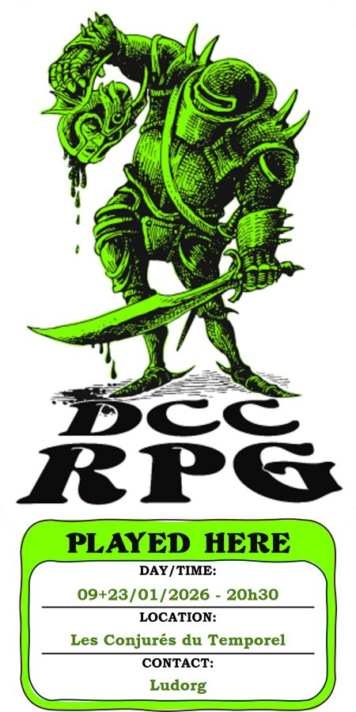

# DCC - Terreur dans l'Arbre

Vendredi 23/01/2026 ; 20h30-00h00 ; Les Conjurés du Temporel

## Précédemment

La chute de Tjaptar, antique dieu hyperboréen, n’a offert qu’un bref répit avant que rumeurs, visions et présages oubliés ne fassent de nouveau peser leur menace sur la région de Hirot.
Égarés dans la forêt, les héros ont fini par tomber sur une clairière maudite où se dresse un arbre calciné qui semble repousser la lumière elle‑même.

## Personnages et Joueurs

- Thomas
    - Yttruyakin, Mage (Apprentie Magicienne)

- Evan 
    - Vala, Voleur (Trappeur)    

- Félix
    - Talion, Voleur (Coupeur de Bourses)

- Eoghan 
    - Toska, Guerrier (Garde de Caravane)

### Héros au repos

- Thomas - Britanice, Clerc de Pelagia (Fromagère)
- Evan - Erohye, Elfe (Avocat Elfe)
- Eoghan - Ciarrior, Nain (Mineur Nain)
- Félix - Enoriel, Elfe (Elfe Forestier)
- Augustin - Horos, Elfe (Sage Elfe)
- Augustin - Artus Stinc, Voleur (Coupeur de Bourses)
- Augustin - Theldur, Prêtre de Crom (Fermier)
- Sacha - Dollex, Collecteur d'Impots
- Sacha - Shul, Serrurier
- Sacha - Willy Claude, Guerrier (Vidangeur de latrines)

## Périls et dangers

### La Clairière Maudite

Une clairière sombre révèle un arbre gigantesque dont le tronc tordu, noirci comme par un feu infernal, étouffe la lumière. 
Autour de lui, des ossements et des pommiers déracinés jonchent le sol, repoussés par des roches acérées surgies comme des dents.

Ce lieu était autrefois un verger protégé par une épimélide, une dryade gardienne des pommiers, mais l'influence abyssale l’a rendue folle. 
Les héros la surprennent sous une forme elfique, en train de frapper les racines de l’arbre avec une lance de bois de cœur.

Les entailles faites dans l'écorce de l’arbre par la dryade suintent une sève noire et visqueuse, mais l'écorce se cicatrise à vue d'oeil.

Apaisée par Yttruyakin, elle raconte sa chute : deux mois plus tôt, des créatures sylvestres lui ont offert une graine prétendument bénie par l'Espit de la Forêt.
Trois jours après l’avoir plantée, elle a vu le verger s’effondrer en une nuit, remplacé par cet arbre monstrueux dont les branches portent désormais d’énormes gousses prêtes à éclore.

Les aventuriers acceptent d’aider Esméryl, l’épimélide, en échange de son aide pour retrouver leur chemin dans la forêt.
Ils passent la soirée et la nuit à l’orée de la clairière, près de la petite hutte de bois où vit la dryade.
Esméryl leur confie que d'immenses toiles d’araignées sont apparues au sud de son verger, sans qu’elle n’ait aperçu la moindre créature capable d’en être l’auteur.

Au cœur de la nuit, des ricanements provenant de l’arbre les réveillent.
Yttruyakin distingue des yeux rouges et menacants dans l’obscurité et croit entendre des voix chuchoter des menaces.

### L'Arbre Infernal

Theldur et Willy-Claude, troublés par l'atmosphère malsaine du lieu préfèrent se reposer dans la hutte de l'épimélide.

À l’aube, les héros s’avancent vers l’arbre infernal.
Son tronc s’élève droit sur une dizaine de mètres avant de se tordre en spirales inquiétantes. 

Vala mène l’ascension : à cette hauteur, il découvre l’origine du violon qu’il entendait depuis le sol : une petite créature ailée, semblable à une libellule humanoïde, jouant perchée sur les branches. 
Le musicien l’invite à boire une sève sombre contenue dans une cruche d’argile, qu’il partage avec trois fées surgissant dans les airs.
La petite troupe explique qu’elle récolte la sève de l’arbre. 
Celle‑ci les enivre visiblement, mais semble aussi avoir altéré leur esprit.

A tour de rôle, ils grimpent dans l'arbre, aidés d'une corde fournie par la dryade. 
L’écorce sous leurs pieds semble se contorsionner pour former des visages démoniaques. 
En écrasant une gousse, Toska libère quatre Infernureuils qui se jettent sur eux avec férocité. 
Restée au sol, Yttruyakin invoque un nuage étouffant qu’elle dirige vers les créatures, manquant de peu d’asphyxier Talion, qui s’en échappe de justesse.

### Combat dans l'Arbre

Les aventuriers parviennent finalement à abattre les Infernureuils. 
Talion redescend aussitôt pour recevoir les soins de Theldur, qui invoque Crom dans une prière rugueuse mais salvatrice.

Ils reprennent ensuite l’ascension parmi les branches. 
Plus haut, une large cavité s’ouvre dans le tronc. 
À l’intérieur, un énorme gland, enraciné au cœur de l’arbre abyssal, est incrusté dans le bois. 
Autour de lui, des os tranchants et des lambeaux de carcasses de cerfs, d’ours et d’autres bêtes de la forêt sont plantés comme des offrandes macabres. 
Les héros comprennent que ce gland est la source même de la corruption.

Vala descend dans la cavité au moment où six nouveaux Infernureuils surgissent. 
Le combat éclate. Tandis que Toska et Yttruyakin retiennent les créatures, Vala s’acharne sur le gland. 
Une sève noire et gluante dégouline du plafond, les aspergeant. 

Finalement, une flèche de Talion atteint sa cible : le gland éclate dans une gerbe de flammes, brisant le cœur de l’arbre maudit.

### Repos dans la Hutte d’Esméryl et Fin de la Corruption

Affaiblis et meurtris, les héros regagnent la hutte d’Esméryl. 
La dryade les soigne avec ses herbes et ses onguents, puis les invite à se reposer. 
Dans l’après‑midi, ils constatent que la destruction du Gland de Feu Infernal a stoppé la croissance de l’arbre abyssal : le tronc se flétrit déjà, et ses branches se dessèchent.

Au matin, l’un des aventuriers les plus agiles grimpe dans l’arbre pour tenter de se repérer dans la forêt. 
Vers l’est, il distingue à environ une heure de marche une crête rocheuse, au sommet de laquelle se dressent les murs trapus d’une abbaye en ruine.

L’Abbaye des Bois est désormais en vue ; dès que leurs blessures seront pansées, les héros reprendront la marche vers cet mythique sanctuaire.

## À suivre...

_Consigné sous la plume de Kophaloth, gardien des chroniques interdites._

