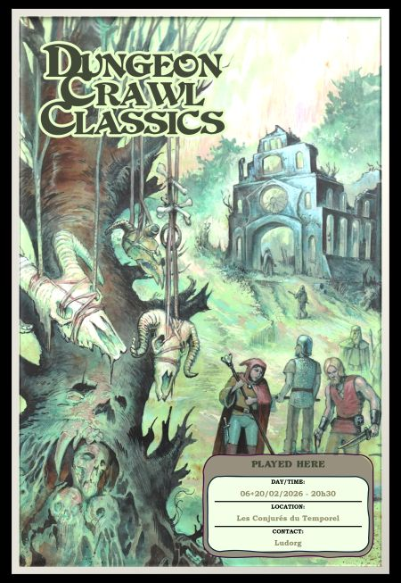

# DCC - Exploration de l'Abbaye des Bois

Vendredi 06/02/2026 ; 20h30-00h00 ; Les Conjurés du Temporel

## Précédemment

Les héros ont aidé Esméryl à affronter la corruption qui rongeait son ancien verger, puis ont gravi l’arbre abyssal en affrontant les Infernureuils pour détruire la source de la corruption : un Gland de Feu Infernal. Soignés dans la hutte de la dryade, ils ont vu l’arbre se flétrir et aperçu à l’est leur prochaine destination : les ruines de l’Abbaye des Bois.

## Personnages et Joueurs

- Thomas
    - Yttruyakin, Mage (Apprentie Magicienne)

- Evan 
    - Vala, Voleur (Trappeur)    

- Sacha 
    - Willy Claude, Guerrier (Vidangeur de latrines)

- Félix
    - Talion, Voleur (Coupeur de Bourses)

- Eoghan 
    - Toska, Guerrier (Garde de Caravane)

- Augustin 
    - Theldur, Prêtre de Crom (Fermier)

### Héros au repos

- Thomas - Britanice, Clerc de Pelagia (Fromagère)
- Evan - Erohye, Elfe (Avocat Elfe)
- Eoghan - Ciarrior, Nain (Mineur Nain)
- Félix - Enoriel, Elfe (Elfe Forestier)
- Augustin - Horos, Elfe (Sage Elfe)
- Augustin - Artus Stinc, Voleur (Coupeur de Bourses)
- Sacha - Dollex, Collecteur d'Impots
- Sacha - Shul, Serrurier

## Périls et dangers

### L'Abbaye des Bois

Après trois jours de repos et avoir pris congé d’Esméryl, les héros mettent le cap à l’est vers l’Abbaye des Bois, un ancien monastère en ruines enfoui au cœur d’une forêt sombre et oppressante. 

En chemin, guidés par la carte trouvée dans la Forteresse des Seigneurs du Chaos, Vala partage avec ses compagnons ce qu’il a appris sur ce lieu oublié.
Tous les chasseurs de trésors connaissent la légende du trésor de l’abbé : dégoûté par la décadence des cités humaines, un grand prêtre mena jadis ses disciples dans la nature sauvage pour y vivre à l’abri du vice. Ils emportèrent avec eux une véritable caravane de reliques inestimables : fonts baptismaux sertis d’or et d’argent, crosses incrustées de gemmes, ouvrages liturgiques reliés en platine, encensoirs d’or, et cinq reliquaires sacrés symbolisant les périls qui menacent chaque mortel. Puis l’abbé et sa congrégation disparurent, sans laisser la moindre trace.

Yttruyakin et Theldur, de leur côté, ont entendu parmi les érudits une rumeur plus inquiétante : l’abbé, obsédé par la quête de la vie éternelle, aurait découvert un rite capable de libérer l’humanité des Cinq Fléaux : la Folie, la Violence, la Maladie, la Faim et la Vieillesse. L’abbaye aurait pu être le théâtre de ce rituel interdit, et les reliques qu’elle abritait en seraient peut‑être les composantes essentielles.

### En arrivant aux ruines

Alors qu’ils approchent de l’abbaye en ruine, les héros entendent les voix d’un groupe avançant sans la moindre discrétion. Certaines leur sont familières : ils reconnaissent notamment Britanice, la fromagère devenue clerc de Pelagia.

Sept silhouettes émergent bientôt de la brume : Britanice, Ciarrior, Erohye, Shul, Enoriel, Horos et Artus Stinc. 

Inquiets de ne pas les voir revenir à Hirot après deux jours d’absence, ils se sont mis en route pour les retrouver. Les elfes du Bosquet des Trois Sœurs avaient été alertés par les sœurs sylvestres d’Esméryl, l’épimélide gardienne du verger. 
