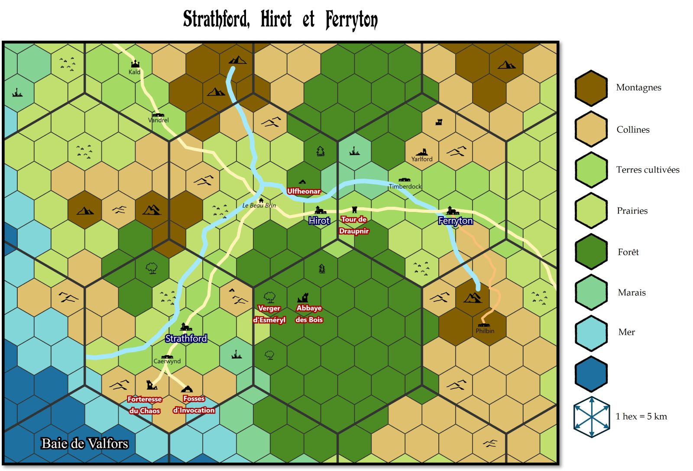

# DCC - Trouble Troublant à Timberdock

Vendredi 20/03/2026 ; 20h30-23h00 ; Les Conjurés du Temporel

## Précédemment

A l'abbaye des bois, les héros ont traversé une salle où le Temps ronge la chair, affrontant le Fléau de la Vieillesse qui a laissé Vala prématurément flétri. 
Plus bas, ils ont abattu l’abomination née du sang des acolytes de l’abbé et ont récupéré une partie de son trésor. 
À la surface, ils ont repoussé une attaque de brigands avant de reprendre la route de Hirot, chargés de reliques et de richesses.

## Personnages et Joueurs

- Thomas
    - Yttruyakin, Mage (Apprentie Magicienne)
    - Britanice, Clerc de Pelagia (Fromagère)

- Evan 
    - Vala, Voleur (Trappeur) 
    - Erohye, Elfe (Avocat Elfe)

- Augustin 
    - Horos, Elfe (Sage Elfe)
    - Artus Stinc, Voleur (Coupeur de Bourses)

- Eoghan 
    - Ciarrior, Nain (Mineur Nain)
    - Toska, Guerrier (Garde de Caravane)

### Héros au repos, ou en retrait du groupe

- Félix
    - Talion, Voleur (Coupeur de Bourses)
    - Enoriel, Elfe (Elfe Forestier)

- Augustin 
    - Theldur, Prêtre de Crom (Fermier)

## Périls et dangers

### Intermède à Hirot

#### Un départ vers d'autres horizons

Willy‑Claude a compris, ces dernières semaines, que la force qu’il a gagnée ne pouvait plus rester silencieuse. Il a décidé de l’employer pour relever les Gongfarmers et briser la misère et le déshonneur qui pèsent sur leur caste. Après tant d’années passées les mains dans la fange, il a fini par y découvrir une forme de noblesse, peut‑être même un éclat de chevalerie qu’il ne soupçonnait pas. 
Avant de partir tracer sa propre voie, il a pris sa juste part du butin des expéditions, de quoi soutenir sa cause et nourrir ses ambitions nouvelles.

#### Un mystérieux visiteur

Pendant la courte absence des héros, à peine moins d'une semaine, un jeune homme à l'allure hirsute est arrivé à Hirot. Il se faisait appeler Osric et affirmait venir de Galaron, la capitale du royaume de Morrain. Selon ses dires, il représentait le Tome, une société de magiciens âgés, de maîtres du savoir et d'arcanistes fortunés, collectionneurs de grimoires rares et mécènes de compagnies d'aventuriers. Il prétendait avoir été envoyé par Gazred le Vieux, Maître‑Livre suppléant.

Durant son séjour, Osric a longuement interrogé les habitants à l'Enseigne de la Lance Tue‑Loup, s'attardant surtout auprès de Lloré, le barde du village. Il s'intéressait de très près aux événements récents liés au Molosse et à sa défaite, notant chaque détail avec une curiosité presque fébrile.

Selon Morgane Haverson, la fille de l'aubergiste, Osric a finalement quitté le village pour explorer les Tourbières Basses, la vaste zone marécageuse située à l'est de la Tombe de l'Ulfheonar.
Il n'est jamais revenu.

#### Un appel à l’aide

Depuis leur retour victorieux à Hirot, la renommée des aventuriers a dépassé les frontières du village. Dans les tavernes des environs, on murmure désormais leur nom : les Libérateurs de Hirot. C’est sans doute pour cette raison qu’un messager essoufflé les a trouvés au petit matin, porteur d’un sceau de cire verte : celui du Thane Veldrik de Lornhame, seigneur de Timberdock, un hameau de bûcherons établi sur la rivière.

Dans sa lettre, le Thane les implore de venir au plus vite. Des habitants ont disparu sans lutte, sans trace, comme avalés par la nuit elle‑même. Autour de Yarlford, on rapporte des phénomènes inquiétants : des lueurs entre les troncs, des silhouettes immobiles sur les collines, des cris étouffés portés par le vent. Yarlford, situé à une vingtaine de kilomètres de Hirot, n’est plus qu’un champ de pierres noircies : autrefois siège d’une congrégation de magiciens étudiant une source d’énergie tellurique, le lieu fut détruit il y a plus de cinquante ans lors d’expériences qui dépassèrent leurs maîtres.

Et partout, la même rumeur court : quelque chose rôde depuis les hauteurs.

