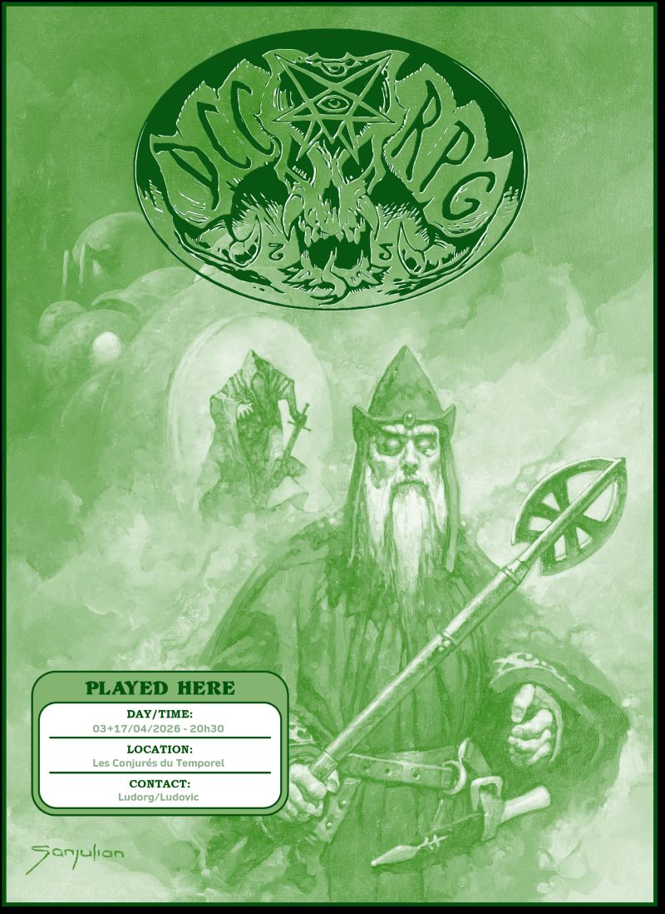

# DCC - Assaut sur la Citadelle de l'Enchanteur d'Émeraude

Vendredi 03/04/2026 ; 20h30-23h00 ; Les Conjurés du Temporel

## Précédemment

Auréolés de leurs multiples hauts-faits dans la région, les Libérateurs de Hirot ont répondu à l'appel désespéré du Thane Veldrik de Lornhame, seigneur de Timberdock.
Les habitants de ce village de bucherons disparaissent autour des ruines hantées de Yarlford.
En suivant les indications des éclaireurs du Thane, ils ont atteint la Citadelle de l'Enchanteur d'Émeraude, affrontant des gardiens de pierre et un tourbillon vivant de mosaïques.
Au cœur du bastion, un mourant leur a soufflé un avertissement cryptique : « Thesdipèdes connaît le mot... »  

## Personnages et Joueurs

- Thomas
    - Yttruyakin, Mage (Apprentie Magicienne)
    - Britanice, Clerc de Pelagia (Fromagère)

- Evan
    - Vala, Voleur (Trappeur)
    - Erohye, Elfe (Avocat Elfe)

- Augustin
    - Horos, Elfe (Sage Elfe)
    - Artus Stinc, Voleur (Coupeur de Bourses)

- Eoghan
    - Ciarrior, Nain (Mineur Nain)
    - Toska, Guerrier (Garde de Caravane)

- Félix
    - Talion, Voleur (Coupeur de Bourses)

### Héros au repos

- Félix
    - Enoriel, Elfe (Elfe Forestier)

- Augustin
    - Theldur, Prêtre de Crom (Fermier)

## Périls et dangers

### La table d'émeraude de la salle de réception

Le plateau d'émeraude se met à luire, puis deux crânes verts en jaillissent comme surgissant d'un portail liquide, bientôt suivis par l'Enchanteur d'Émeraude lui‑même, un homme à la peau et aux habits aussi verts que le mal qui l'entoure.

D'un regard noir, il désigne les intrus et murmure quelques mots aux crânes dans une langue que seul Talion comprend : il leur ordonne de surveiller les aventuriers.

Alors que certains espèrent encore une issue pacifique à ce face à face, Toska transperce l'un des crânes d'un coup sec, brisant toute possibilité de négociation.
Avant de disparaître par le même passage mystique, l'Enchanteur lance un dernier avertissement : ses gardiens s'occuperont d'eux, et rien ne pourra les arrêter.

Le crâne survivant s'échappe en filant à travers l'un des judas près des portes, laissant les héros se demander s'il ne les observe pas déjà depuis l'autre côté.

Talion et Artus inspectent alors les deux issues, cherchant pièges et indices. 
Par le judas de gauche, BuzzBuzz, la fourmi extraplanaire d'Yttruyakin, aperçoit des parois de roche sombre et étrange ; lorsque Talion ouvre la porte, il croit voir quelque chose remuer sur ces murs.

Vala, de son côté, observe par le judas de droite un soldat d'émeraude massif, si finement sculpté qu'il semble presque vivant, des boucles de ses cheveux jusqu'aux marques de sa peau.

Pendant ce temps, les deux elfes et la magicienne étudient la table d'émeraude, tentant d'en comprendre la nature et les pouvoirs.
Au cours de cet examen, la table se met à luire,  et deux nouveaux crânes apparaissent.
L'un parvient à s'enfuir par un judas.

Yttruyakin tente d'activer la table, mais perd le contrôle des flux magiques et échappe de peu à un déchaînement arcanique dû à une perturbation du Phlogiston. 
Horos essaie à son tour, mais réalise qu'il n'a pas la puissance nécessaire.

Finalement, Erohye sacrifie une part de son énergie vitale pour forcer l'activation. La table se met à irradier une lueur intense... et, sans hésiter, les aventuriers se précipitent dans le portail qui vient de s'ouvrir.

### Le gardien des souterrains de la Citadelle

Les aventuriers émergent dans une vaste salle souterraine, dominée par une immense boule de cristal enchassée dans le plafond.
De l'autre côté du portail se trouve une table d'émeraude identique à celle qu'ils viennent de traverser, entourée de quelques chaises et meubles simples.
Deux couloirs s'ouvrent depuis la pièce, et Ciarrior, grâce à ses sens nains, confirme sans hésitation qu'ils se trouvent sous terre.

Erohye commence à examiner la boule de cristal tandis que Toska reprend son souffle, assis devant elle.
Artus Stinc s'avance discrètement dans l'un des couloirs, suivi de loin par Ciarrior, qui croit entendre des pas approcher.
Artus aperçoit alors une statue d'émeraude humanoïde de près de 2,40 m, plus terrifiante encore que les précédentes : elle possède d'énormes pinces à la place des mains et une queue de scorpion hérissée de pointes.

Les deux éclaireurs se replient aussitôt pour prévenir le groupe.
Yttruyakin invoque un nuage acide à l'entrée du couloir pour ralentir la créature, mais celle‑ci traverse la brume corrosive sans la moindre hésitation et charge les aventuriers.
Britanice invoque Pélagia pour tenter de la paralyser, mais elle s'effondre sous les coups des pinces meurtrières.
Tandis que Talion décoche des flèches, Toska extrait le corps inanimé de Britanice et la ramène vers Artus.
BuzzBuzz, la fourmi extraplanaire d'Yttruyakin, tente de distraire le monstre, mais est broyée en un instant, infligeant à la magicienne une douleur terrible qui la vide de ses forces.

In extremis, Artus utilise la Corne des Rois sur Britanice pour soigner ses blessures, lui permettant de se relever et de reprendre le combat.

Horos, Erohye et Ciarrior se replient dans l'autre couloir, tandis que Toska protège Britanice et Yttruyakin des assauts de la statue vivante.
Vala et Artus prennent la créature à revers et lui infligent de lourds dégâts. 
Finalement, c'est Toska, porté par la furie de la Peau de l'Ours des Cavernes, qui parvient à abattre le gardien d'émeraude d'un coup de sa lance.

### La demeure de l'Enchanteur d'Émeraude

Le couloir par lequel le gardien est arrivé mène à une porte donnant sur un escalier qui remonte vers les niveaux supérieurs.

Dans l'autre couloir, où Horos, Erohye et Ciarrior se sont réfugiés, les aventuriers découvrent une chambre confortable.
Une bibliothèque y renferme divers volumes poussiéreux ; un examen rapide révèle qu'il s'agit pour la plupart de grimoires magiques.

Plus loin, Talion débouche dans une pièce qui ressemble à l'atelier d'un sculpteur.
Plusieurs blocs d'émeraude y sont taillés en formes encore inachevées : des torses humanoïdes, un cheval miniature, ainsi que plusieurs cubes et crânes humains d'un réalisme troublant.
Des outils de sculpture sont éparpillés sur les établis.

Entre ces deux pièces, une porte laisse filtrer des bruits inquiétants de machineries.
Le roublard tente de l'ouvrir discrètement et, par chance, parvient à la déverrouiller sans un grincement.

Il découvre alors une vaste salle emplie de machines magiques.
Quatre énormes cuves remplies d'un liquide vert bouillonnant occupent les coins de la pièce.
Au‑dessus, des poulies soutiennent des chaînes reliées à des cages d'acier suspendues au plafond. Deux d'entre elles renferment des prisonnières, sans doute des habitants de Timberdock.

À l'autre extrémité de la salle, un homme à la peau verte manipule une machine hérissée de leviers.

Talion retourne aussitôt prévenir ses compagnons.
Les Libérateurs se regroupent alors pour élaborer un plan d'attaque contre l'Enchanteur d'Émeraude.

## À suivre...

_Consigné sous la plume de Kophaloth, témoin des secrets gravés dans la pierre._
