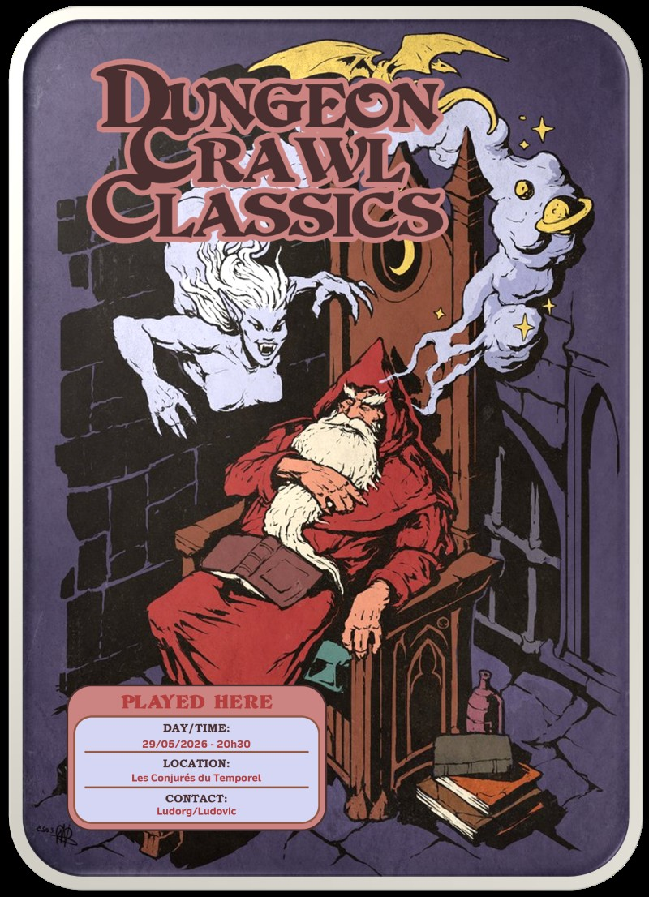
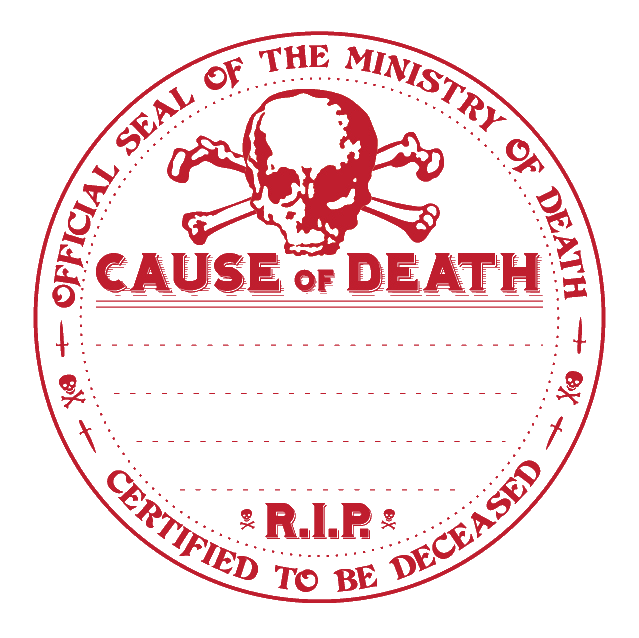

# DCC - Le combat final contre l'Enchanteur d'Émeraude

Vendredi 29/05/2026 ; 20h30-23h30 ; Les Conjurés du Temporel

## Précédemment

Les Libérateurs de Hirot ont suivi la piste des disparitions de Timberdock jusqu'à la Citadelle de l'Enchanteur d'Émeraude, où un mourant leur a soufflé : "Thesdipèdes connaît le mot...".

Le sorcier vert leur est apparu brièvement avant de disparaître, laissant ses gardiens d'émeraude tenter de les broyer.
Après avoir activé un portail, les aventuriers ont survécu à un colosse aux pinces et à la queue de scorpion.

Désormais, au cœur du repaire, ils ont découvert les ateliers du sorcier... et l'Enchanteur lui‑même, prêt à actionner ses machines impies.

## Personnages et Joueurs

- Thomas
    - Yttruyakin, Mage (Apprentie Magicienne)
    - Britanice, Clerc de Pelagia (Fromagère)

- Evan
    - Vala, Voleur (Trappeur)
    - Erohye, Elfe (Avocat Elfe)

- Augustin
    - Horos, Elfe (Sage Elfe)
    - Artus Stinc, Voleur (Coupeur de Bourses)

- Eoghan
    - Ciarrior, Nain (Mineur Nain)
    - Toska, Guerrier (Garde de Caravane)

### Héros au repos, ou en retrait

- Félix
    - Enoriel, Elfe (Elfe Forestier)
    - Talion, Voleur (Coupeur de Bourses)

- Augustin
    - Theldur, Prêtre de Crom (Fermier)

## Périls et dangers

### Le combat final contre l'Enchanteur d'Émeraude

Dans l'Observatorium, sous la masse silencieuse de la gigantesque boule de cristal, les aventuriers affinent leur stratégie.
Un mouvement dans le couloir attire leur attention : un crâne d'émeraude volant les observe, immobile comme un espion suspendu dans l'air. Toska s'avance pour le chasser, mais à mesure qu'il progresse, les bruits se précisent : grincements de machines, chaînes qui s'animent... et surtout, les cris de terreur des deux prisonnières aperçues plus tôt par Talion.

N'y tenant plus, Toska bondit dans la salle.

Quatre cuves colossales, pleines d'un liquide vert en ébullition, occupent les coins de la pièce. Au‑dessus, un réseau de poulies et de chaînes soutient des cages d'acier oscillant au‑dessus du vide, prêtes à être plongées dans les cuves.

À l'autre extrémité, l'Enchanteur d'Émeraude, petit homme à la peau verte, silhouette nerveuse, manipule frénétiquement une machine hérissée de leviers.
Les cages contenant les jeunes femmes commencent à glisser vers les cuves bouillonnantes. Dans le même instant, une nuée de crânes ailés s'arrache de l'ombre derrière le sorcier, tandis que deux statues d'émeraude émergent lentement des cuves restantes, se tournant d'un même mouvement vers les héros.

L'Enchanteur d'Émeraude, les yeux brûlant d'une folie jubilatoire, siffle à leur intention :
"Ainsi donc, vous avez franchi mes seuils, défié mes gardiens et souillé mes œuvre... Approchez. Que je voie les visages de ceux qui orneront mes cuves."

Grâce au sort de pattes d'araignée qu'il avait anticipé avant l'intrusion de Toska, le sorcier se cramponne au mur comme un insecte et déchaîne une salve de projectiles magiques. En contrebas, les statues d'émeraude se ruent sur les aventuriers.

Sous le feu croisé de l'Enchanteur, des statues et des crânes volants, les héros doivent esquiver, contre‑attaquer et tenter de sauver les prisonnières, dont les cages glissent inexorablement vers les cuves bouillonnantes.

Les eidolons d'émeraude bloquent l'accès au sorcier, tandis que les crânes ailés concentrent leurs rayons sur les lanceurs de sorts.
Toska puis Britanice s'effondrent, terrassés par la magie de l'Enchanteur.
Mais Artus Stinc, brandissant la Corne des Rois, ramène Britanice à la vie. La prêtresse se relève aussitôt et ranime Toska d'une imposition des mains.

Les deux premières statues sont finalement brisées... mais les prisonnières, plongées dans les cuves, en ressortent transformées, hurlantes, et se jettent à leur tour sur les Libérateurs. Les crânes continuent de harceler les héros, épuisant leurs forces.

Ciarrior, le nain mineur, tombe sous les coups d'une statue. Britanice tente de le sauver, mais Pélagia ne répond pas à ses prières : le nain meurt dans la mêlée.

Profitant d'une ouverture, Artus Stinc et Vala parviennent à atteindre l'Enchanteur, qui s'était imprudemment rapproché dans un excès de confiance. Le sorcier est abattu.

Mais dans la fureur du combat, Britanice succombe à la volonté maléfique d'Écorchenuit : l'épée démoniaque la pousse à frapper Vala, son fidèle compagnon.
Reprenant ses esprits dans un sursaut d'horreur, elle invoque Pélagia et parvient à le ramener in extremis.

Les dernières statues et les crânes encore en vol sont finalement réduits en éclats, mais les héros sont exsangues. Épuisés, meurtris, ils récupèrent le corps sans vie de Ciarrior et se préparent à quitter cet enfer en activant une dernière fois la magie de la table d'émeraude.
Erohye réussit à l'activer une dernière fois, et un portail s'ouvre.

Ils s'y engouffrent sans demander leur reste, n'emportant que le corps de Ciarrior… ainsi que ceux des prisonnières, mortes, qui ont retrouvé leurs traits humains, de chair et de sang, à la place de leur ancienne forme maudite de statues d'émeraude.

Alors qu'ils s'éloignent de la Citadelle pour reprendre la route de Timberdock, une explosion titanesque secoue la montagne. La forteresse se disloque dans un fracas de pierre et de magie, engloutie par une onde verte qui pulse un instant dans le ciel avant de se dissiper, comme si l'Enchanteur d'Émeraude avait emporté son dernier secret dans la tombe.

## Héros tombés à l'Aventure
  

Ci-dessous, les héros qui ne reviendront pas de ce périple et la cause de leur trépas.

| Personnage | _Cause of Death_ |
| --- | --- |
| Ciarrior | Vaincu par une statue d'émeraude |

_Témoignage fixé par la main de Kophaloth, témoin des récits que la pierre endure et que l''émeraude reflète._