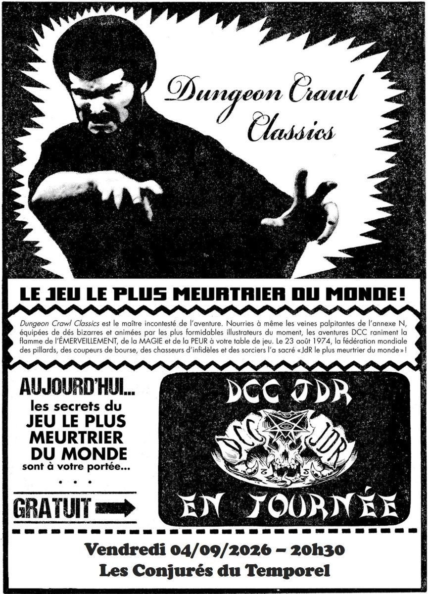

# DCC - Un périlleux voyage vers une Brèche dans le Ciel

Vendredi 04/09/2026 ; 20h30-23h30 ; Les Conjurés du Temporel

Session de reprise pour certains et de découverte de DCC pour d’autres, avec le funnel « La Brèche dans le Ciel » (Hole in the Sky).
Dans ce module, tous les joueurs incarnent des aventuriers de niveau 0, encore naïfs et inexpérimentés.

Les anciens joueurs pourront retrouver leurs personnages des sessions précédentes, dès que leur niveau sera équivalent à celui des nouveaux venus, afin de réintégrer la campagne en douceur et sans déséquilibre.

## Personnages et Joueurs

- Chloé
    - Edna, Halfelin gantière
    - Albert, Fromager (RIP)
    - Boris, Trappeur (RIP)

- Elena
    - Icar, Scribe
    - Lilylia, Fermière
    - Roahm, Bucheron

- Augustin
    - Belle, Orpheline
    - Sir Glubulum, Coupeur de bourse (RIP)
    - Martin, Trappeur (RIP)

- Sébastien
    - Thonger, Coupeur de bourse
    - Sebor, Excavateur (RIP)
    - Flamme, Halfelin Marinier (RIP)

- Sophie
    - Amalia, Halfeline Bohémienne
    - Malik, Maraîcher
    - Crow, Scribe (RIP)

- Valentin
    - Jar, Astrologue
    - Jarre, Elfe Artisan
    - Disco Pouet, Nain forgeron (RIP)

## Périls et dangers

### Les songes de la Dame Bleue

Depuis toujours, les futurs aventuriers sentent que leur vie n'est pas la leur. Une impression tenace les habite : ils sont faits pour autre chose, pour un destin plus grand que les champs, les outils et la fatigue du quotidien.
Depuis des semaines, une voix mystérieuse revient dans leurs rêves, leur parlant d'un destin brisé et d'une étoile perdue.

Ce soir, la voix ne murmure plus : elle appelle.
Les novices quittent leurs maisons sans réfléchir et marchent des jours et des nuits jusqu'à une falaise.

### Rencontre avec la Dame Bleue

Épuisés et troublés, les novices atteignent enfin la falaise qui domine l'océan. La scène correspond exactement à leurs songes, confirmant qu'ils n'étaient pas fous.
Au bord se tient la femme qui hante leurs nuits depuis des mois, immobile derrière une longue table dressée pour un banquet incongru.

Haute de près de 2,40 m, drapée de beaux atours bleus en lambeaux, elle révèle pour la première fois son visage : un masque de pierre, érodé par le vent et la pluie.
Dans une main, deux têtes humaines coupées ; dans l'autre, trois de plus. Lorsqu'ils approchent, elle les brandit comme un sinistre comité d'accueil.

Les yeux morts s'ouvrent. Les cinq têtes parlent d'une seule voix, chacune avec son timbre propre : "Bienvenue, courageux amis. Vos questions devront attendre. Votre voyage fut long. Mangez, reposez‑vous. Aujourd'hui, vous aurez toutes les réponses."

L'une des têtes, celle d'un étranger aux cheveux roux, s'exprime dans une langue inconnue.

Les novices profitent du banquet dressé sur la falaise : la plupart des plats sont frais, mais quelques mets sont étrangement avariés, sans provoquer le moindre effet néfaste. La Dame en Bleu, toujours parlant par ses cinq têtes coupées, les remercie d'avoir entrepris ce voyage et explique qu'elle ne peut révéler son véritable nom, sous peine d'attirer leurs ennemis.

Elle affirme que ces ennemis ont brisé le destin des futurs aventuriers, les faisant naître "sous des étoiles contraires". Elle leur propose une alliance : réparer ce tort, à condition qu'ils acceptent une mission.
À la pleine lune, un pont invisible apparaîtra au bord de la falaise. Ceux qui l'emprunteront traverseront l'océan jusqu'à la Brèche dans le Ciel, portail vers un autre monde où un titan garde prisonnière leur alliée.

La Dame en Bleu révèle son nom sans le prononcer : DREZZTA, inscrit un instant dans le vin versé au sol avant d'être dévoré par des scarabées. Elle met en garde : ce nom ne doit jamais être dit à voix haute.

Pour convaincre les novices, elle ouvre un instant une déchirure dans le ciel, dévoilant la Roue du Destin, immense roue noire constellée d'étoiles, pivot cosmique de l'univers.
Elle promet que ceux qui reviendront après avoir libéré l'alliée pourront faire tourner la Roue une seule fois, retrouvant ainsi le destin qui leur était dû.

La faille se referme, les vents retombent, et les restes du banquet disparaissent dans la mer.

La Dame en Bleu s'éloigne en lévitant sur la mer et disparaît dans un nuage de fumée, laissant les novices seuls sur la falaise, avec pour seule indication de se préparer à la pleine lune et au pont invisible.

### Le village de Mherkin

En attendant la nuit, les apprentis‑héros se préparent.
Non loin des falaises, ils gagnent le petit village de Mherkin, hameau de pêcheurs sous l'autorité d'un seigneur de guerre. Deux gardes, quelques échoppes, et de quoi acheter rations et matériel pour le voyage.

Une partie du groupe y fait ses provisions.
Pendant ce temps, Disco Pouet le nain forgeron et Amalia l'halfeline bohémienne organisent un concours de boisson avec un tonnelet subtilisé au banquet.
Contre toute attente, c'est l'halfeline qui l'emporte, laissant le nain passablement secoué.

Les novices retournent ensuite vers les falaises, prêts pour l'apparition du pont invisible.

### Premiers pas sur le pont invisible

Lorsque la pleine lune atteint son zénith, le pont invisible se matérialise au bord de la falaise.
Les marcheurs du destin s'y engagent prudemment : les premiers pas sont délicats, la surface à peine perceptible sous leurs pieds. Plusieurs glissent, rattrapés de justesse par leurs compagnons.

Mais deux d'entre eux : Boris le Trappeur, et Sir Glubulum le coupeur de bourses, perdent l'équilibre dès les premiers mètres. Aucun secours n'est possible : ils basculent dans le vide et disparaissent dans les flots, victimes du pont avant même que le voyage ne commence.

Les survivants poursuivent la traversée.
Le pont s'élève en pente douce jusqu'à près de 800 mètres au‑dessus de l'océan.
Au matin, le soleil brille, mais l'air devient mordant à cette altitude.

### Un violent orage

Au deuxième jour de marche, alors que les novices progressent sur le pont invisible, la météo bascule.
En milieu de journée, une pluie fine s'installe ; en fin d'après‑midi, elle se transforme en orage violent. Le vent hurle autour d'eux, fouettant le pont et poussant les apprentis‑héros vers le vide.

Certains glissent, manquent de basculer, mais parviennent à se rattraper au bord translucide du pont.
D'autres n'ont pas cette chance : Martin le Trappeur et Disco Pouet, le nain forgeron, sont emportés par une rafale, dérapent... et disparaissent dans les flots, victimes de la tempête céleste.

Les survivants resserrent leurs rangs et poursuivent la traversée, secoués par la violence du ciel.

### Les grièches marines

Le troisième jour, le froid s'installe et le vent souffle sans relâche.
À midi, les gueux téméraires passent au‑dessus de l'épave d'un navire perdu au milieu de l'océan. Une nuée de grièches marines (des charognards pustuleux et infects) s'envole soudain et fond sur le groupe.

Ces créatures, habituées à se nourrir des voyageurs du pont, cherchent à arracher de la chair fraîche. Elles harcèlent les apprentis‑héros, tentant de les faire basculer dans le vide dès qu'un coup porte.

Malgré la défense du groupe, plusieurs novices succombent à l'attaque.
Les grièches tuent :
- Albert, Fromager
- Sebor, Excavateur
- Flamme, Halfelin Marinier
- Crow, Scribe

Les survivants repoussent finalement la nuée, mais le pont est désormais jonché de sang et de plumes, et le vent emporte les corps vers l'océan.

### La Brèche dans le Ciel

À la fin du troisième jour, alors que les marcheurs du destin progressent en file indienne sur un pont désormais réduit à sa largeur minimale, un nuage massif se rapproche lentement au loin, comme attiré par leur présence.

Soudain, le pont s'interrompt.
À l'horizon, une ouverture apparaît pour la première fois : un mirage vibrant, une déformation du ciel. En avançant, les apprentis‑héros distinguent une ouverture circulaire de près de 5 mètres, cerclée d'éclairs d'énergie bleue qui crépitent et se tordent comme des serpents de lumière.

Au travers de cette brèche, un autre monde se dévoile : un ciel magenta, irréel, étranger à toute logique terrestre.
La traversée touche à son terme. La Brèche dans le Ciel les attend.

### Un autre monde

Après le coucher du soleil, le pont invisible est entièrement englouti par l'énorme nuage et par la Brèche elle‑même. L'accès est enfin possible.

Les voyageurs du destin franchissent l'ouverture. Un petit déclic résonne dans leurs oreilles, puis une chaleur soudaine les assomme un instant : ils viennent de quitter leur monde.
Le ciel, malgré la brume, est d'un magenta vif, irréel. Autour d'eux s'étend une forêt étrange, composée de bambous plats et minces comme des lames.

En se retournant, ils ne voient plus l'entrée : leurs compagnons semblent surgir de nulle part, comme si la Brèche avalait toute trace du passage.
L'air est épais, saturé d'une odeur de safran.
Au loin, à travers la brume, se dresse un unique bâtiment sombre, massif, isolé, qui domine ce paysage étranger.

Les apprentis‑héros ont quitté le monde des hommes. La véritable épreuve commence.

### Un peu de marche (encore)

Le groupe avance droit vers le bâtiment sombre aperçu à travers la brume. Le trajet dure près de quatre heures, à travers une forêt irréelle où les "bambous" ressemblent à d'immenses brins d'herbe plats, oscillant comme des lames souples dans l'air chaud.

La progression est lente, étouffée par l'atmosphère épaisse et l'odeur de safran qui imprègne ce monde.
Lors d'une halte, les apprentis‑héros découvrent une cache de fournitures dissimulée entre les tiges géantes : une hache de guerre, une armure de cuir, un bouclier, un arc et une outre. Une trouvaille providentielle avant d'atteindre le bâtiment solitaire qui domine ce paysage magenta.

### Le bâtiment solitaire

À mesure que le groupe avance, le bâtiment se révèle : un monolithe de près de 90 mètres, couvert d'épines de quinze mètres, semblable à une cosse géante surgie du sol plutôt qu'à une construction.
Une double porte de dix-huit mètres de haut marque l'entrée.

Jar et Jarre poussent discrètement un des battants.
Dedans, les apprentis‑héros découvrent une salle unique, immense, d'aspect organique, comme l'intérieur d'une ruche titanesque. La lumière filtre par des trous au plafond, où volent des créatures brillantes projetant des reflets verts sur les parois.

Au fond, une créature gigantesque, sans doute haute de dix-huit mètres si elle se levait, repose assise contre le mur. Couvert d'une fourrure rousse, le titan a la tête et le torse d'un prédateur monstrueux. Ses ronflements font vibrer la poitrine des voyageurs.

Au‑dessus de lui, suspendue à plus de trente mètres, une cage en dôme faite d'entrelacs de bois pend à une branche géante poussant depuis la paroi.

### Rencontre avec d'autres envoyés de la Dame Bleue

À peine le seuil du monolithe franchi, les gueux téméraires ne sont pas seuls.
D'autres silhouettes émergent de l'ombre organique de la salle : des voyageurs aussi misérables qu'eux, hagards, couverts de poussière et de fatigue.
Eux aussi ont été appelés par la Dame en Bleu, guidés par les mêmes rêves, poussés par le même destin brisé.

Ces nouveaux arrivants rejoignent le groupe devant l'immense titan endormi, leurs pas résonnant dans la ruche colossale.
Leur présence confirme une chose : la Dame n'a pas misé sur un seul groupe... mais sur plusieurs âmes ordinaires, sacrifiées pour une mission impossible.

## Les héros tombés à l'Aventure

Dans le tableau ci-dessous, les héros qui ne reviendront pas de ce périple et la cause de leur trépas.

| Personnage | _Cause of Death_ |
| --- | --- |
| Albert, Fromager | Tué par les Grièches marines  |
| Boris, Trappeur | Tombé du Pont Invisible |
| Sir Glubulum, Coupeur de bourse | Tombé du Pont Invisible |
| Martin, Trappeur | Glissade du Pont Invisible, pendant un violent orage |
| Sebor, Excavateur | Tué par les Grièches marines |
| Flamme, Halfelin Marinier | Tué par les Grièches marines |
| Crow, Scribe | Tué par les Grièches marines |
| Disco Pouet, Nain forgeron | Tombé du Pont Invisible, pendant un orage |

## À suivre...

_Consigné par Kophaloth, gardien des récits que la Brèche murmure et que la Roue du Destin confirme._
