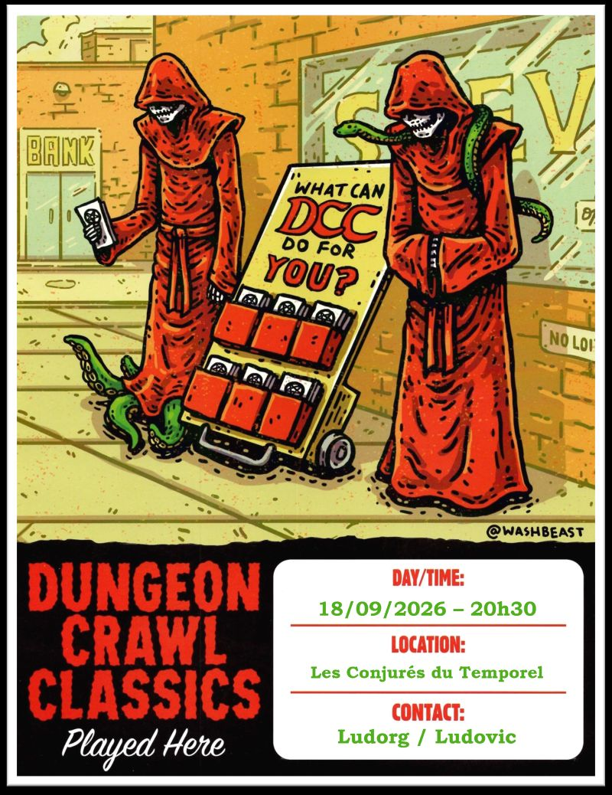
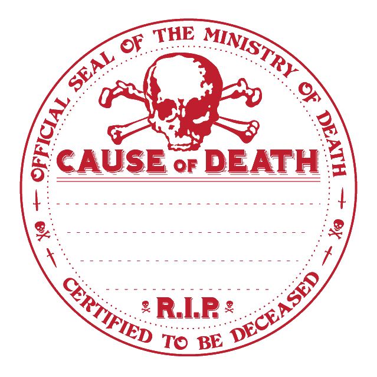

# DCC - La Libération de Drezzta

Vendredi 18/09/2026 ; 20h30-23h30 ; Les Conjurés du Temporel

Suite de l'entonnoir « La Brèche dans le Ciel » (Hole in the Sky), débuté [deux semaines plus tôt](./dcc_cdt_2026_09_04).

## Précédemment

Guidés par leurs rêves, les marcheurs du destin ont rencontré la Dame en Bleu, qui leur a révélé que leur véritable destinée leur avait été volée. Pour la restaurer, ils doivent traverser un pont invisible jusqu'à la Brèche dans le Ciel et libérer Drezzta, son alliée, retenue prisonnière.

La traversée fut meurtrière : tempêtes, rafales et grièches marines ont précipité plusieurs novices dans l'océan. Les survivants ont atteint la Brèche et ont basculé dans un monde magenta, saturé de safran, où une forêt de lames géantes mène à un monolithe organique.

À l'intérieur, un titan endormi garde une cage suspendue à trente mètres du sol. D'autres envoyés de la Dame en Bleu, hagards et épuisés, émergent de l'ombre : ils ont été appelés par les mêmes songes.
Tous se tiennent désormais face au titan... et à la mission impossible de libérer Drezzta.

## Personnages et Joueurs

- Elena
    - Icar, Scribe
    - Lilylia, Fermière
    - Roahm, Bucheron (RIP)
    - Raya, Serrurière (2)

- Augustin
    - Belle, Orpheline
    - Siméon, Garde de Caravane (2)
    - Gloin, Nain Forgeron (2)
    - Hedia, Astrologue (2)

- Sophie
    - Amalia, Halfeline Bohémienne
    - Malik, Maraîcher (RIP) (RIP)
    - Wulf Gangus, Ménestrel (2)
    - June, Elfe Navigatrice (2) (RIP)

- Félix
    - Gurdil, Nain Myciculteur (2)
    - Merry, Hafelin Usurier (2)

Les personnages marqués (2) font partie du deuxième groupe de héros, rencontré à la Brèche dans le Ciel. Les personnages marqués (RIP) sont ([ceux qui ont péri au cours de l'aventure](#les-héros-tombés-à-laventure)). 

## Périls et dangers

### L'union des envoyés de la Dame en Bleu

Les deux groupes d'envoyés de la Dame en Bleu décident de s'unir pour libérer Drezzta.

Les premiers arrivés ont déjà affronté l'un des périls de ce lieu : Cur Maxima, un gardien végétal de la prison. Cette créature, semblable à une gigantesque citrouille d'Halloween au rictus maléfique, est grande comme un attelage. Une flamme verte danse derrière les ouvertures de ses yeux et de sa bouche. D'une voix douce et mielleuse, elle avertit poliment les intrus qu'ils doivent quitter la dimension sous peine d'être exécutés sur‑le‑champ.

Sire Helperick, noble en armure et fier de sa belle épée, a tenté de l'attaquer. Il a été neutralisé en quelques secondes, puis déchiqueté par la créature dans d'horribles souffrances. Ses camarades ont dû fuir et se cacher dans les débris de la prison.

Les créatures lumineuses, en revanche, sont inoffensives. Ce sont des mouches cérébrales, des insectes gros comme des pamplemousses, qui se nourrissent des sécrétions continues des parois. Leurs énormes organes sensoriels, semblables à un cerveau humain recouvert d'un fin exosquelette opaque, émettent une lumière verdâtre assez intense pour éclairer la salle.

### A l'extérieur

Quelques courageux, dont Siméon, un garde de caravane, tentent une approche par l'extérieur.
Cependant, les tiges des épines qui couvrent les parois de la prison sont trop flexibles pour permettre de grimper haut. Elles sont en outre extrêmement tranchantes et suintent un liquide verdâtre qui brûle la peau au moindre contact.

Le trio d'aventuriers curieux finit par renoncer et rejoint les autres à l'intérieur du monolithe.

### La salle à l'intérieur du mur

En observant la paroi, certains remarquent une brèche dans le mur opposé au titan.

En écartant les débris, les aventuriers débouchent dans une salle plongée dans la pénombre, imprégnée d'une odeur de feuilles d'automne après la pluie. L'espace est éclairé par une cage d'entrelacs de bois suspendue au centre, renfermant plusieurs des créatures lumineuses aperçues dans la salle principale. Le sol, encombré de détritus, rend la progression difficile.

Sur leur gauche, ils distinguent un passage obscur, légèrement incurvé, qui suit la courbure intérieure du mur de l'immense salle qu'ils viennent de quitter. À plusieurs endroits, de minuscules fissures laissent filtrer l'étrange lueur verdâtre du hall principal.

Le groupe s'engage dans le passage. Les premiers repèrent rapidement un piège rudimentaire : un fil déclencheur effiloché tendu en travers du couloir, relié à un amas de débris de bois, de branches et de pierres. Ils l'évitent sans difficulté.

Plus loin, certains entendent devant eux des bruits de pas précipités, suivis de chuchotements étouffés.

### Le conduit dans le mur - Affrontement avec les survivants

Un passage vertical, étroit et grossièrement creusé, mène vers les hauteurs de la prison. Une première échelle conduit à une deuxième, puis à une troisième, toutes bricolées de bric et de broc, branlantes mais utilisables. Le mur est percé de minuscules ouvertures laissant filtrer une faible lueur provenant de la salle principale.

Les échelles débouchent sur une longue salle basse, saturée de l'odeur désagréable d'un trop grand nombre d'humains vivant dans une promiscuité étouffante.

Roahm, le bûcheron, qui ouvrait la voie, est le premier à être attaqué : un survivant embusqué lui assène un coup de gourdin, le blessant mortellement et le faisant basculer dans le conduit.

Le combat éclate aussitôt. Les aventuriers doivent se défendre contre un groupe d'humains dépenaillés installés dans la pièce : hommes et femmes adultes, vêtus de haillons, négligés et crasseux. Parmi eux se tient un nain aussi misérable que les autres, mais portant une armure d'écailles rouillée. Il semble être leur chef.

Le nain aiguise sa hache avec une pierre ; l'arme émet une étrange flamme violette. June, l'elfe navigatrice, est frappée à mort par ce chef nain.

Dans la confusion, Malik, le maraîcher, est tué par un tir fratricide d'Amalia.

Finalement, Karlos Gend, le nain qui dirigeait les survivants, est abattu d'un puissant coup de pelle porté par Gurdil, le nain myciculteur.
Privés de leur chef, les autres se rendent rapidement.

### Les Survivants

Au plafond de la salle, les murs sont noircis par la suie et l'humidité. Le sol est jonché de débris, de restes de viande bouillie et d'objets abandonnés. Des paquets sont suspendus au plafond, ainsi que deux cages de branches entremêlées contenant des insectes géants et lumineux, semblables à ceux de la salle principale.

Plus loin, l'air devient encore plus nauséabond que dans la pièce précédente. Seuls quelques rayons filtrant par les minuscules trous du mur parviennent à percer la pénombre. Plusieurs silhouettes sont accroupies dans l'ombre.

Huit abandonnés se trouvent ici, trop malades et trop faibles pour aller bien loin. Ce sont les plus anciens survivants : leur exposition prolongée à l'espace extradimensionnel a déformé leur corps et altéré leur esprit au point de les rendre méconnaissables. Leurs corps sont tordus et monstrueusement transformés : traits asymétriques, membres atrophiés, peau pâle et verdâtre, yeux fixes et aveugles.

Ils sont pourtant inoffensifs et ne représentent aucune menace pour les aventuriers.

En fouillant les lieux, les héros comprennent que ces survivants ont probablement sombré dans l'anthropophagie. Contraints de se nourrir des corps de leurs compagnons morts, ils se sont réfugiés dans ce passage pour échapper au titan et à Cur Maxima. Il s'agit sans doute d'anciens envoyés de la Dame en Bleu, ceux qui ont échoué à libérer Drezzta et ont été lentement corrompus par la prison vivante.

Dans les sacs, ils trouvent de vieux vêtements et quelques objets personnels. Ils mettent également la main sur une cinquantaine de pièces d'argent. Dans le paquet ayant appartenu à Karlos Gend, ils découvrent 7 pièces d'or ainsi qu'une topaze bleue d'une rare clarté.

Les nains estiment sa valeur à au moins cent pièces d'or.

### Un autre conduit et une salle oubliée

Le passage s'élève dans les ténèbres. Des échelles de fortune sont fixées dans le mur. La paroi opposée est percée de minuscules trous par lesquels filtre la lumière de la salle principale.

Gloin ouvre la voie et découvre qu'une des prises dans le mur est en réalité un bras de squelette humain dépassant d'un amas de pierres incrusté dans la paroi. Guidé par ses sens nains pour flairer l'or et les joyaux, il fouille les lieux. Avec l'aide de ses compagnons, ils parviennent à dégager les pierres et à ouvrir un passage menant à une petite salle poussiéreuse et abandonnée.

L'atmosphère y est lourde, chargée d'un parfum de renfermé. Le plafond est bas. Plusieurs petits sacs, des armures couvertes de poussière et un tas d'armes sont éparpillés au sol. Une lance de bois noir à pointe d'argent repose contre le mur du fond. Contrairement au reste, elle semble neuve, comme fraîchement polie.

La pièce renferme également les squelettes de deux des premiers envoyés de la Dame en Bleu dont les compagnons ont été très probablement tués par Cur Maxima.

Le butin retrouvé comprend :

- Un clibanion nain, nécessitant des réparations.
- Deux cottes de mailles de taille humaine, également à réparer.
- Deux armures de cuir en bon état : l'une pour humain, l'autre pour halfelin.
- Une arbalète dont la corde est cassée.
- Un splendide marteau de guerre nain, en excellent état.
- Deux fioles d'eau bénite.
- Un symbole sacré de Justicia, en platine et cuivre, suspendu à une chaîne d'argent (valeur estimée : 1000 po).

Quant à la lance, un examen minutieux révèle des runes gravées sur sa hampe noire : POUR SIRE ... LANCE DÉMON.

## Les héros tombés à l'Aventure

Dans le tableau ci-dessous, les héros qui ne reviendront pas de ce périple et la cause de leur trépas.

| Personnage | _Cause of Death_ |
| --- | --- |
| Roahm, Bucheron | Coup de gourdin |
| Malik, Maraîcher | Tir fratricide d'Amalia |
| June, Elfe Navigatrice | Coup de hache du nain |

