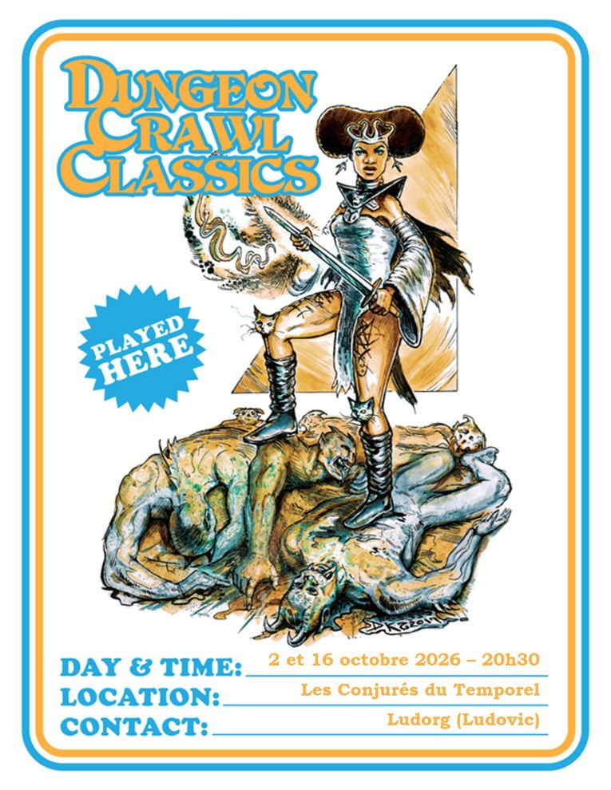

# DCC - Les Animaux de la ferme du Vieux Buck

Vendredi 02/10/2026 ; 20h30-00h00 ; Les Conjurés du Temporel

Session de transition vers le niveau 1 pour les aventuriers ayant survécu aux épreuves du scénario "La Brèche dans le Ciel" (voir [Un périlleux voyage vers la Brèche dans le Ciel](./dcc_cdt_2026_09_04) et [La Libération de Drezzta](./dcc_cdt_2026_09_18) ).

## Précédemment

Les marcheurs du destin ont atteint la Brèche dans le Ciel et rejoint un second groupe d'envoyés de la Dame en Bleu, déjà éprouvés par Cur Maxima, le gardien végétal meurtrier.

En explorant la prison vivante, ils ont affronté des survivants déformés par l'extradimension, perdant Roahm, June et Malik dans l'affrontement. Plus haut, ils ont découvert une salle oubliée contenant les restes d'anciens envoyés et un précieux arsenal, dont la lance runique Lance Démon. Raya a ensuite libéré Drezzta en acceptant la douleur du verrou de sang, permettant à la créature ailée de détruire Cur Maxima et d'effondrer la dimension.

De retour auprès de la Dame en Bleu, non loin du village de Mherkin, les héros ont tourné la Roue du Destin, qui a tordu la réalité en échangeant les vies de Lilylia, Albert et Hedia.

## Personnages et Joueurs

- Elena
  - Lilylia, Guerrière (Fermière)
  - Raya, Voleuse (Serrurière)

- Augustin
  - Belle, Mage (Orpheline)
  - Gloin, Nain (Nain Forgeron)

- Sophie
  - Amalia, Halfeline (Halfeline Bohémienne)
  - Wulf Gangus, Mage (Ménestrel)

### PNJ accompagnant les héros

- Albert, Clerc de Justicia (Fromager)

## Périls et dangers

### Un peu de répit au village de Mherkin

Après le départ de la Dame en Bleu, les héros se sont installés quelque temps à Mherkin, profitant d'un repos bien mérité à l'auberge de l'Outre du Marin Maudit, tenue par Kalyx.

Raya y a lié connaissance avec Traboc, un habitué aux fréquentations douteuses. Plusieurs se souviennent qu'il avait tenté d'arnaquer Sir Glubulum en lui proposant des outils de cambrioleur à un prix cinq fois supérieur à leur valeur.

Durant ces quelques semaines, Belle et Wulf Gangus ont étudié les arts de la magie auprès de Nemid l'Ancien, approfondissant leurs talents nouvellement éveillés.

Quant à Albert, inspiré par le splendide symbole sacré de Justicia récupéré par Gloin, il s'est plongé dans la prière et la méditation. Une illumination l'a frappé : il a choisi de se consacrer pleinement à cette divinité.

### Besoin d'aide à la ferme du Vieux Buck

Trois semaines après les événements de la Brèche, Némid l'Ancien rassemble les jeunes aventuriers : le vieux Buck a besoin d'aide.

Ses animaux sont devenus fous, ses trois commis ont disparu, et un vacarme terrifiant résonne depuis sa grange.

Son fils, Cwentale, parti chercher des soldats à Velmir Keep, la garnison royale située au sud‑ouest de Mherkin, n'est pas encore revenu. Craignant que les soldats du roi ne détruisent tout sans chercher à comprendre, le vieux Buck a sollicité l'aide de Némid l'Ancien, qui a fait appel à Belle et Wulf Gangus ainsi qu'à leurs compagnons pour enquêter sur ces événements inquiétants.

Arrivés à la ferme, le vieux Buck leur expose la situation : "Mon fils Cwentale et moi récoltions du miel quand un vacarme a éclaté dans la grange. Cwentale est parti chercher des soldats à Velmir Keep, mais ils ne devraient revenir que dans un ou deux jours. J'ai envoyé d'autres personnes vérifier : elles ont disparu elles aussi. L'étang s'est mis à briller d'une lueur rose, et je jurerais avoir vu mon cochon porter mon chapeau. Les soldats du roi préfèrent brûler avant de réfléchir. Aidez‑moi, avant qu'ils ne détruisent tout."

En sortant de la ferme, les aventuriers remarquent un enfumoir à abeilles et une combinaison d'apiculteur posées près de l'entrée.

En se dirigeant vers la grange, ils aperçoivent sur leur droite un bel étang artificiel, soigneusement entretenu. Certains jurent y apercevoir des mouvements, tandis que d'autres entendent des bruits de plongeons dans l'eau.

### Les cochons bipèdes dans la grange

C'est une vieille grange, entretenue selon les standards de Mherkin, même si les citadins y trouveraient à redire. La grande porte coulisse latéralement, et au‑dessus se trouve l'ouverture du fenil, utilisée pour hisser le fourrage. À gauche, une clôture borde les champs de radis. Entre la grange et cette clôture, une rangée de buissons fleuris apporte une touche de couleur.

Amalia et Raya escaladent la façade pour atteindre le fenil.

La porte principale est clouée, mais Gloin la dégage sans difficulté et fait glisser un battant. Aussitôt, un cochon bipède, fourche en main, charge les intrus.

Depuis le fenil, Amalia et Raya découvrent un autre cochon bipède, affublé d'un étrange chapeau. Il observe la scène en contrebas, manifestement prêt à agir. Raya se glisse derrière lui et l'égorge ; en s'effondrant, la créature reprend aussitôt l'apparence d'un cochon ordinaire.

Un troisième cochon surgit derrière un box. Gloin et Lilylia en viennent rapidement à bout, tandis que Belle et Wulf Gangus mettent à l'épreuve leurs nouveaux pouvoirs magiques. Les cochons reprennent aussitôt un aspect normal et ordinaire.

### Une étrange poule

Gloin reconduit les cochons vers leur enclos.

Juste à côté se trouve le poulailler. Il n'abrite qu'une seule créature, vaguement semblable à une poule, mais deux fois plus grande qu'un gallinacé ordinaire. Elle possède des ailes de chauve‑souris, des crocs au bout du bec, ainsi que des pattes et un long cou nus, dépourvus de plumes.

Derrière elle, trois statues de pierre, tournées vers le monstre, se dressent silencieusement.

Une fois la créature vaincue, elle reprend l'apparence d'une poule normale. Les trois statues sont les fermiers envoyés par le Vieux Buck pour enquêter.

### Un poulain blessé

En quittant le poulailler et l'enclos à cochons, les aventuriers remarquent des traces de sang. Elles viennent de l'arrière de la grange et mènent directement vers l'écurie.

Ils s'y rendent et découvrent un poulain blessé, couvert de sang. Étendu sur la paille, le jeune animal porte des ecchymoses profondes et une plaie nette à la jambe arrière, semblable à un coup de dague ou de lance. Il tente de se reposer, haletant.

Le poulain est blanc, avec une queue dorée pâle striée de rose. Sa crinière partage les mêmes teintes, et, en y regardant de plus près, une petite corne d'ivoire se dresse sur son front.

Wulf Gangus, fort de son apprentissage auprès de Némid l'Ancien, le soigne grâce aux effets secondaires d'un sort. Albert, nouvel adepte de Justicia, lui impose les mains. Peu à peu, le poulain se relève, visiblement soulagé.

La créature se met alors à parler, mais seules les femmes l'entendent. Il explique que des chasseurs ont attaqué sa mère et lui. Terrifié, il a fui et s'est réfugié dans la grange, espérant y trouver de l'aide. Les novices suivent les traces de sang.

### Un étrange portail

Dans le champ de radis se dresse un vieil arbre équipé d'une balançoire. La traînée de sang mène les aventuriers derrière le tronc, où ils aperçoivent un anneau rose lumineux flottant dans l'air. En son centre, la surface miroite comme une eau ondulante, parcourue de nuances de vert impossibles à distinguer clairement.

Le phénomène ressemble à un portail que l'on pourrait traverser, mais nul ne sait ce qui se trouve de l'autre côté. Après quelques essais prudents, les aventuriers renoncent et retournent vers les bâtiments de la ferme.

### Des fées joueuses

Pendant que certains se dirigent vers l'étang (Lilylia et Gloin), d'autres vers la ferme (Belle et Amalia), ou restent dans la grange (Wulf Gangus), Raya et Albert s'approchent de la clôture et des buissons fleuris. Là, ils découvrent un spectacle inattendu : un nuage de petites créatures s'élève des fleurs, virevoltant de manière erratique. Ces êtres ont le corps de jeunes femmes et des ailes de papillons aux couleurs innombrables.

Elles rient, jouent, et semblent totalement indifférentes à l'arrivée des aventuriers. Très vite, elles les entraînent dans une danse joyeuse, sautant, tournoyant, éclatant de rire dans une extase pure.

Pendant ce temps, Amalia et Belle discutent avec le vieux Buck dans la ferme... lorsqu'un combat éclate soudain au bord de l'étang.

<!-- markdownlint-disable MD026 -->
## À suivre...

_Rapporté par Kopeelotr, témoin des premiers pas d'un poulain‑licorne et des légendes qui naissent dans les champs de radis._
