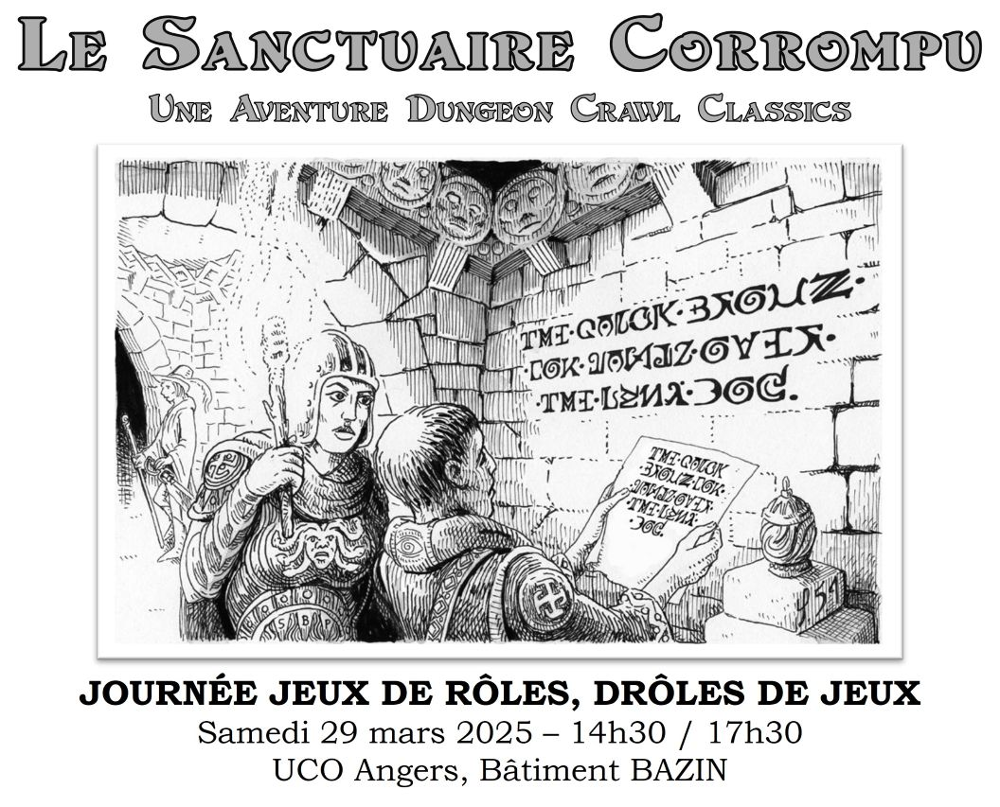

# Les Gongfarmers de l'Anjou - Historique des sessions publiques

## Les Gongfarmers de l'Anjou

Les Gongfarmers de l'Anjou, le [chapitre local numéro 159 des Gongfarmers](./img/159_Les-Gongfarmers-de-l-Anjou.png), a été créé en mai 2024 à Angers dans le cadre du programme [Road Crew](https://goodman-games.com/road-crew-landing-page-2025/) de [Goodman Games](https://goodman-games.com/). Ce groupe rassemble des fans des jeux de rôle de l'éditeur, comme Dungeon Crawl Classics ou Mutant Crawl Classics. Ils organisent des sessions ouvertes à tous et des événements collaboratifs pour faire découvrir et partager leur passion pour les jeux de rôle dans la région.

## Historique des sessions publiques

Un aperçu rapide des sessions organisées par Les Gongfarmers de l'Anjou, classées de la plus récente à la plus ancienne.

<!-- TEMPLATE

### DATE : TITRE

 

- Lieu : XXXXXX
- Juge : NNNNNN
- Scénario : SSSSSSSSS
- Joueurs : J -->

### 2026/01/30 : Dans les Glaces du Temps

 

- Lieu : Ludothèque de Belle-Beille (avec les Conjurés du Temporel)
- 2 sessions :
    - Session 1
        - Juge : Augustin
        - Scénario : La porte des Brumes
        - Joueurs : 5
    - Session 2
        - Juge : Ludovic/Ludorg
        - Scénario : Dans les Glaces du Temps (Frozen in Time)
        - Joueurs : 6
    
### 2025/10/04 : L'Hypercube de Myt

 

- Lieu : Deux Jours en Jeux 2025
- Juge : Ludovic/Ludorg
- Scénario : L'Hypercube de Myt
- Joueurs : 5

### 2025/06/08 : L'Hypercube de Myt 

- Lieu : LudoFest 2025
- Juge : Ludovic/Ludorg
- Scénario : L'Hypercube de Myt
- Joueurs : 0, Evènement annulé car pas de système de réservation pour les parties de jeux de rôles.

### 2025/05/28 : Initiation Id20, Le Portail sous les Étoiles

 

- Lieu : LudoTrotter avec Id20
- Juge : Augustin et Ludovic/Ludorg
- Scénario : Le Portail sous les Étoiles (The Portal Under the Stars)
- Joueurs : 3+4

### 2025/03/29 : Jeux de rôles, drôles de jeux

- Lieu : Université Catholique de l'Ouest (avec ImaJn'ère) 
- Juge : Ludovic/Ludorg
- Scénario : Le Sanctuaire Corrompu (Dungeon Crawl Classics #14/The Defiled Sanctuary)
- Joueurs : 6

### 2025/03/15 : À vous de jouer !

 

- Lieu : Musée des Beaux Arts d'Angers (avec les Conjurés du Temporel)
- Juge : Ludovic/Ludorg
- Scénario : Grimtooth Museum of Death (Dungeon Crawl Classics #87.5)
- Joueurs : 4

### 2025/01/25 : Nuit de la Lecture

 

- Lieu : Bibliothèque Toussaint (avec avec ImaJn'ère)
- Juge : Ludovic/Ludorg
- Scénario : Un bien étrange conte (A Fairly Odd Tale)
- Joueurs : 7

### 2024/11/29 : La Nuit des Jeux de rôles (50 ans de D&D)

 

- Lieu : Bibliothèque Ludothèque de Belle-Beille
- Juge : Ludovic/Ludorg
- Scénario : Le Dragon Squelette de la Mine aux Champignons
- Joueurs : 4

### 2024/11/09 : Initiation Dungeon Crawl Classics - Le Portail sous les Étoiles

 

- Lieu : Bibliothèque Ludothèque de Belle-Beille
- Juge : Ludovic/Ludorg
- Scénario : Le Portail sous les Étoiles
- Joueurs : 4

### 2024/10/12 : Initiation Mutant Crawl Classics

 

- Lieu : Bibliothèque Ludothèque de Belle-Beille
- Juge : Romain
- Scénario : ?
- Joueurs : ?

### 2024/07/20 : DCC Day 2024

 

- Lieu : Centre Ginette Leroux (avec les Arts Ludiques)
- Juge : Ludovic/Ludorg
- Scénario : Les légendes ne naissent pas (Dungeon Crawl Classics #0 - Legends are made not born) 
- Joueurs : 6

### 2024/07/05 : Dig Hard

 

- Lieu : Troglodytes et Sarcophages - Doué-la-Fontaine (avec ImaJn'ère)
- 2 scénarios, 3 tables, 4 sessions
    - Session 1
        - Juge : Ludovic/Ludorg
        - Scénario : Le Dragon Squelette de la Mine aux Champignons
        - Joueurs : 7    
    - Session 2
        - Juge : Guillaume
        - Scénario : Le Dragon Squelette de la Mine aux Champignons
        - Joueurs : 6
    - Session 3 :
        - Juge : Guillaume
        - Scénario : Kidnapping en haut lieu
        - Joueurs : 6
    - Session 4 :
        - Juge : Romain
        - Scénario : Kidnapping en haut lieu
        - Joueurs : 6
