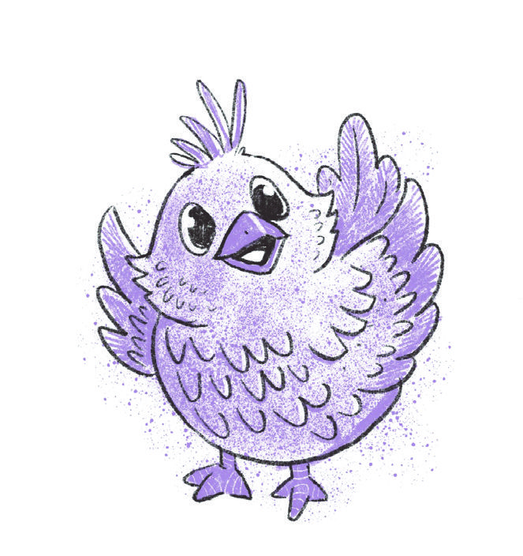
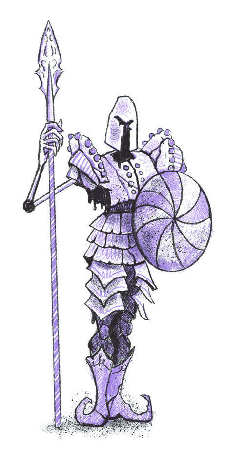
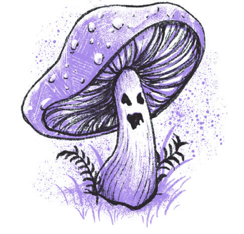
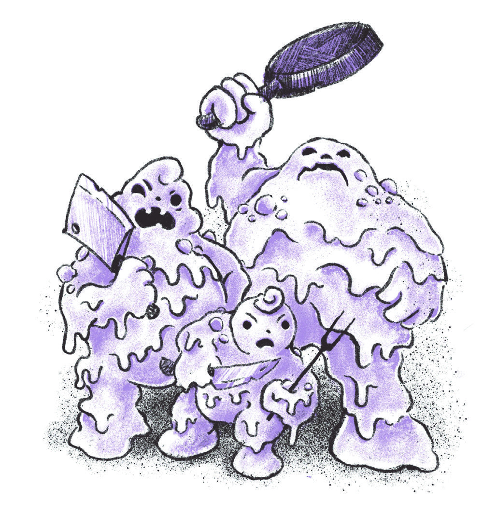
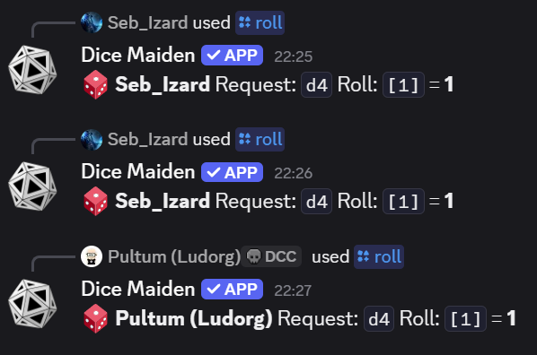
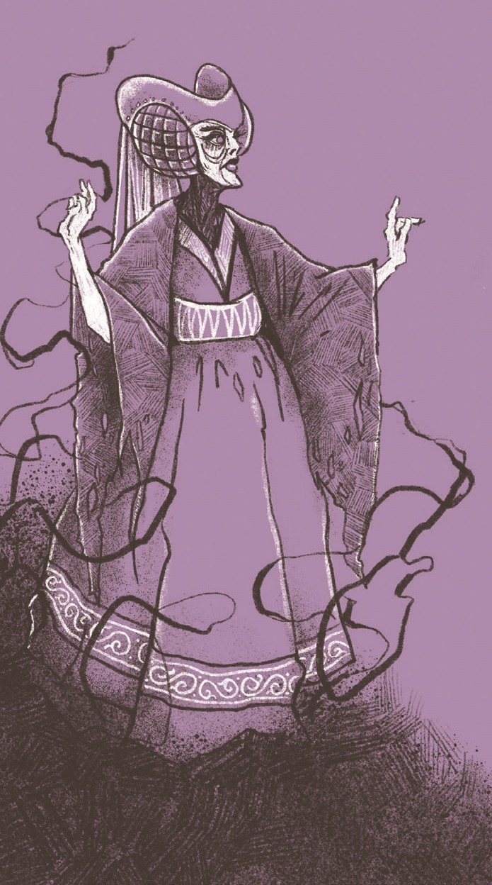

# Périls et Princesses

## Personnalité et objet fétiche

- Personnalité (5,4,1) / 20 : premier coup d'oeil : élégance royale, perspicace et diplomate, peur de ne pas être à la hauteur.
- Objectif : réaliser son devoir royal.
- Objet fétiche : boite à musique triste.

- Trésor : 11 pièces d'argent.

## Histoire

Il était une fois, trois princesses et un prince qui vivaient dans un royaume lointain. Chacune des princesses possédait un don unique : la première pouvait contrôler les éléments, la deuxième était très agile, quant à la troisième, elle pouvait parler aux animaux. Le prince, quant à lui, avait le pouvoir de guérir.

- [Ash](ASH_PORTRAIT.jpg)
- [Gemma](GEMMA_PORTRAIT.jpg)
- [Isolde](ISOLDE_PORTRAIT.jpg)
- [Valarian](VALARIAN_PORTRAIT.jpg)

Cette petite troupe, contre la volonté du roi, fait une fugue pour se rendre au bal dans le royaume voisin, mais ils doivent d'abord traverser la forêt à cheval.

Ils partent donc à l'aube, chacun sur son cheval.
Valarian prend : sac à dos, une cape, un bouclier, un gros collier de famille, un peu tape à l'oeil.

Pendant la pause pique-nique du midi, un petit oiseau rentre dans le sac à dos de Ash.

Puis, du bruit, c'est une créature avec une armure !

Le combat s'engage. Valarian décapite la créature et Ash lui perce le torse de sa hacgette. La créature s'effondre. En la fouillant, il s'avère qu'elle est faite de sucre.

L'oiseau ressort du sac à dos de Ash et semble nous indiquer une direction. Le groupe de princesses et le prince le suivent. Il se dirige vers une chaumière avec une tour.

Sur le chemin, Valarian marche sur un champignon qui dégage un gaz incapacitant. Mais grâce à ses pouvoirs de guérison, il se remet rapidement.

Arrivés à la chaumière, la porte est entrebaillée. À l'intérieur, un chaudron fume sur le feu. Deux oeufs, dont un est éclos, reposent à côté. Un bas de laine. Sur la table, trois petits bonhommes en pâte. Ils s'animent et se saississent d'ustensiles !

Ash aide d'un croche-pied Isolde pendant que Valarian la pousse. Elle coupe malgré tout le bras d'un des bonhommes.

Dégâts sur Valarian :

- 2 (créature avec un couteau)

Valarian d'un coup d'épée tranche une des créatures d'un seul coup. Quant à Ash, elle utilise sa hachette pour découper le dernier des bonhommes en pâte en deux.

Dans la cuisine, une porte mène à un escalier en colimaçon qui monte vers la tour. Au rez-de-chaussée, un bureau avec un livre ouvert. Il s'intitule "Faune Fabuleuse des nos Forêts" et est ouvert à la page du Phénix. Jeune, il ressemble au petit oiseau qui nous a guidés jusqu'ici.

Dans l'escalier, différents tableaux représentent des portraits.

Gemma renverse le chaudron. Ash trouve une pomme qui semble empoisonnée.

Soudain, un cri d'oiseau retentit. C'est un Phénix adulte. Les princesses lui ouvre et Pitchou (le petit oiseau) retrouve sa mère dans des piaillements de joie. Valarian lui tend le bas de laine avec les deux autres oeufs. Le phénix le prend et s'envole avec son petit.

En partant, le phénix laisse tomber quatres plumes de feu que le groupe ramasse.

En montant dans la tour, les portraits ressemblent à la même femme mais à différents âges. En voulant ouvrir, la porte Ash sent une chaleur désagréable émaner de la poignée.

Valarian donne un coup de pied dans la porte qui s'ouvre. C'est la chambre d'une vieille femme. Un lit à baldaquin, et divers vêtements.

Isolde trouve son dentier avec des dents en or, Valarian un flacon de parfum, une statuette en ivoire pour Gemma, et une bague en or pour Ash.

Les pincesses et le prince quittent la chaumière et reprennent leur route vers le bal, emportant avec eux les trésors trouvés et les plumes de phénix comme souvenirs de leur aventure extraordinaire.
